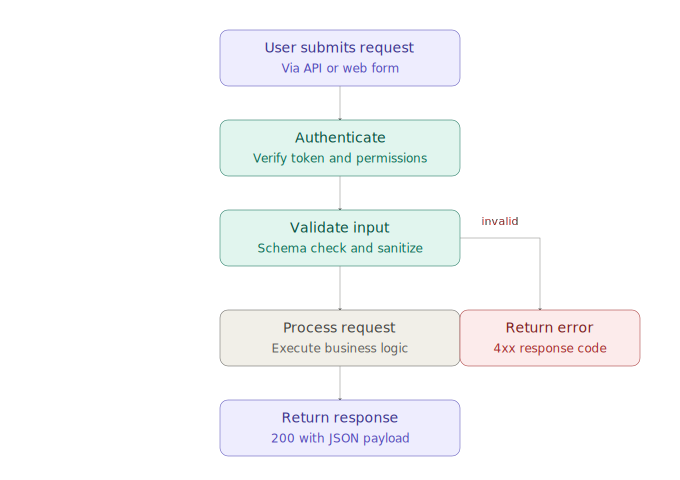
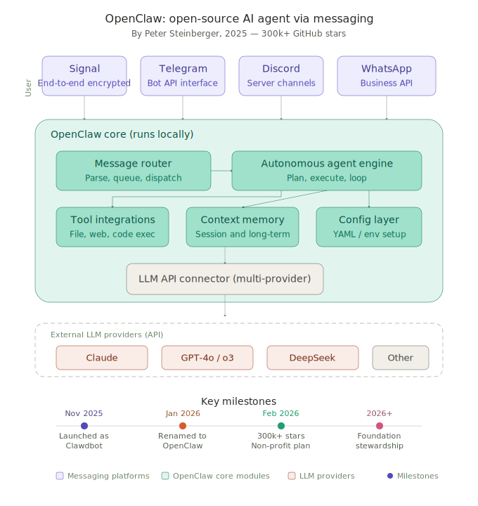
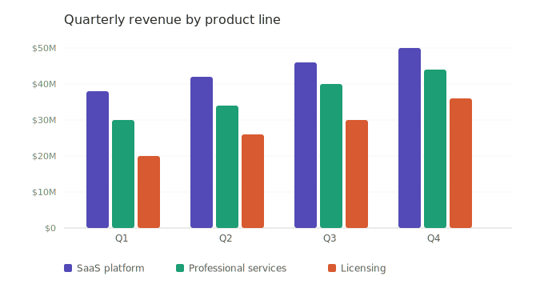
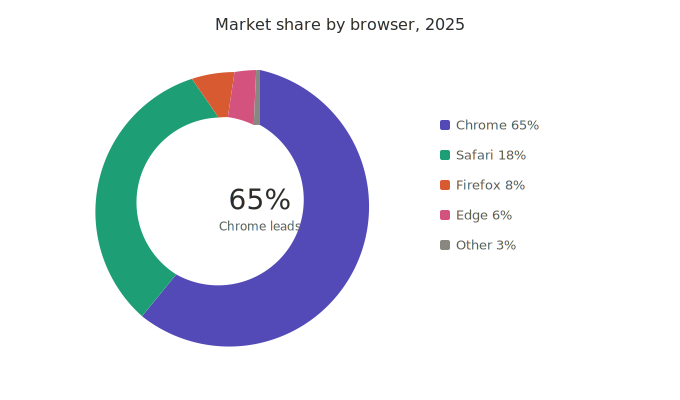

# Claude infographic Charts — 让任何大模型都能生成 Claude artifact 风格的专业图表、流程图和交互式可视化。

---

## 这是什么

这是一套提示词 Skill，提炼自 Claude 内置的生成式 UI 系统，将其视觉风格标准化为任何 LLM 都能遵循的规则文件。

Claude 的 artifact 图表有一套独特的设计语言：9 色调色系、680px viewBox 基准、极简扁平美学、完整的亮/暗模式支持。这套 Skill 把这些规则从 Claude 的专有渲染管线中剥离出来，变成独立的、可复用的提示词规范。

**输出格式两种：**
- **SVG 文件** — 静态图表、流程图、架构图、插画
- **HTML 文件** — 需要 JavaScript 的交互式图表（Chart.js、滑块、动画）

---

## 效果预览

### 1) Flowchart 示例（优先看这个）



### 2) OpenClaw 架构概览



### 3) 分组柱状图



### 4) 甜甜圈图



> 交互式示例见 `tests/test-interactive-benchmark.html`

---

## 文件结构

```
claude infographic charts/
├── README.md                         ← 你正在读的这个
├── skill/
│   ├── SKILL.md                      ← 主 Skill 文件（模块路由 + 格式决策 + 完整规范）
│   ├── diagram.md                    ← 流程图 / 结构图 / 说明图
│   ├── chart-types.md                ← 图表类型选择指南（9 种图表）
│   ├── mockup.md                     ← UI 组件 / 仪表盘 / 数据卡片
│   ├── interactive.md                ← 滑块 / 动画 / stepper 交互组件
│   └── art.md                        ← SVG 插画 / 几何图案
└── tests/
    ├── test-flowchart.svg            ← 测试流程图
    ├── openclaw-overview.svg         ← 架构概览图
    ├── test-bar-chart.svg            ← 柱状图示例
    ├── test-donut-chart.svg          ← 甜甜圈图示例
    └── test-interactive-benchmark.html ← 交互式 HTML 示例
```

---

## 设计系统核心

### 9 色调色板

| 色系   | 400（主色）| 600（描边）| 800（深色）|
|--------|-----------|-----------|-----------|
| purple | `#7F77DD` | `#534AB7` | `#3C3489` |
| teal   | `#1D9E75` | `#0F6E56` | `#085041` |
| coral  | `#D85A30` | `#993C1D` | `#712B13` |
| pink   | `#D4537E` | `#993556` | `#72243E` |
| gray   | `#888780` | `#5F5E5A` | `#444441` |
| blue   | `#378ADD` | `#185FA5` | `#0C447C` |
| green  | `#639922` | `#3B6D11` | `#27500A` |
| amber  | `#BA7517` | `#854F0B` | `#633806` |
| red    | `#E24B4A` | `#A32D2D` | `#791F1F` |

每个色系包含 7 个色阶（50 / 100 / 200 / 400 / 600 / 800 / 900），完整色表见 `skill/SKILL.md`。

### 三条核心规则

1. **ViewBox 宽度固定 680px** — 所有 SVG 使用 `viewBox="0 0 680 H"`，`width="100%"`
2. **Flat 美学** — 无渐变、无阴影、无模糊，字重只用 400 / 500
3. **格式决策** — 静态内容 → SVG；需要 JS 交互 → 自包含 HTML

---

## 使用方法

### 在 Claude Code / Cowork 中作为 Skill

将整个仓库文件夹放入你的项目目录下的 `.claude/skills/` 中，并重命名为 `claude-svg-charts`，即可被 Claude Code 自动识别为可调用的 Skill。

### 作为提示词上下文（任何模型）

直接将 `skill/SKILL.md` 的内容作为 system prompt 或 context 传给任何 LLM，让它生成对应风格的 SVG 或 HTML 文件。需要更详细规范时，附上对应的 `skill/*.md` 模块文件。

### 五个视觉模块

| 模块 | 参考文件 | 适用场景 |
|------|---------|---------|
| **diagram** | `skill/diagram.md` | 流程图、架构图、原理说明图 |
| **chart** | `skill/chart-types.md` | 柱状图、折线图、饼图、散点图 |
| **mockup** | `skill/mockup.md` | UI 界面、数据卡片、仪表盘 |
| **interactive** | `skill/interactive.md` | 滑块、按钮、实时计算、动画 |
| **art** | `skill/art.md` | 插画、几何图案、装饰性视觉 |

---

## 创意来源

本项目的设计系统和视觉规范提炼自：

**[pi-generative-ui](https://github.com/Michaelliv/pi-generative-ui)** by [@Michaelliv](https://github.com/Michaelliv)

该仓库对 Claude 内置的生成式 UI 系统进行了逆向工程和开源还原，包含完整的 SVG 样式定义（`svg-styles.ts`）、9 色调色板规范、以及 5 个视觉模块的 Claude 官方提示词指南（`diagram.md`、`interactive.md`、`art.md` 等）。

本 Skill 的工作是：将上述规范从 Claude 的专有渲染上下文中抽离，转换为任何 LLM 都能独立遵循的可移植提示词文件，同时扩展了 HTML 交互输出的支持。

---

## License

MIT
