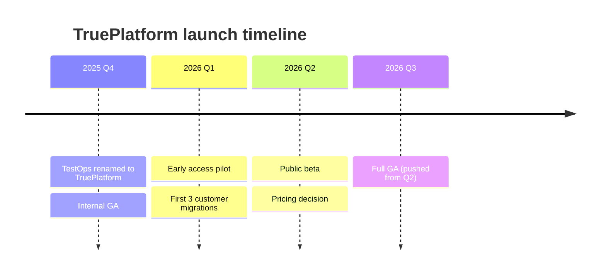

# Output Formats

The wiki stores markdown. Queries can emit richer artifacts when the audience
or question warrants it. Karpathy's original gist specifically calls out
Marp slide decks, matplotlib charts, and canvas output.

For PM work, non-markdown artifacts matter: stakeholder briefings need slides,
competitor pricing needs charts, customer lists need CSV.

## Artifact Filing Convention

Rich-format query answers go under `queries/<slug>/` as a directory with:

```
queries/
└── competitor-pricing-2026-q2/
    ├── README.md          # wiki page with frontmatter + links to artifacts
    ├── deck.md            # Marp source
    ├── deck.pdf           # rendered (optional, for sharing)
    ├── pricing-trend.png  # matplotlib output
    ├── pricing-trend.py   # script that generated it (for reproducibility)
    └── customers.csv      # structured export
```

The `README.md` is the wiki page, shows up in index.md, has frontmatter,
links to the artifacts. Artifacts are not standalone wiki pages.

## Format Selection

| Question type | Primary output | Secondary |
|---|---|---|
| "What do we know about X?" | Markdown page |, |
| "Compare A vs B vs C" | Comparison page (markdown table) | CSV if ≥10 rows |
| "Brief the leadership team on X" | Marp deck | Markdown summary |
| "Show the pricing trend over 6 months" | matplotlib PNG | CSV data |
| "Customer segment breakdown" | CSV + markdown summary | matplotlib bar chart |
| "Timeline of Kai launch decisions" | Markdown timeline | Mermaid diagram |
| "Give me a one-pager for the SE team" | Markdown | Marp if meeting-bound |

## Marp Slides

Marp renders markdown into slide decks. Obsidian has a plugin; standalone
CLI exists.

### When to use

- Leadership briefings (you're presenting live)
- Customer-facing competitive decks (abstracted, shareable)
- SE/sales enablement on new positioning
- Quarterly review summaries

### Template

`queries/<slug>/deck.md`:

```markdown
---
marp: true
theme: default
paginate: true
header: "PM Wiki | <topic>"
footer: "Private, do not distribute"
---

# <Topic>
## <Subtitle>
Anh Chu · YYYY-MM-DD

---

## Context

- Bullet 1
- Bullet 2

---

## Decision / Finding

> Key claim in one line

Supporting points:
- ...

---

## Appendix: Sources

- [[raw/articles/...]]
- [[raw/transcripts/...]]
```

### Render

```bash
# Install once
npm install -g @marp-team/marp-cli

# Generate PDF
marp queries/<slug>/deck.md --pdf
# or PPTX
marp queries/<slug>/deck.md --pptx
```

### Privacy

If the deck will leave your machine, check frontmatter for `private: true`
pages referenced and strip those sections before exporting.

## matplotlib Charts

For pricing trends, win/loss ratios, customer growth, any numeric series.

### Pattern

`queries/<slug>/chart.py`:

```python
"""Generate pricing trend chart from raw/articles analyst data.

Inputs sourced from:
- raw/articles/gartner-mq-2025.md
- raw/articles/forrester-wave-2026.md
- raw/articles/tricentis-price-2026-03.md
"""
import matplotlib.pyplot as plt
from pathlib import Path

dates = ["2024-Q4", "2025-Q2", "2025-Q4", "2026-Q2"]
tricentis = [2.0, 2.0, 1.8, 1.4]   # ratio vs Katalon Enterprise
smartbear = [1.1, 1.1, 1.2, 1.2]
katalon   = [1.0, 1.0, 1.0, 1.0]

fig, ax = plt.subplots(figsize=(10, 6))
ax.plot(dates, tricentis, marker="o", label="Tricentis")
ax.plot(dates, smartbear, marker="s", label="SmartBear")
ax.plot(dates, katalon,   marker="^", label="Katalon (baseline)")
ax.set_title("Enterprise test automation pricing vs Katalon (ratio)")
ax.set_ylabel("Price ratio (Katalon = 1.0)")
ax.legend()
ax.grid(alpha=0.3)

out = Path(__file__).parent / "pricing-trend.png"
plt.savefig(out, dpi=150, bbox_inches="tight")
print(f"wrote {out}")
```

### Run + commit both .py and .png

The `.py` is the source of truth (reproducible). The `.png` is what you
embed in markdown or share.

Reference in wiki page:

```markdown


_Generated by [chart.py](chart.py), re-run after new pricing data._
```

## CSV Exports

For data that needs further analysis (feeding to the data team, pivoting in
a spreadsheet, filtering mentally beyond markdown-table scope).

### Pattern

`queries/customer-segment-breakdown/customers.csv`:

```csv
customer,sector,arr_band,renewal_quarter,risk,private_ref
customer-alpha,financial,mid-6,2026-Q3,medium,<private>
customer-beta,retail,low-7,2026-Q4,low,<private>
customer-gamma,healthcare,mid-7,2027-Q1,high,<private>
```

### Always

- Keep a `README.md` next to the CSV explaining columns and sources
- If any real names appear, mark the parent page `private: true`
- Dataview can read CSVs in Obsidian via the Dataview CSV plugin

## Mermaid Diagrams

Inline in markdown pages for flows, timelines, org relationships. Obsidian
renders them natively.

### Use for

- Decision flow (how we arrived at X)
- Customer migration path
- Org relationships (who reports to whom, internal RACI)
- Timeline of competitor moves
- Dependency graphs between strategic bets

### Example

````markdown

````

## Canvas (Obsidian)

Freeform spatial layout. Use for:

- Competitive landscape maps (2x2 positioning)
- Strategic bets board (shipped / in flight / considered / rejected)
- Customer journey boards

Canvases live as `.canvas` files in Obsidian. Reference from the related
wiki page:

```markdown
Related: [[competitive-landscape-2026.canvas]]
```

Don't treat canvases as the source of truth, the markdown pages remain
authoritative. Canvas is a visualization layer.

## One-Pagers (Briefs)

Short markdown documents under `queries/<slug>/brief.md` for handing off to
someone else. Structure:

```markdown
---
title: Brief, <Topic> (for <audience>)
type: query
tags: [brief, <domain>]
sources: [entities/..., concepts/..., ...]
private: true
---

# <Topic>

**Audience**: <name or role>
**Ask**: <what you want them to do or decide>
**TL;DR**: <one sentence>

## What we know
## What we don't know yet
## Recommendation
## Supporting evidence
- [[...]]
```

## Agent Decision Rule

When filing a valuable query answer:

1. Always write the wiki page (markdown) under `queries/<slug>/README.md`
2. If the answer involves numeric data → add CSV + chart
3. If the answer is for a specific audience/meeting → add Marp deck
4. If the answer has spatial/relational structure → consider Mermaid or Canvas
5. Link all artifacts from the README.md

Never skip the markdown page. Rich formats augment, they don't replace.
