# svg-flow-diagram

用于生成 Excalidraw 风格的 SVG 流程图、架构图和节点关系图。默认保留原始 `svg`，同时可导出兼容转换器的 `flat.svg` 和可直接发送的 `png`。

## 目录

- `SKILL.md`：给代理读的技能定义
- `scripts/render_flow_svg.py`：主渲染器
- `scripts/flatten_svg_colors.py`：颜色扁平化辅助脚本
- `references/style-guide.md`：视觉规则
- `references/svg-recipes.md`：spec 格式和命令示例

## 示例展示

### base-template.svg



### Hermes Agent 架构图示例



## 安装

### Codex

Codex 用户级 skills 默认安装在：

```bash
~/.codex/skills/
```

如果你已经有这个 skill，只需要确认目录存在：

```bash
ls ~/.codex/skills/svg-flow-diagram
```

如果是手动安装或同步：

```bash
mkdir -p ~/.codex/skills
cp -R /path/to/svg-flow-diagram ~/.codex/skills/svg-flow-diagram
```

如果你想从工作目录软链接进去：

```bash
mkdir -p ~/.codex/skills
ln -s /path/to/svg-flow-diagram ~/.codex/skills/svg-flow-diagram
```

安装或更新后，重启 Codex 会话更稳妥。

### Claude Code

Claude Code 常见的技能目录是：

```bash
~/.claude/skills/
```

手动安装：

```bash
mkdir -p ~/.claude/skills
cp -R /path/to/svg-flow-diagram ~/.claude/skills/svg-flow-diagram
```

或者用软链接：

```bash
mkdir -p ~/.claude/skills
ln -s /path/to/svg-flow-diagram ~/.claude/skills/svg-flow-diagram
```

安装后开启新的 Claude Code 会话，让它重新发现技能。

## 使用方式

### Codex

推荐直接在提示词里点名技能：

```text
$svg-flow-diagram 帮我画一个 Hermes Agent 架构图，并把 png 发给我，同时保留 svg
```

如果需要显式指定路径：

```text
Use $svg-flow-diagram at /Users/you/.codex/skills/svg-flow-diagram to draw a Hermes Agent architecture diagram. Export svg and png, and tell me both file paths.
```

交付约定：

- `png`：用于聊天里发送和预览
- `svg`：用于继续编辑或二次加工
- 回复时应同时标注两者路径

### Claude Code

在 Claude Code 里，建议用“技能名 + 路径 + 任务”的方式，避免技能发现差异：

```text
Use $svg-flow-diagram at ~/.claude/skills/svg-flow-diagram to draw a Hermes Agent architecture diagram. Keep the original svg, also export a png preview, and tell me where both files were written.
```

中文也可以直接说：

```text
使用 $svg-flow-diagram（路径 ~/.claude/skills/svg-flow-diagram）帮我画一个 Hermes Agent 架构图，保留 svg，同时导出 png 发给我，并告诉我两个文件的位置。
```

## 命令行直跑

如果你不通过代理，而是直接跑脚本：

```bash
SKILL_DIR="${CODEX_HOME:-$HOME/.codex}/skills/svg-flow-diagram"
python3 "$SKILL_DIR/scripts/render_flow_svg.py" \
  /absolute/path/to/spec.json \
  /absolute/path/to/output.svg \
  --flat-svg-out /absolute/path/to/output.flat.svg \
  --png-out /absolute/path/to/output.png
```

这条命令会产出三份文件：

- `output.svg`：原始矢量
- `output.flat.svg`：兼容大多数 SVG 转 PNG 工具的扁平版
- `output.png`：可直接发送的图片

## 推荐交付规范

生成完成后，默认按下面的方式回复用户：

1. 发送 `png` 预览
2. 告知 `png` 文件位置
3. 告知 `svg` 文件位置
4. 如有需要，再补充 `flat.svg` 位置

推荐表述：

```text
已生成图片：
- PNG: /absolute/path/to/output.png
- SVG: /absolute/path/to/output.svg
```

## 注意事项

- 如果导出的 PNG 变黑，优先检查 SVG 转换器是否完整支持 CSS 变量。
- 本 skill 现在已经把颜色扁平化步骤并入交付链，优先用 `--flat-svg-out` + `--png-out`。
- 对复杂图，先拆主流程和支线，不要把“系统构成”和“执行时序”强塞进一张图。
