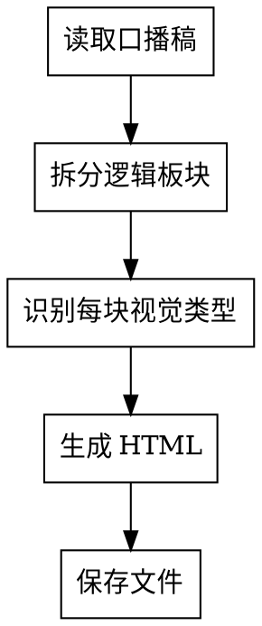

# 口播稿 → 板书 HTML 幻灯片

## Overview

将口播稿拆解为 5-8 张幻灯片，生成一个带手绘风格 SVG 插图的 HTML 文件。
录屏时当背景板讲解用。

## Input

口播稿文本（中文，通常 800-2000 字）

## Output

一个完整的 HTML 文件，保存到 `~/Downloads/[topic]-board.html`

## Process



### Step 1: 拆分口播稿为逻辑板块

将口播稿拆成 5-8 个逻辑单元，每个单元 = 1 张 slide。

拆分原则：
- 每张 slide 只讲一个核心观点
- 开头/定义类内容独占一张
- 对比内容独占一张
- 金句/总结独占一张
- 不要超过 8 张（录屏节奏太慢）

### Step 2: 识别每个板块的视觉类型

| 口播内容类型 | 视觉模式 | 布局 |
|------------|---------|------|
| 定义/概念解释 | 类比插图（SVG） | text-col + art-col |
| A vs B 对比 | 左右对比表格 `.compare` | 全宽 |
| 列举问题/要点 | 卡片网格（2-3列） | 全宽 grid |
| 流程/步骤 | 流程箭头 `.flow` | text-col + art-col |
| 时间线/演进 | 时间轴 SVG | text-col + art-col |
| 核心金句/总结 | `.callout` 高亮框 | text-col + art-col |

### Step 3: 生成 HTML

使用 board-template.html 作为基础模板。关键要素：

**字体**：Caveat（手写英文） + Noto Sans SC（中文正文）
**配色**：
- `--ink: #1a1a1a`（主色）
- `--accent-red: #c0392b`（强调/警告）
- `--accent-blue: #2c5f8a`（流程/结构）
- `--accent-green: #2d6a4f`（正面/完成）
- `--paper: #faf8f3`（背景纸张色）

**每张 Slide 结构**：
```html
<div class="slide" id="s1">
  <div class="slide-num">1 / N</div>
  <div class="slide-title">
    中文标题
    <span class="en">English subtitle</span>
  </div>
  <div class="slide-body">
    <div class="text-col">
      <!-- 文字内容：.point / .callout / .flow / .compare -->
    </div>
    <div class="art-col">
      <!-- 手绘 SVG 插图 -->
    </div>
  </div>
</div>
```

## SVG 插图规范

每张有 art-col 的 slide 都需要一个手绘风格的 SVG。

**尺寸**：150-180px 宽，200-230px 高
**风格要求**：
- 使用 `stroke` 而非 `fill`（线条画风格）
- 圆角矩形 `rx="3-4"` 模拟手绘
- 虚线 `stroke-dasharray="4,3"` 表示关联/传递
- 文字用 `font-family="Caveat, cursive"`
- 颜色只用 CSS 变量中的 4 种
- 适当使用 emoji 作为标记符号
- 可以画：方框、圆、箭头、连线、标注

**SVG 内容选择**：
- 定义类 → 类比图（如引擎=车、马=挽具）
- 流程类 → 上下流转图
- 对比类 → 左右对称图
- 演进类 → 时间轴

## 可用组件

### 要点列表 `.point`
```html
<div class="point">
  <div class="point-marker">①</div>
  <div class="point-text">
    <strong>加粗关键词</strong>带荧光笔效果
    <div class="point-sub">灰色补充说明</div>
  </div>
</div>
```

### 高亮框 `.callout`
```html
<div class="callout">核心金句放这里</div>
```
自带 ★ 装饰和暖纸背景。

### 流程图 `.flow`
```html
<div class="flow">
  <div class="flow-item">
    <div class="flow-box blue">步骤名</div>
    <div class="flow-label">补充说明</div>
  </div>
  <div style="padding-left:20px; font-size:22px; color:#aaa;">↓</div>
  <!-- 重复 -->
</div>
```
颜色类：`.red` `.blue` `.green`

### 对比表格 `.compare`
```html
<div class="compare">
  <div class="compare-header">A 方案</div>
  <div class="compare-header">B 方案</div>
  <div class="compare-cell">A 的特点</div>
  <div class="compare-cell">B 的特点</div>
</div>
```

### 标签 `.tag`
```html
<span class="tag red">关键词</span>
<span class="tag blue">分类</span>
```

## 完整模板

生成 HTML 时，使用 board-template.html 中的完整 CSS 和 JS。
只需要替换 slides 内容和 `total` 变量。

**IMPORTANT**: 参考 @board-template.html 获取完整的 CSS 样式和 JS 导航逻辑。
每次生成时复制完整模板，只替换 `<!-- SLIDES GO HERE -->` 部分。

## Quality Checklist

- [ ] 每张 slide 只有一个核心观点
- [ ] 标题简洁有力（中文 + 英文副标题）
- [ ] SVG 插图与内容相关，不是装饰
- [ ] strong 标签用在真正的关键词上
- [ ] 金句/核心观点用 .callout 框出
- [ ] 总 slide 数在 5-8 张之间
- [ ] HTML 文件可直接浏览器打开使用
