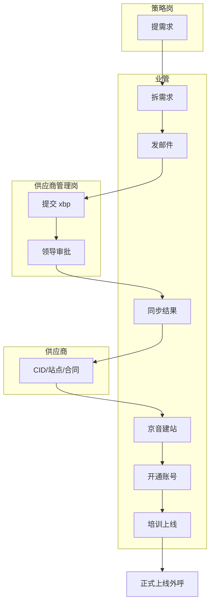

# 供应商引入 SOP

> **用途**：自用执行清单 + 审计查看
> **状态**：v1.0（含 9 个模板）
> **最后更新**：2026-03-12

---

## 表格速查版

| 阶段 | 名称 | 触发条件 | 责任人 | 输入物 | 输出物 | 预计时效 |
|------|------|---------|--------|--------|--------|---------|
| **1** | 需求发起 | 策略岗提出新供应商需求 | 策略岗 | 业务缺口分析 | 《需求清单》 | T+0 |
| **2** | 需求拆解 | 收到《需求清单》 | 业管/供应商管理岗 | 《需求清单》 | 《寻源需求表》 | T+1 |
| **3** | 寻源触达 | 《寻源需求表》确认 | 业管 | 《寻源需求表》 | 供应商回复 + 意向名单 | T+3 |
| **4** | 方案审批 | 完成初步筛选 | 供应商管理岗 | 意向名单 + 评估表 | xbp 方案 + 领导审批 | T+5 |
| **5** | 结果同步 | 领导审批通过 | 供应商管理岗 | 审批通过方案 | 《结果同步邮件》 | T+5 |
| **6** | 供应商准备 | 结果同步完成 | 供应商 | 准入通知 | CID/站点报备/合同 | T+10 |
| **7** | 内部操作 | 供应商完成准备 | 业管/供应商管理岗 | 供应商准备完成确认 | 京音架构 + 账号开通 | T+12 |
| **8** | 培训上线 | 账号开通完成 | 供应商 + 业管 | 账号 + 培训材料 | 正式上线外呼 | T+15 |

**整体时效**：从需求发起到上线外呼，标准周期 **15 个工作日**

---

## 详细流程

### 阶段 1：需求发起

**触发条件**：策略岗识别到业务缺口，需要新供应商承接

**责任人**：策略岗

**输入物**：
- 业务量预测数据
- 现有供应商产能分析
- 缺口说明

**执行清单**：
- [ ] 策略岗填写《需求清单》
- [ ] 明确需求量（人力/产能）
- [ ] 明确业务类型（拉新/复购）
- [ ] 明确时效要求

**输出物**：《需求清单》（邮件/文档）

**验收标准**：需求清晰、可拆解、可执行

**审计检查点**：
- [ ] 《需求清单》是否存档
- [ ] 需求是否有数据支撑
- [ ] 是否有策略岗负责人签字/确认

---

### 阶段 2：需求拆解

**触发条件**：收到策略岗《需求清单》

**责任人**：业管/供应商管理岗

**输入物**：《需求清单》

**执行清单**：
- [ ] 解读需求（业务类型、人力规模、技能要求）
- [ ] 拆解成可执行需求（供应商画像）
- [ ] 评估现有供应商承接能力
- [ ] 确定是否需要外部寻源
- [ ] 填写《寻源需求表》

**输出物**：《寻源需求表》

**验收标准**：需求具体化、可量化、可筛选供应商

**审计检查点**：
- [ ] 《寻源需求表》是否存档
- [ ] 是否有现有供应商评估记录
- [ ] 外部寻源决策是否有依据

---

### 阶段 3：寻源触达

**触发条件**：《寻源需求表》确认需要外部寻源

**责任人**：业管

**输入物**：《寻源需求表》

**执行清单**：
- [ ] 选择邮件模板（简单版/详细版）
- [ ] 发送寻源邮件给目标供应商
- [ ] 设定回复截止时间
- [ ] 跟进未回复供应商
- [ ] 收集供应商回复
- [ ] 初步筛选意向供应商

**输出物**：供应商回复汇总 + 意向名单

**验收标准**：≥3 家有效回复，有明确意向

**审计检查点**：
- [ ] 寻源邮件是否存档（简单版/详细版）
- [ ] 回复供应商名单是否记录
- [ ] 筛选标准是否客观、可追溯

**模板链接**：
- 寻源邮件模板（简单版）- 见附录模板 1
- 寻源邮件模板（详细版）- 见附录模板 2

---

### 阶段 4：方案审批

**触发条件**：完成供应商初步筛选

**责任人**：供应商管理岗

**输入物**：
- 意向供应商名单
- 供应商评估表

**执行清单**：
- [ ] 整理供应商资质信息
- [ ] 填写 xbp 方案
- [ ] 附上供应商评估材料
- [ ] 提交领导审批
- [ ] 跟进审批进度
- [ ] 根据反馈补充材料

**输出物**：xbp 审批通过方案

**验收标准**：领导审批通过，无 pending 问题

**审计检查点**：
- [ ] xbp 方案是否存档
- [ ] 审批流程是否完整
- [ ] 领导审批意见是否记录
- [ ] 补充材料是否完整

**模板链接**：
- xbp 方案模板 - 见附录模板 3

---

### 阶段 5：结果同步

**触发条件**：领导审批通过

**责任人**：供应商管理岗

**输入物**：审批通过方案

**执行清单**：
- [ ] 起草《结果同步邮件》
- [ ] 发送给策略岗（需求方）
- [ ] 发送给业管（执行方）
- [ ] 发送给供应商（入选/未入选通知）
- [ ] 存档同步记录

**输出物**：《结果同步邮件》+ 发送记录

**验收标准**：各方都收到通知，无信息差

**审计检查点**：
- [ ] 《结果同步邮件》是否存档
- [ ] 发送名单是否完整
- [ ] 供应商通知是否规范（入选/未入选）

**模板链接**：
- 结果同步邮件模板 - 见附录模板 4
- 供应商入选通知模板 - 见附录模板 5
- 供应商未入选通知模板 - 见附录模板 6

---

### 阶段 6：供应商准备

**触发条件**：结果同步完成

**责任人**：供应商（配合业管/供应商管理岗跟进）

**输入物**：准入通知

**执行清单**（供应商执行，业管跟进）：
- [ ] 供应商同步 CID 信息
- [ ] 完成站点报备
- [ ] 确认合同模板
- [ ] 提交所需资质文件

**输出物**：
- CID 信息表
- 站点报备确认单
- 合同模板确认函

**验收标准**：三项准备全部完成，无遗漏

**审计检查点**：
- [ ] CID 信息是否存档
- [ ] 站点报备是否有记录
- [ ] 合同模板是否确认并存档
- [ ] 资质文件是否完整

**模板链接**：
- CID 信息收集表 - 见附录模板 7
- 站点报备模板 - 见附录模板 8
- 合同模板确认函 - 见附录模板 9

---

### 阶段 7：内部操作

**触发条件**：供应商完成阶段 6 准备

**责任人**：业管/供应商管理岗

**输入物**：
- CID 信息
- 站点报备确认
- 合同模板确认

**执行清单**：
- [ ] 在京音上建供应商
- [ ] 建立供应商架构
- [ ] 开通账号
- [ ] 配置权限
- [ ] 测试账号可用性

**输出物**：
- 京音供应商档案
- 账号开通确认
- 权限配置记录

**验收标准**：账号可用，权限配置正确

**审计检查点**：
- [ ] 京音系统是否有供应商档案
- [ ] 账号开通记录是否存档
- [ ] 权限配置是否符合规范
- [ ] 是否有账号测试记录

---

### 阶段 8：培训上线

**触发条件**：账号开通完成

**责任人**：供应商（执行培训）+ 业管（组织/跟进）

**输入物**：
- 开通的账号
- 培训材料

**执行清单**：
- [ ] 供应商完成培训
- [ ] 培训考核/验收
- [ ] 安排上线外呼
- [ ] 监控首日外呼质量
- [ ] 记录上线情况

**输出物**：
- 培训完成记录
- 上线外呼记录
- 首日质量报告

**验收标准**：供应商正式上线，开始外呼

**审计检查点**：
- [ ] 培训记录是否存档
- [ ] 培训考核结果是否记录
- [ ] 上线外呼时间是否记录
- [ ] 首日质量报告是否存档

---

## 附录：流程全景图

**流程说明**：

| 步骤 | 动作 | 责任方 |
|------|------|--------|
| 1 | 提出新供应商需求 | 策略岗 |
| 2 | 拆解需求成寻源要求 | 业管 |
| 3 | 发送寻源邮件 | 业管 |
| 4 | 提交 xbp 方案 | 供应商管理岗 |
| 5 | 领导审批 | 供应商管理岗 |
| 6 | 同步结果给各方 | 业管 |
| 7 | 准备 CID/站点/合同 | 供应商 |
| 8 | 京音系统建站 | 业管 |
| 9 | 开通账号 | 业管 |
| 10 | 培训上线 | 业管 + 供应商 |
| 11 | 正式外呼 | 供应商 |

---

## 附录：关键时效

| 阶段 | 标准时效 | 最长容忍 | 超时处理 |
|------|---------|---------|---------|
| 1. 需求发起 | T+0 | T+1 | 策略岗跟进 |
| 2. 需求拆解 | T+1 | T+2 | 业管跟进 |
| 3. 寻源触达 | T+3 | T+5 | 追加供应商 |
| 4. 方案审批 | T+5 | T+7 | 领导催批 |
| 5. 结果同步 | T+5 | T+6 | 当天完成 |
| 6. 供应商准备 | T+10 | T+12 | 供应商催办 |
| 7. 内部操作 | T+12 | T+14 | 业管跟进 |
| 8. 培训上线 | T+15 | T+17 | 协调资源 |

---

## 附录：模板库

### 模板 1：寻源邮件（简单版）

> **适用场景**：快速寻源，供应商已有一定了解，需求简单明确

**主题**：【寻源邀约】京东电销 BPO 供应商合作邀约

---

尊敬的 [供应商名称]：

您好！我是京东数据科技业务部电销服务组 [姓名]，现诚邀贵司参与京东电销 BPO 项目合作。

**项目概况：**
- 业务类型：[拉新/复购]
- 预计规模：[X] 人坐席
- 期望上线时间：[YYYY-MM-DD]
- 合作模式：BPO 外包

**资质要求：**
- 注册资金 ≥ [X] 万元
- 有电销/呼叫中心运营经验
- 能接受京东合规管理要求

**回复材料：**
- 公司基本信息（营业执照、法人信息）
- 相关项目经验介绍
- 可投入人力规模
- 联系人及联系方式

**截止时间：** 请于 [YYYY-MM-DD HH:MM] 前回复本邮件。

期待您的回复！

此致
敬礼

[姓名] | 京东数据科技业务部电销服务组
[电话] | [邮箱]

---

### 模板 2：寻源邮件（详细版）

> **适用场景**：首次合作供应商、复杂业务需求、需要充分信息披露

**主题**：【寻源邀约】京东电销 BPO 供应商合作邀约（[业务线名称]）

---

尊敬的 [供应商名称]：

您好！我是京东数据科技业务部电销服务组 [姓名]，现诚邀贵司参与京东电销 BPO 项目合作。

**一、项目背景：**
[简要说明业务背景，如：为支撑 XX 业务增长，需引入优质 BPO 供应商承接电销外呼业务]

**二、业务需求详情：**

| 项目 | 内容 |
|------|------|
| 业务类型 | [拉新/复购/具体产品线] |
| 预计规模 | 首期 [X] 席，峰值可达 [X] 席 |
| 人员要求 | 学历、年龄、语言要求等 |
| 职场要求 | [地点/职场条件] |
| 期望上线时间 | [YYYY-MM-DD] |
| 合作模式 | BPO 外包（具体结算方式后续沟通） |

**三、资质要求：**
- 公司注册满 [X] 年，注册资金 ≥ [X] 万元
- 有电销/电话营销/呼叫中心运营经验（需提供案例）
- 具备完善的培训体系和质量管理体系
- 能接受京东合规管理要求（信息安全、录音质检等）
- 无重大法律纠纷和信用记录不良

**四、回复材料清单：**
1. 公司基本信息（营业执照扫描件、法人信息）
2. 公司简介及发展历程
3. 相关项目经验（至少 2 个案例，含甲方名称、项目规模、合作时长）
4. 可投入人力规模及招聘能力说明
5. 培训体系和质量管理体系介绍
6. 联系人及联系方式（姓名、职务、电话、邮箱）

**五、后续流程：**
1. [YYYY-MM-DD] 截止回复
2. [YYYY-MM-DD] 完成初步筛选
3. [YYYY-MM-DD] 安排线上/线下沟通
4. [YYYY-MM-DD] 提交内部审批
5. 审批通过后通知入选结果

**截止时间：** 请于 [YYYY-MM-DD HH:MM] 前回复本邮件。

如有疑问，欢迎随时联系。

此致
敬礼

[姓名] | 京东数据科技业务部电销服务组
[电话] | [邮箱]

---

### 模板 3：xbp 方案模板

> **适用场景**：提交领导审批

# 新供应商引入方案

## 一、方案摘要

| 项目 | 内容 |
|------|------|
| 申请部门 | 数据科技业务部电销服务组 |
| 申请人 | [姓名] |
| 申请日期 | [YYYY-MM-DD] |
| 拟引入供应商 | [供应商名称] |
| 业务类型 | [拉新/复购] |
| 预计规模 | [X] 人坐席 |
| 期望上线时间 | [YYYY-MM-DD] |

**核心建议**：建议引入 [供应商名称] 承接 [业务线] 电销外呼业务，首期规模 [X] 人，预计 [YYYY-MM-DD] 上线。

---

## 二、需求背景

### 2.1 业务缺口
[说明为什么要引入新供应商，如：现有供应商产能不足/新业务线需要/风险分散等]

### 2.2 需求量测算
| 业务线 | 当前产能 | 需求预测 | 缺口 |
|--------|---------|---------|------|
| [业务线 1] | [X] 人 | [X] 人 | [X] 人 |
| [业务线 2] | [X] 人 | [X] 人 | [X] 人 |

---

## 三、寻源过程

### 3.1 触达供应商名单
| 序号 | 供应商名称 | 触达时间 | 回复情况 | 初步评估 |
|------|-----------|---------|---------|---------|
| 1 | [A 公司] | [MM-DD] | 已回复/未回复 | 意向强烈/一般/无意向 |
| 2 | [B 公司] | [MM-DD] | 已回复/未回复 | 意向强烈/一般/无意向 |
| 3 | [C 公司] | [MM-DD] | 已回复/未回复 | 意向强烈/一般/无意向 |

### 3.2 筛选标准
- [ ] 资质符合要求（注册资金、成立时间、无不良记录）
- [ ] 有相关项目经验
- [ ] 可投入人力规模满足需求
- [ ] 配合度高，响应及时

---

## 四、推荐供应商评估

### 4.1 基本信息
| 项目 | 内容 |
|------|------|
| 供应商名称 | [全称] |
| 成立时间 | [YYYY-MM] |
| 注册资金 | [X] 万元 |
| 法人代表 | [姓名] |
| 主营业务 | [描述] |
| 现有合作甲方 | [列举] |

### 4.2 核心能力评估
| 维度 | 评估 | 评分 (1-5) |
|------|------|----------|
| 资质合规 | [描述] | [X] |
| 项目经验 | [描述] | [X] |
| 招聘能力 | [描述] | [X] |
| 培训体系 | [描述] | [X] |
| 质量管理 | [描述] | [X] |
| 配合意愿 | [描述] | [X] |
| **综合评分** | | **[X]/30** |

### 4.3 风险点及应对
| 风险 | 等级 | 应对措施 |
|------|------|---------|
| [如：无电销经验] | 中 | [安排专人带教/设置保护期] |
| [如：职场异地] | 低 | [远程质检/定期巡检] |

---

## 五、合作方案

### 5.1 分量安排
- 首期规模：[X] 人
- 测试期：[X] 个月
- 测试期后评估达标后，可扩展至 [X] 人

### 5.2 定价建议
[如有，填写定价方案；如按现有标准执行，注明"按现行 BPO 定价标准执行"]

### 5.3 集中度检查
引入后供应商集中度是否符合要求：
- 当前 TOP3 供应商占比：[X]%
- 引入后 TOP3 供应商占比：[X]%
- 是否符合集中度要求：[是/否]

---

## 六、审批请求

**请领导审批**：
1. 同意引入 [供应商名称] 作为京东电销 BPO 供应商
2. 批准首期规模 [X] 人
3. 批准 [YYYY-MM-DD] 上线计划

---

## 附件
1. 供应商营业执照扫描件
2. 供应商评估表
3. 寻源邮件往来记录
4. [其他材料]

---

### 模板 4：结果同步邮件

> **适用场景**：领导审批通过后，同步各方

**主题**：【结果同步】关于引入 [供应商名称] 承接 [业务线] 的通知

---

各位同事：

关于 [业务线] 新供应商引入事项，已完成内部审批，现将结果同步如下。

**一、审批结果：**
- 审批状态：✅ 已通过
- 审批时间：[YYYY-MM-DD]
- 引入供应商：[供应商名称]
- 首期规模：[X] 人坐席
- 期望上线：[YYYY-MM-DD]

**二、后续安排：**

| 阶段 | 责任方 | 预计完成时间 |
|------|--------|-------------|
| 供应商准备（CID/站点/合同） | 供应商 | T+10 |
| 内部建档开通账号 | 业管 | T+12 |
| 培训上线 | 供应商 + 业管 | T+15 |

**三、各方协作事项：**
- **策略岗：** 请准备业务对接材料，协助供应商理解业务
- **业管：** 请跟进供应商准备进度，完成内部建档和账号开通
- **供应商：** 请按准入通知要求完成 CID 同步、站点报备、合同确认

感谢各位的支持与配合！

此致
敬礼

[姓名] | 京东数据科技业务部电销服务组
[日期]

**抄送：** 策略岗、业管、相关领导

---

### 模板 5：供应商入选通知

> **适用场景**：通知供应商入选

**主题**：【入选通知】欢迎加入京东电销 BPO 合作伙伴

---

尊敬的 [供应商名称]：

恭喜贵司通过京东电销 BPO 供应商筛选，成功入选 [业务线] 项目合作伙伴！

**一、入选信息确认：**
- 业务类型：[拉新/复购]
- 首期规模：[X] 人坐席
- 期望上线时间：[YYYY-MM-DD]

**二、下一步安排：**

请贵司在 [X] 个工作日内完成以下三项准备：

1. **CID 信息同步**：填写附件《CID 信息收集表》，提供公司基本信息
2. **站点报备**：填写附件《站点报备模板》，提供拟运营站点信息
3. **合同确认**：查阅附件合同模板，确认无异议后回复

**三、对接人信息：**
- 京东对接人：[姓名]
- 联系方式：[电话/邮箱]

再次祝贺贵司入选！期待合作愉快！

此致
敬礼

[姓名] | 京东数据科技业务部电销服务组
[日期]

**附件：**
- 附件 1：CID 信息收集表.xlsx
- 附件 2：站点报备模板.xlsx
- 附件 3：BPO 合同模板.pdf

---

### 模板 6：供应商未入选通知

> **适用场景**：通知供应商未入选

**主题**：【结果通知】京东电销 BPO 供应商筛选结果

---

尊敬的 [供应商名称]：

感谢贵司参与京东电销 BPO 供应商寻源项目。

经过综合评估，本次暂未能与贵司建立合作。主要原因如下：
- [原因 1：如"当前业务需求已满足"]
- [原因 2：如"资质条件与当前需求不完全匹配"]
- [原因 3：可选，如"已有类似供应商承接"]

我们已将贵司信息纳入供应商储备库，未来如有合适机会，将优先联系。

再次感谢贵司的关注与支持！

此致
敬礼

[姓名] | 京东数据科技业务部电销服务组
[日期]

---

### 模板 7：CID 信息收集表

> **格式建议**：Excel 表格

| 字段名称 | 填写说明 | 示例 |
|---------|---------|------|
| 公司全称 | 营业执照上的完整名称 | XX 科技有限公司 |
| 公司简称 | 对外简称 | XX 科技 |
| 统一社会信用代码 | 18 位信用代码 | 91110108MA00XXXX |
| 注册地址 | 营业执照注册地址 | 北京市 XX 区 XX 路 XX 号 |
| 实际经营地址 | 实际办公地址 | 北京市 XX 区 XX 大厦 X 层 |
| 法人代表 | 法人姓名 | 张三 |
| 法人身份证号 | 18 位身份证号 | 110101XXXXXXXX1234 |
| 联系人 | 项目对接人姓名 | 李四 |
| 联系人职务 | 对接人职务 | 项目经理 |
| 联系人电话 | 手机号 | 138XXXXXXXX |
| 联系人邮箱 | 公司邮箱优先 | lisi@xx.com |
| 公司官网 | 如有 | www.xx.com |
| 成立时间 | YYYY-MM | 2020-01 |
| 注册资金 | 万元 | 1000 |
| 员工规模 | 人 | 500 |
| 主营业务 | 简要描述 | 呼叫中心外包、电话营销 |
| 现有合作甲方 | 列举 1-3 个 | 某保险公司、某银行 |

---

### 模板 8：站点报备模板

> **格式建议**：Excel 表格

| 字段名称 | 填写说明 | 示例 |
|---------|---------|------|
| 站点编号 | 供应商内部编号 | SITE-BJ-001 |
| 站点名称 | 站点全称 | 北京朝阳呼叫中心 |
| 所在省份 | 省级行政区 | 北京市 |
| 所在城市 | 地级市 | 北京市 |
| 详细地址 | 详细到楼层 | 北京市朝阳区 XX 路 XX 号 XX 大厦 X 层 |
| 职场面积 | 平方米 | 1000 |
| 最大坐席数 | 可同时容纳坐席数 | 200 |
| 当前使用坐席数 | 实际使用数 | 50 |
| 站点负责人 | 姓名 + 电话 | 王五 139XXXXXXXX |
| 启用时间 | YYYY-MM | 2024-01 |
| 职场类型 | 自建/租赁 | 租赁 |
| 电力保障 | 是否有备用电源 | 是/否 |
| 网络运营商 | 主用网络 | 联通/电信/移动 |
| 备用网络 | 备用网络 | 联通/电信/移动 |
| 备注 | 其他说明 | 7x24 小时运营 |

---

### 模板 9：合同模板确认函

> **适用场景**：供应商回复合同确认结果

**主题**：【合同确认】BPO 合同模板确认回复

---

尊敬的京东数据科技业务部电销服务组：

我司已收到并仔细查阅贵司提供的《BPO 合同模板》。

**确认结果：**
- ✅ 我司同意按此合同模板签署合作协议
- ⚠️ 我司有以下修改建议/异议条款：

**异议条款说明（如有）：**

| 条款编号 | 原条款内容 | 建议修改为 | 修改理由 |
|---------|-----------|-----------|---------|
| [如：第 X 条] | [原内容] | [建议内容] | [理由] |

**其他说明：**
[如有其他需要沟通的事项，请在此说明]

期待与贵司的顺利合作！

此致
敬礼

[供应商名称]
[联系人姓名]
[职务]
[电话]
[邮箱]
[日期]

---

## 附录：SOP 使用指南

### 如何使用本 SOP

| 场景 | 用法 |
|------|------|
| **第一次执行供应商引入** | 从头到尾按顺序阅读，跟随 8 个阶段的执行清单逐项打勾 |
| **审计检查** | 直接跳到"审计检查点"部分，核对每阶段的文档是否存档 |
| **查时效** | 查看"表格速查版"或"关键时效"部分，确认当前进度是否正常 |
| **找模板** | 直接跳到"附录：模板库"，复制对应模板修改使用 |

### SOP 修订原则

- 每次执行后，如发现流程不顺，记录到修订日志
- 模板使用后，如有优化建议，提交更新
- 每季度回顾一次，确保 SOP 与实际工作一致

---

## 修订记录

| 版本 | 日期 | 修订内容 | 修订人 |
|------|------|---------|--------|
| v1.0 | 2026-03-12 | 框架版发布（8 阶段 + 9 模板） | Mino |
