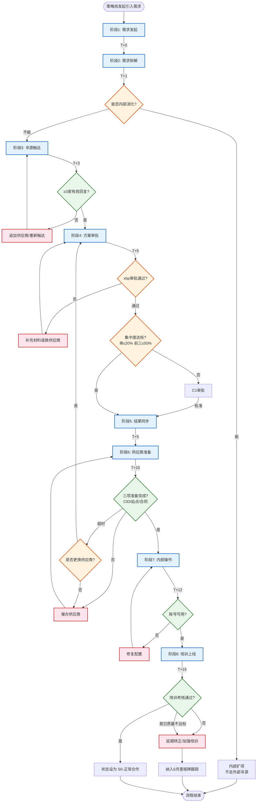
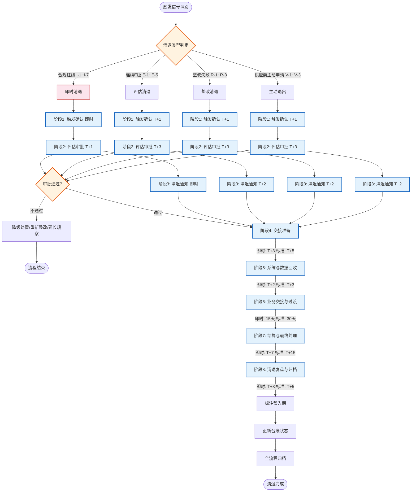
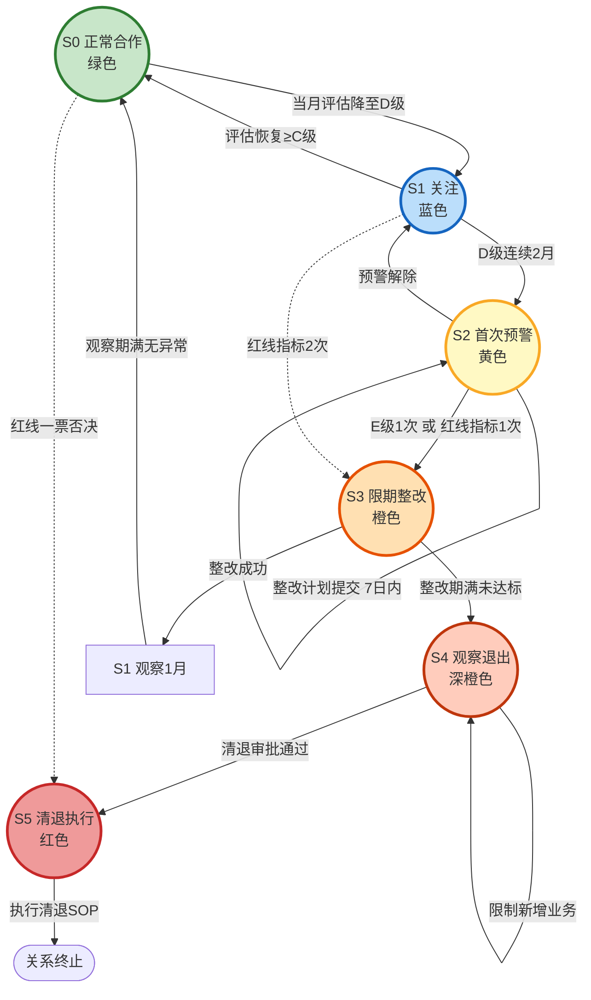
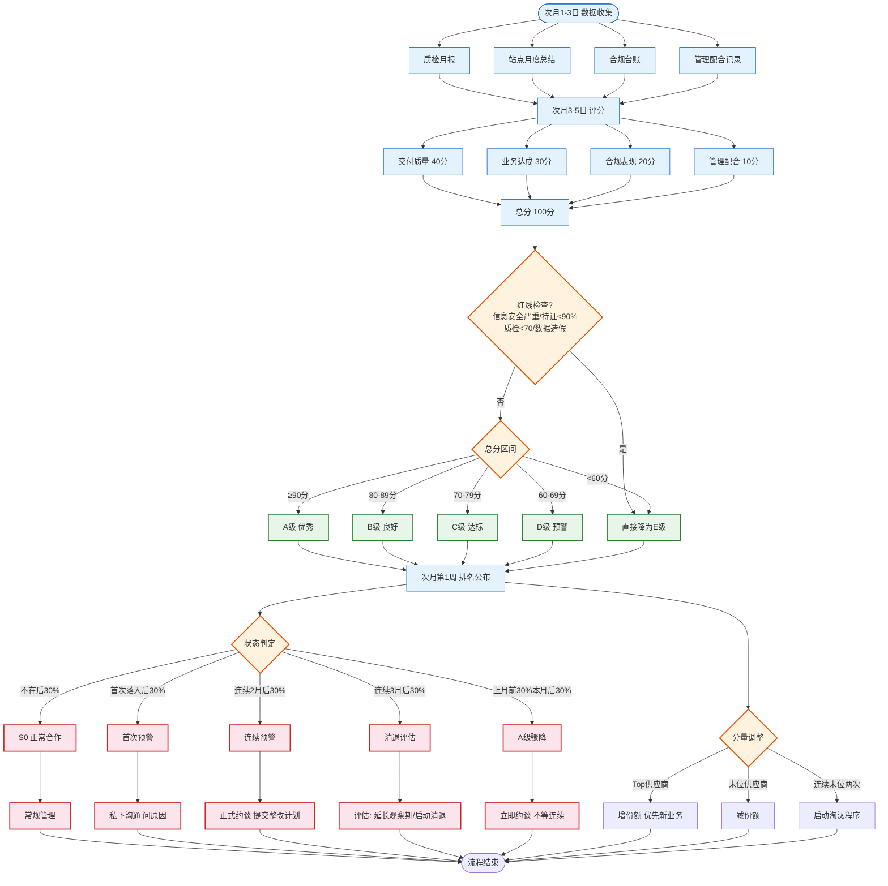

# 供应商管理规范 — 流程图集

> **文件编码**：TM-2026-300
> **版本**：V1.0
> **生效日期**：2026年__月__日
> **对标来源**：供应商引入管理规范（SM-2026-010）、供应商清退管理规范（SM-2026-040）、供应商日常管理规范（SM-2026-020）、供应商状态机（SM-2026-091）

---

## 1. 供应商引入流程图（8阶段）

> 来源：SM-2026-010 §4，标准周期 T+15 工作日

---

## 2. 供应商清退流程图（8阶段）

> 来源：SM-2026-040 §5，标准周期约50-60天，即时清退约15天

---

## 3. 日常管理流程图（7个核心场景）

> 来源：SM-2026-020，覆盖信息报送、人员管理、运营合规、异常处理、沟通会议、分量产能、状态监控

```mermaid
graph TD
    subgraph 场景1: 信息报送
        D1[每日10:00前 出勤报送] --> D2[每日下线前 业绩报送]
        D2 --> D3[每日下班前 排班报送]
        D3 --> W1[每周五下班前 周报]
        W1 --> M1[次月3日前 月度总结]
        M1 --> M2[每月25日前 合规自查报告]
    end

    subgraph 场景2: 人员管理
        P1[上岗前: 入职培训+合规培训+考核+持证] --> P2[30天试用期 质检2倍抽检]
        P2 --> P3[定期复训: 月度业务/季度合规/按需话术]
        P3 --> P4{人员变动?}
        P4 -->|新入职| P5[上岗前3工作日报备]
        P4 -->|离职| P6[主动提前3工作日/被动即时]
        P4 -->|大面积≥3人/月| P7[第一人离职时即时报备+专项复盘]
        P5 --> P8[花名册实时更新]
        P6 --> P8
        P7 --> P8
    end

    subgraph 场景3: 运营合规
        Q1[信息安全红线 0容忍] --> Q2[持证上岗 100%]
        Q2 --> Q3[数据真实性 零造假]
        Q3 --> Q4[录音留存 ≥6个月 100%]
        Q4 --> Q5[供应商自建7模块制度 15工作日内提交]
    end

    subgraph 场景4: 异常处理
        E1[异常发生] --> E2{异常级别?}
        E2 -->|一般异常| E3[站点自行处理 当日群内报备]
        E2 -->|重要异常| E4[2h内书面+电话 升级供管岗]
        E2 -->|紧急异常| E5[立即电话 联合处理]
        E3 --> E6[记录台账 闭环]
        E4 --> E6
        E5 --> E6
    end

    subgraph 场景5: 沟通会议
        C1[日常群消息 30min回复] --> C2[周度业务复盘会 每周1次]
        C2 --> C3[月度评估沟通会 次月第1周]
        C3 --> C4{专项沟通会?}
        C4 -->|C级及以下| C5[约谈站点负责人]
        C4 -->|触发预警| C6[要求提交整改计划]
        C4 -->|重大业务调整| C7[业务方/供管岗发起]
    end

    subgraph 场景6: 分量与产能管理
        F1[月度赛马排名] --> F2{产能达标?}
        F2 -->|≥90%| F3[Top增份额]
        F2 -->|<80%预警| F4[产能诊断四象限]
        F2 -->|<70%红线| F5[红线处置]
        F4 --> F6{四象限类型?}
        F6 -->|问题型 双低| F7[立即约谈 内部管理问题]
        F6 -->|尽力型 自身高/头部低| F8[评估产线适配]
        F6 -->|暂时波动 自身低/头部高| F9[观察2周]
        F6 -->|标杆型 双高| F10[标杆分享]
        F3 --> F11[集中度检查 单≤20% 前三≤50%]
    end

    subgraph 场景7: 状态监控与预警
        G1[月度评估出分] --> G2{评估等级?}
        G2 -->|≥C级 无红线| G3[S0 正常合作]
        G2 -->|D级1次| G4[S1 关注]
        G2 -->|D级连续2月| G5[S2 首次预警]
        G2 -->|E级1次| G6[S3 限期整改]
        G2 -->|整改未达标/E级连续2月| G7[S4 观察退出]
        G2 -->|清退审批通过/红线| G8[S5 清退执行]
    end

    classDef scene fill:#e3f2fd,stroke:#1565c0,stroke-width:1px
    class D1,D2,D3,W1,M1,M2,P1,P2,P3,P4,P5,P6,P7,P8,Q1,Q2,Q3,Q4,Q5,E1,E2,E3,E4,E5,E6,C1,C2,C3,C4,C5,C6,C7,F1,F2,F3,F4,F5,F6,F7,F8,F9,F10,F11,G1,G2,G3,G4,G5,G6,G7,G8 scene
```

---

## 4. 预警状态流转图（S0→S5）

> 来源：SM-2026-091 §2/§4/§5，6级管理状态 + 9种业务状态映射

---

## 5. 评估决策流程图（月度评估→评级→分量调整→状态判定）

> 来源：SM-2026-030 §2-5，SM-2026-091 §3

---

*文件编码：TM-2026-300*
*最后更新：2026-04-23*
