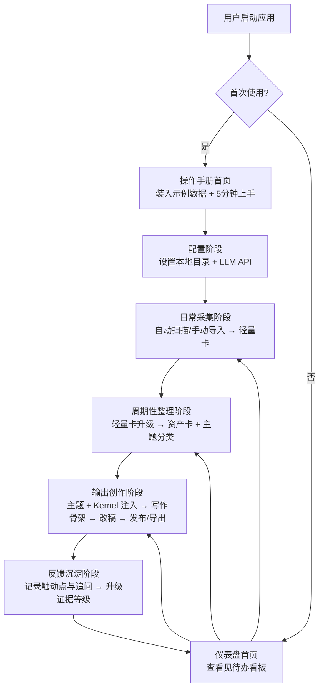
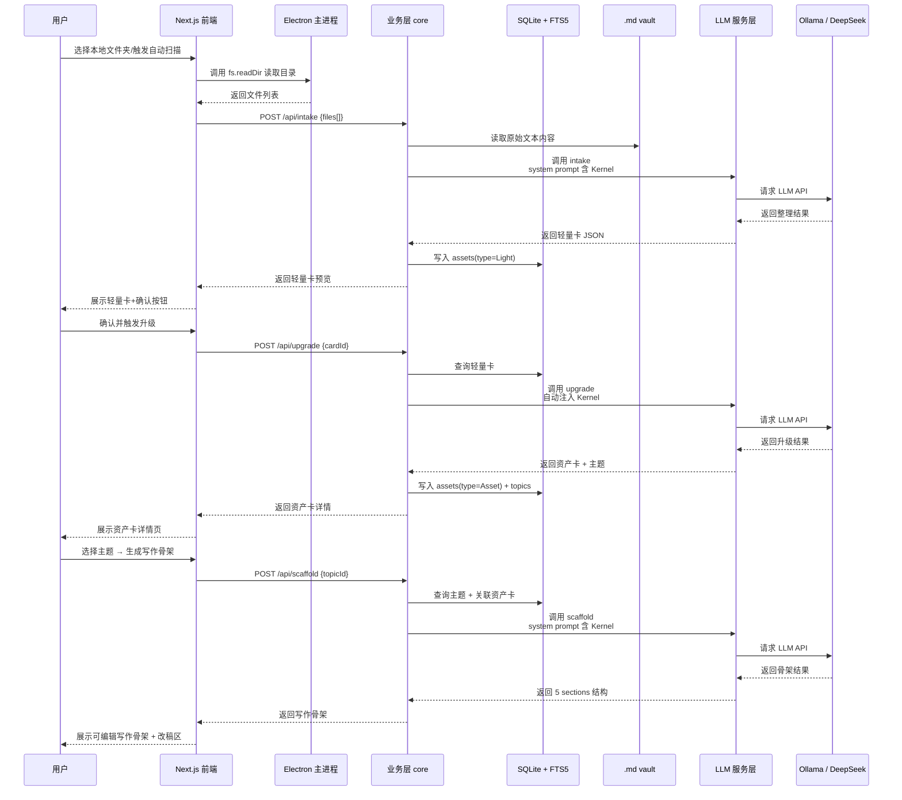
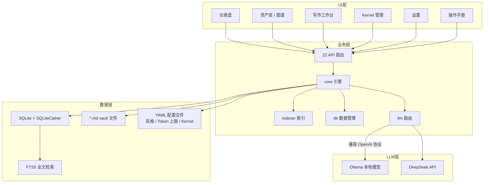
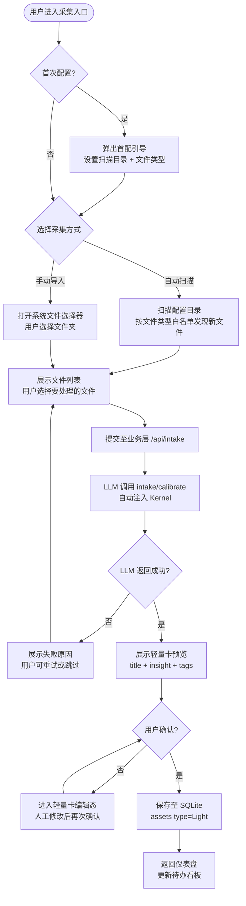
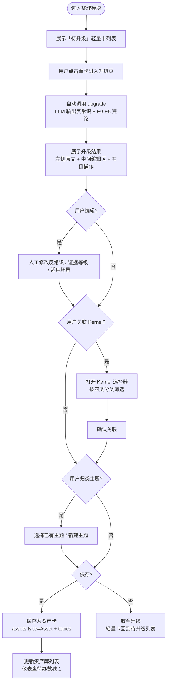

# Insight Asset OS — 本地优先思想资产工作台 PRD

## 文档修订记录

| 版本 | 内容 | 作者 | 日期 |
|------|------|------|------|
| V1.0 | 初版：采集·整理·输出三步循环 + Kernel 注入 + 5 界面 + 19 注入点完整复刻 | Claude | 2026-06-28 |

---

## 1. 概述

### 1.1 需求背景、目标及收益

**业务背景**

> 用户作为知识密集型工作者，日常积累了大量散落本地的笔记、书摘、公众号剪藏与录音转写，但始终缺乏一个能将「零散经验」转化为「可调用的判断力」的系统性工具。现有工具（如 Notion、Obsidian）要么偏向云端协作且数据不可控，要么虽有本地优先特性，却缺少与 LLM 深度融合的「知识提取→洞察升级→输出创作」闭环。Insight Asset OS 的核心命题是：让 LLM 不再产生泛泛之论，而是在每一次调用中自动带上用户的个人判断立场（Insight Kernel），使输出成为「带有你体温」的观点。

**项目目标**

- 在 6-8 周内交付 Insight Asset OS v1.4 完整版本，跑通「采集→整理→输出」三步业务闭环
- 实现 5 个核心界面（Kernel 管理、资产卡详情、写作风格配置、仪表盘、操作手册）+ 19 个 LLM 注入点全部可用
- 支持本地文件夹自动扫描与手动导入，支持 Ollama 本地模型与 DeepSeek API 自由切换

**预期收益（量化）**

| 指标 | 当前值 | 目标值 | 衡量周期 |
|------|--------|--------|----------|
| 本地笔记资产化率 | 0%（无结构化） | ≥70%（采集内容转化为资产卡） | 上线后 30 天 |
| 主题覆盖完整度 | 0 | ≥10 个活跃主题 | 上线后 30 天 |
| 单篇输出耗时（从主题到成文） | 2-4 小时 | ≤30 分钟 | 上线后 30 天 |

### 1.2 时间节奏

| 阶段 | 时间 | 责任方 |
|------|------|--------|
| UI 稿 + 交互方案定稿 | 2026-06-28 ~ 2026-07-04 | 产品 + 设计 |
| 研发出 TRD + 架构评审 | 2026-07-07 | 研发 |
| 第一阶段开发（采集 + 整理闭环）| 2026-07-08 ~ 2026-07-25 | 研发 |
| 第二阶段开发（输出增强 + Kernel 注入）| 2026-07-28 ~ 2026-08-08 | 研发 |
| 第三阶段开发（仪表盘 + 写作风格配置 + 操作手册）| 2026-08-11 ~ 2026-08-22 | 研发 |
| 联调 / UAT | 2026-08-25 ~ 2026-08-29 | 全员 |
| 目标上线时间 | 2026-08-30 | — |

### 1.3 竞品分析

| 竞品 | 核心玩法 | 优势 | 劣势 | 我们的差异化 |
|------|---------|------|------|-------------|
| Notion / 飞书 | 云端知识库 + 块编辑器 | 协作强、模板丰富 | 数据上云不可控、无个人判断注入 | 本地优先、LLM 原生、自动带用户立场 |
| Obsidian | 本地 Markdown 库 + 插件 | 完全本地、双链笔记 | 缺少系统化的采集→洞察→输出工作流、无 Kernel 注入机制 | 面向洞察生产的三步闭环 + 19 个自动注入点 |
| Readwise | 书摘同步 + 间隔复习 | 自动同步、复习机制 | 仅聚焦阅读输入，缺乏升级→输出 | 从书摘到洞察到创作的全链路 |

### 1.4 用户分析

| 用户名称 | 使用频率 | 用户描述 | 核心关注点 |
|----------|----------|----------|-------------|
| 个人创作者（用户本人）| 每天采集、每周整理、按需输出 | 个人自用，需要把本地碎片化笔记转化为结构化洞察资产 | 数据不出本机、LLM 输出带个人判断立场、流程闭环高效 |

### 1.5 指标支撑

| 产品目标 | 产品核心指标 | 支撑关系说明 |
|----------|-------------|---------------|
| 将零散经验变成可调用的判断力 | 笔记资产化率（采集→资产卡转化率） | 通过 LLM 整理 + 人工校准升级，使原本无序的笔记变为可检索、可引用的资产卡 |
| 让 LLM 输出自动带个人立场 | Kernel 注入覆盖率（19/19 注入点可用） | 每次 LLM 调用前自动将 Kernel 拼入 system prompt，从根源上影响输出风格与判断方向 |
| 缩短从选题到成文的时间 | 单篇输出耗时 | 写作骨架基于主题 + 资产卡 + 5 维度自动生成，减少从零构思的时间 |

---

## 2. 总体流程

### 2.1 使用旅程图谱

虽然产品仅面向单一用户，但用户在不同阶段有不同操作重心。下图将使用过程按阶段展开，标注每个阶段的核心动作与界面入口。



### 2.2 业务流程图

下图描述「采集→整理→输出」三步主循环的核心动作与闭环逻辑，包含 Kernel 注入点与反馈升级链路。

```mermaid
flowchart TD
    Start([启动应用]) --> Config{首次配置完成?}
    Config -- 否 --> DoConfig[设置扫描目录 + LLM 配置<br/>Token 上限 + 加密开关]
    DoConfig --> Config
    Config -- 是 --> Inbox[采集阶段<br/>自动扫描/手动导入]
    Inbox --> Intake[intake / calibrate<br/>LLM 生成轻量卡]
    Intake --> Review1{用户确认?}
    Review1 -- 否 --> Inbox
    Review1 -- 是 --> Curate[整理阶段<br/>主题分类 + E0-E5 证据等级]
    Curate --> Upgrade[promote / upgrade<br/>LLM 升级为资产卡]
    Upgrade --> Review2{用户校准?}
    Review2 -- 否 --> Curate
    Review2 -- 是 --> LinkKernel[关联 Insight Kernel]
    LinkKernel --> Store[存储：assets + topics<br/>SQLite + .md vault]
    Store --> Dashboard[仪表盘更新]<->Todo[待办看板]
    Store --> Write[输出阶段<br/>选择主题 + 资产卡]
    Write --> Inject[自动注入 Kernel<br/>拼入 system prompt]
    Inject --> Scaffold[生成写作骨架<br/>5 sections]
    Scaffold --> Edit[改稿 + AI 味自检]
    Edit --> Publish[发布/导出 .md]
    Publish --> Feedback[记录反馈<br/>触动点 / 追问]
    Feedback --> Evolve[反馈升级证据等级<br/>主题内核自动重生成]
    Evolve --> Store
    Write --> Chat[对话阶段<br/>洞察助手 chat]
    Chat --> Publish
```

### 2.3 系统交互图

下图描述用户操作如何从前端 UI 传递到 Electron 底层，经过业务层与数据层，最终调用 LLM 服务并完成结果回显。



### 2.4 涉及系统

| 涉及系统 | 支持/依赖内容 | 对接人 | 是否需改造 | 内容确认状态 |
|----------|----------------|--------|------------|---------------|
| Electron 32 | 桌面端壳层，提供本地文件系统访问、窗口管理、IPC 通信 | 本人 | 是（新建） | 已确认需求 |
| Next.js 15 | UI 渲染层（仪表盘/写作/资产库/图谱/设置/Kernel 管理） | 本人 | 是（新建） | 已确认需求 |
| SQLite + SQLiteCipher | 结构化数据持久化（assets / topics / feedback / outputs / kernel / style 等） | 本人 | 是（新建） | 已确认需求 |
| FTS5 全文检索 | 本地笔记/资产卡全文搜索 | 本人 | 是（新建） | 已确认需求 |
| .md vault | Markdown 文件存储（原始笔记、导出产出） | 本人 | 是（新建） | 已确认需求 |
| Ollama | 本地 LLM 推理服务（离线、零 API 费用） | 本人 | 否 | 已确认需求 |
| DeepSeek API | 云端 LLM 服务（中文强、性价比高） | 本人 | 否 | 已确认需求 |
| LLM 路由层 | 统一封装 Ollama 与 OpenAI 兼容 API，支持切换与 Token 控制 | 本人 | 是（新建） | 已确认需求 |

### 2.5 产品架构

下图展示 Insight Asset OS 的四层架构，从 UI 到 LLM 分层清晰，模块间可独立替换。



---

## 3. 功能需求

### 3.1 功能列表总览

| 功能模块 | 子功能点 | 调整类型 | 调整内容简要描述 | 优先级 |
|----------|----------|----------|------------------|--------|
| 采集模块 | 自动扫描本地目录 | 新增 | 按配置目录自动发现 *.md / *.txt 等笔记文件 | P0 |
| 采集模块 | 手动导入文件夹 | 新增 | 用户手动选择文件夹，一次性批量导入 | P0 |
| 采集模块 | LLM 整理生成轻量卡 | 新增 | 调用 intake/calibrate，输出 title + insight + tags | P0 |
| 整理模块 | 轻量卡升级资产卡 | 新增 | 人工校准 + LLM upgrade，生成反常识 + E0-E5 等级 | P0 |
| 整理模块 | 主题分类与维护 | 新增 | 自动分类 + 人工归纳主题，支持主题树结构 | P0 |
| 整理模块 | 资产卡关联 Kernel | 新增 | 支持将单条或多条资产卡标记到对应 Kernel | P0 |
| Kernel 管理 | 四类 Kernel CRUD | 新增 | 底层信念 / 反常识判断 / 擅长问题域 / 想挑战的常识 | P0 |
| Kernel 管理 | 自动提炼候选 Kernel | 新增 | 从资产卡中高亮文本一键提取候选，供人工确认 | P1 |
| 输出模块 | 写作骨架生成 | 新增 | 围绕主题 + 资产卡 + 5 维度生成 5 sections | P0 |
| 输出模块 | Kernel 自动注入（19个注入点）| 新增 | 业务层 core 在每次 LLM 调用前自动拼接 Kernel | P0 |
| 输出模块 | 改稿与流式输出 | 新增 | 选中段落 + 改稿指令 → 流式返回改写建议 | P1 |
| 写作风格 | YAML 配置与预设切换 | 新增 | vincent-standard / academic / client-comm 3 套预设 | P1 |
| 仪表盘 | 待办看板 | 新增 | 分类展示「待校准 / 可输出 / 待反馈」三类资产 | P1 |
| 仪表盘 | 资产数据统计 | 新增 | 资产总量 / 在用数 / 真实案例数 / 待校准数 | P1 |
| 设置模块 | 本地目录与扫描策略配置 | 新增 | 配置自动扫描路径、文件类型白名单、排除规则 | P0 |
| 设置模块 | LLM 服务商切换与 Token 上限 | 新增 | 支持 Ollama/DeepSeek 切换，设置单次/月度 Token 上限 | P0 |
| 设置模块 | 隐私与加密 | 新增 | SQLite 加密开关、导出与备份 | P1 |
| 设置模块 | 数据导出与备份 | 新增 | 批量导出为 Markdown/JSON；备份到指定目录 | P1 |

### 3.2 采集模块

#### 3.2.1 业务描述

采集模块是三步循环的起点，负责将用户散落在本地的原始笔记（Markdown、纯文本、剪藏网页等）转化为结构化的轻量卡（Light Card）。轻量卡是后续整理的输入，包含标题、核心洞察、标签三要素。

#### 3.2.2 入口与展示规则

- **入口**：仪表盘首页「导入」按钮 / 侧边栏「采集」入口 / 系统托盘右键「扫描目录」
- **是否需要配置**：首次使用需配置扫描目录，未配置时弹窗引导
- **展示样式**：列表展示待处理文件，每项显示文件名、最后修改时间、预估内容长度；已处理显示生成的轻量卡预览卡片

#### 3.2.3 交互流程



#### 3.2.4 详细规则

- **正常路径**：用户选择文件 → 系统读取文本 → LLM 按 intake/calibrate 指令整理 → 返回轻量卡 → 用户确认 → 落库
- **异常情况**：
  - LLM 调用超时（超过 30 秒）：自动降级提示「LLM 响应过慢，请检查网络或切换本地模型」，不扣减 Token 配额
  - 空文件或不可读文件：toast 提示「跳过空文件：xxx.md」
  - 文件内容与已有资产卡重复（相似度 > 85%）：弹窗提示「发现与「xxx」高度相似，是否合并？」
- **批量处理**：支持连续扫描时批量提交，单次最多提交 20 个文件，避免 LLM 调用队列过长

### 3.3 整理模块

#### 3.3.1 业务描述

整理模块将已确认的轻量卡升级为资产卡（Asset Card）。升级过程包含两个环节：一是由 LLM 根据 upgrade 指令完成内容深化（提取反常识、标注 E0-E5 证据等级）；二是用户人工校准归属主题、确认证据等级、关联 Insight Kernel。资产卡是个人思想资产的核心存储单元。

#### 3.3.2 入口与展示规则

- **入口**：侧边栏「资产库」→「待升级」标签页 / 仪表盘待办看板「待校准」卡片点击
- **展示样式**
  - 左侧：轻量卡原文（只读，保留来源可追溯）
  - 中间：升级后的资产卡编辑区（反常识、洞察摘要、证据等级下拉、适用场景）
  - 右侧：操作区（关联 Kernel / 主题归类 / 保存 / 放弃）

#### 3.3.3 交互流程



#### 3.3.4 详细规则

- **证据等级定义**（E0-E5，标注在资产卡上）
  - E0：原始观察，未经加工
  - E1：初步推测
  - E2：有少量案例支撑
  - E3：有系统验证
  - E4：经历过反向验证
  - E5：形成可迁移的判断
- **主题分类规则**：支持层级主题树（如「工作方法 > 决策 > 底线规则」），资产卡可归属到叶子节点，也可同时挂载多个主题
- **批量升级**：支持多选轻量卡调用 promote-batch，批量生成资产草稿，用户逐条确认
- **异常兜底**：LLM 返回不符合 YAML schema 时，前端展示原始文本，提示「升级结果解析异常，请手动编辑或重试」

### 3.4 输出模块

#### 3.4.1 业务描述

输出模块围绕用户选定的主题 + 关联资产卡 + 写作风格配置，自动生成写作骨架（5 sections），并在每次 LLM 调用时自动注入 Insight Kernel，使输出带上用户判断立场。支持改稿（选中段落 + 改稿指令，流式输出）和最终导出为 Markdown。

#### 3.4.2 入口与展示规则

- **入口**：侧边栏「输出」→「新建写作」/ 资产卡详情页「以此卡创作」/ 仪表盘「快速输出」快捷按钮
- **展示样式**
  - 顶部：主题选择器、写作风格选择器
  - 左侧：关联资产卡面板（可拖拽调整引用顺序）
  - 中间：写作骨架编辑区（5 sections 分区块展示，支持折叠）
  - 右侧：改稿指令区 + LLM 流式输出窗口

#### 3.4.3 交互流程

```mermaid
flowchart TD
    A([进入输出模块]) --> B[用户选择主题]
    B --> C[系统自动加载关联资产卡]<->D[用户调整引用卡片与顺序]
    D --> E[用户选择写作风格<br/>vincent-standard / academic / client-comm]
    E --> F[点击「生成骨架」]
    F --> G[业务层拼 system prompt<br/>主题 + 资产卡摘要 + 风格 YAML + Kernel]
    G --> H[调用 writing/scaffold<br/>LLM 返回 5 sections]
    H --> I[展示写作骨架<br/>用户逐段编辑]
    I --> J{需要改稿?}
    J -- 是 --> K[用户选中段落 + 输入改稿指令]
    K --> L[调用 output/review<br/>流式返回改写建议]
    L --> M[用户接受或继续修改]
    M --> I
    J -- 否 --> N{完成?}
    N -- 是 --> O[导出为 .md / 复制到剪贴板]
    O --> P[提示「是否保存输出历史到 outputs 表」]
    P -- 是 --> Q[保存输出历史 + 反馈引导]
    Q --> R[返回仪表盘]
    P -- 否 --> R
```

#### 3.4.4 详细规则

- **19 个注入点概览**（业务层 core 层统一实现）
  - 采集阶段 4 个：`intake`、`calibrate`、`upgrade`、`classify`
  - 整理阶段 4 个：`promote`、`promote-batch`、`merge`、`style-extractor`
  - 输出阶段 10 个：`writing/scaffold`、`writing/companion`、`output/multi`、`output/review`、`output/vision`、`output/try-write`、`output/verify-data`、`ai-taste-check`、`topic/[id]/kernel`
  - 对话阶段 1 个：`assistant/chat`
- **改稿指令预设**：提供常用指令按钮，如「增加数据支撑」「去掉 AI 味」「增加反常识判断」「调整语气更尖锐」等
- **异常兜底**：
  - LLM 返回为空或格式错误：toast 提示「生成内容为空，请检查网络或降低 Token 上限后重试」
  - Token 达到用户设置上限：弹窗提示「本月 Token 配额已用尽，剩余操作将使用本地 Ollama」

### 3.5 Kernel 管理模块

#### 3.5.1 业务描述

Insight Kernel 是用户的「判断宪法」，即在每次 LLM 调用时自动拼入 system prompt 的个人立场声明。Kernel 分四类（底层信念、反常识判断、擅长问题域、想挑战的常识），每条包含一句话判断、适用场景、反例、置信度。管理模块支持用户对 Kernel 进行增删改，以及从资产卡中高亮文本一键提炼候选 Kernel。

#### 3.5.2 入口与展示规则

- **入口**：侧边栏「Insight Kernel」独立导航 / 整理模块「关联 Kernel」选择器
- **展示样式**：四列卡片布局，每列对应一类；卡片显示一句话判断 + 置信度进度条（0-100）

#### 3.5.3 交互流程

```mermaid
flowchart TD
    A([进入 Kernel 管理]) --> B[展示四类 Kernel 卡片墙]
    B --> C{用户操作}
    C -- 新增 --> D[填写：判断 / 适用场景 / 反例 / 置信度]
    D --> E[保存至 SQLite kernel 表]
    C -- 编辑 --> F[进入编辑态]
    F --> G[修改后保存]
    C -- 删除 --> H[二次确认弹窗<br/>提示「已关联 N 条资产卡」]
    H -- 确认 --> I[标记失效 / 或物理删除]
    C -- 自动提炼 --> J[从资产库中选择高亮文本]<br/>K[一键生成候选 Kernel]<br/>L[人工确认后入库]
    E --> M[触发主题内核自动重生成]
    G --> M
    L --> M
    M --> N[更新通知<br/>「Kernel 已更新，下次 LLM 调用自动生效」]
```

#### 3.5.4 详细规则

- **置信度梯度**：高（≥80，经验验证）、中（40-79，推论）、低（<40，待验证或挑战），用颜色深浅区分
- **关联反向校验**：删除 Kernel 时，若已关联资产卡数 > 0，提示「删除后 N 条资产卡将失去关联，是否转移？」
- **版本演进**：每次 Kernel 修改记录变更历史（修改时间、修改前内容、修改原因），支持查看历史版本

### 3.6 仪表盘模块

#### 3.6.1 业务描述

仪表盘是用户打开应用后的默认首页，承担「待办看板 + 资产统计 + 写作复盘」三重角色。帮助用户一眼看清「现在该整理什么、该输出什么、过去一个月沉淀了什么」。

#### 3.6.2 入口与展示规则

- **入口**：打开应用默认进入 / 侧边栏「首页」
- **展示区域**
  - 区域 A（上）：待办看板——三列卡片「待校准」「可输出」「待反馈」
  - 区域 B（中）：资产数据统计——资产卡总数、在用资产数、真实案例数、待校准数量
  - 区域 C（下）：写作复盘——过去 30 天输出数量、被反复引用的真核心资产 TOP5、输出频率折线图

#### 3.6.3 详细规则

- **待办看板**：卡片支持拖拽换列（如将可输出的主题拖入「正在写作」暂存列），点击卡片直接进入对应模块
- **真实案例数**：用户手动标记「已验证」的资产卡计数，与证据等级 E4/E5 强相关
- **写作复盘数据来源**：outputs 表的时间戳 + 资产卡引用次数，纯本地计算不上传

### 3.7 设置模块

#### 3.7.1 业务描述

设置模块管理本地目录配置、LLM 服务商与 Token 配额、隐私与安全开关，是保障用户数据不出本机的核心控制面板。

#### 3.7.2 配置项列表

| 配置项 | 类型 | 是否必填 | 校验规则 | 备注 |
|--------|------|----------|----------|------|
| 自动扫描目录 | 文件夹选择 | 必填 | 目录可读写 | 支持多目录配置 |
| 文件类型白名单 | 多选 | 必填 | md / txt / html 至少选一项 | 默认选中 md |
| 排除规则 | 文本 | 可选 | 支持正则 / glob | 如 `**/templates/**` |
| LLM 服务商 | 单选 | 必填 | Ollama / DeepSeek / 自定义 OpenAI 兼容 | 支持自由切换 |
| Ollama 本地地址 | 文本 | 条件必填 | 服务商=Ollama 时必填 | 默认 `http://localhost:11434` |
| DeepSeek API Key | 密码 | 条件必填 | 服务商=DeepSeek 时必填 | 本地加密存储 |
| 单次 Token 上限 | 数字 | 必填 | 正整数，默认 4096 | 超限则截断提示 |
| 月度 Token 上限 | 数字 | 必填 | 正整数，默认 1,000,000 | 超限弹窗提示 |
| SQLite 加密开关 | 布尔 | 必填 | 开启后启用 SQLiteCipher | 默认关闭 |
| 导出路径 | 文件夹选择 | 必填 | 目录可写 | 默认桌面 |

---

## 4. 非功能需求

### 4.1 联动报备

本产品为个人自用本地工具，不涉及商业运营、用户资金、外部客服、合规审计等联动报备需求。以下按实际场景列明「不涉及」与「仍需关注」项：

| 判断项 | 是否涉及 | 详细情况说明 | 接口人 | 共识方案 | 备注 |
|--------|----------|---------------|--------|----------|------|
| 风控 | 否 | 个人工具，无交易、无外部用户行为 | — | 不涉及 | — |
| 客服 | 否 | 个人使用，无客服通道 | — | 不涉及 | — |
| 财务/法务 | 否 | 无商业化、无支付 | — | 不涉及 | — |
| 合规 | 部分涉及 | LLM API 调用涉及 DeepSeek 第三方服务，需遵守其用户协议 | 本人 | 仅在设置中提示用户阅读第三方服务条款 | 产品层面不做额外合规限制 |

### 4.2 埋点方案

本产品为个人自用工具，不对外部平台做商业埋点。保留本地操作日志（仅本机存储，不上传），用于问题排查与使用回顾：

| 记录位置 | 事件名 | 类型 | 关键参数 | 存储位置 |
|----------|--------|------|----------|----------|
| 采集 | intake_success / intake_fail | 本地日志 | 文件名、LLM 服务商、耗时、Token 用量 | SQLite logs 表 |
| 整理 | upgrade_success / upgrade_fail | 本地日志 | 轻量卡 ID、证据等级、耗时 | SQLite logs 表 |
| 输出 | scaffold_success / review_success | 本地日志 | 主题 ID、字数、LLM 服务商 | SQLite logs 表 |
| 设置 | llm_switch / token_limit_hit | 本地日志 | 切换前后的服务商、超限类型 | SQLite logs 表 |

### 4.3 数据上报与 BI 报表

不涉及云端数据上报。仪表盘中的「写作复盘」与「资产统计」基于 SQLite 本地聚合计算，实时渲染，不上传任何数据到外部服务器。

### 4.4 性能 / 容量

- **本地文件扫描**：首次扫描 10,000 个 md 文件，耗时 ≤ 3 秒；增量扫描基于 mtime 对比，≤ 500ms
- **FTS5 全文检索**：在 10,000 条资产卡上搜索，返回首屏结果 ≤ 200ms
- **LLM 调用超时**：单次 API 调用设置 30 秒超时，超时后 toast 提示并释放 Token 配额（不扣减）
- **内存控制**：Electron 主进程渲染大文件（> 10MB）时，采用虚拟滚动 + 分页加载，避免一次读入全文

### 4.5 安全 / 风控

- **数据加密**：支持 SQLiteCipher 开启数据库加密；API Key 使用系统钥匙串或 SQLiteCipher 本地加密存储，不以明文落盘
- **Token 控制**：用户可设置单次/月度 Token 上限，超限后自动弹窗告警，并提示切换至 Ollama 本地模型继续操作
- **本地文件隔离**：读取本地文件仅用于分析，不修改、不移动、不删除原文件；导出的加工结果另存至用户指定的导出目录
- **备份机制**：支持一键备份 SQLite 数据库 + YAML 配置 + .md vault 文件到外部目录，备份文件可由用户自行管理

---

## 5. 多期产品计划

本次需求为完整复刻 Insight Asset OS v1.4，因此单期交付全部功能。但内部可按开发节奏划分为以下里程碑，以便分阶段验证：

| 期数 | 交付时间 | 迭代内容 | 验收标准 |
|------|----------|----------|----------|
| 第一阶段（MVP）| ~第 4 周 | 采集闭环：本地读取 + intake/calibrate + 轻量卡保存 + 待办看板（待校准列） | 成功导入本地 md 文件并生成轻量卡 |
| 第二阶段 | ~第 6 周 | 整理闭环：upgrade + 主题分类 + 证据等级 + Kernel 基础 CRUD + 资产库 | 轻量卡升级为资产卡，可关联 Kernel |
| 第三阶段 | ~第 8 周 | 输出闭环：writing/scaffold + 19 注入点全部接入 + 改稿 + 写作风格 + 仪表盘完整版 + 操作手册 | 主题→骨架→改稿→导出完整跑通 |

---

## 6. 未解决的问题

| 编号 | 问题描述 | 待确认方 | 期望确认时间 |
|------|----------|----------|---------------|
| 1 | 默认本地扫描路径：是否指定为现有 Obsidian vault 目录，还是新建独立 vault？ | 用户 / 本人 | 2026-07-04 |
| 2 | 写作风格预设除 vincent-standard / academic / client-comm 外，是否还有其他预设需求？ | 用户 | 2026-07-04 |
| 3 | 导出格式范围：是否仅支持 Markdown + JSON，还是需额外支持 PDF / Word？ | 用户 | 2026-07-04 |
| 4 | 界面视觉方向：偏好深色模式、浅色模式，还是随系统自适应？ | 设计 / 用户 | 2026-07-04 |
| 5 | 录音转写功能是否纳入 V1.4：若纳入，依赖的转写服务是本地 Whisper 还是第三方 API？ | 用户 | 2026-07-11 |
| 6 | URL 抓取采集：是否需在采集模块中支持粘贴 URL 后抓取网页正文？ | 用户 | 2026-07-11 |
| 7 | 与现有 5 个技能（jdme-local-tools 等）的关系：本产品是否作为统一平台整合它们，还是独立运行？ | 用户 | 2026-07-04 |
| 8 | 资产卡详情界面中「管理洞察卡」「原始观察卡」的维度字段是否沿用原图定义，还是有自定义维度？ | 用户 | 2026-07-04 |

---

## 7. 附录

### 7.1 参考资料

- 原始需求素材：王文栋 · Insight Asset OS v1.4.0 产品架构图（2026-06-23）
- 外部参考：Cobi 文章《Agents Need a Diary》—— 笔记资产化方法论参考
- 技术参考：Electron 32 + Next.js 15 + SQLite + Ollama SDK

### 7.2 术语表

| 术语 | 含义 |
|------|------|
| Insight Kernel | 个人判断宪法，每次 LLM 调用自动拼入 system prompt，使输出带用户判断立场 |
| 轻量卡（Light Card） | 采集阶段产物，包含 title + insight + tags，未经深度加工 |
| 资产卡（Asset Card） | 整理阶段产物，包含反常识 + 证据等级（E0-E5）+ 主题 + Kernel 关联 |
| E0-E5 | 证据等级体系，从原始观察到可迁移判断的 6 级递进 |
| 写作骨架（Scaffold） | 输出阶段产物，围绕主题 + 资产卡 + 5 维度生成 5 sections 结构 |
| Kernel 注入点 | 业务层在 19 个 LLM 调用位点自动拼接 Kernel 的机制 |
| Vault | 本地 Markdown 文件仓库，存放原始笔记与导出产出 |
| FTS5 | SQLite 内置全文检索扩展，用于本地笔记/资产卡搜索 |
