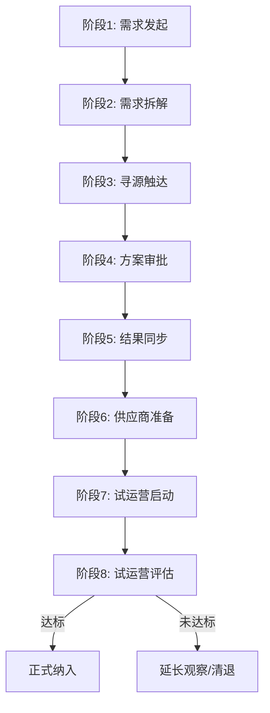
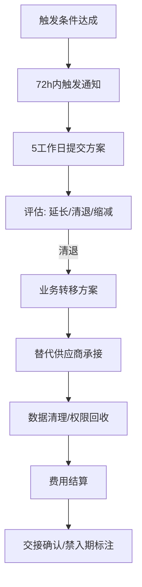
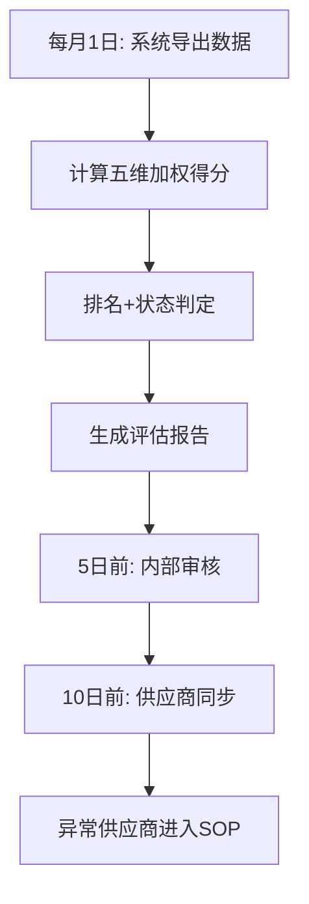

# 09 执行工具集

> 编码：TM-2026-xxx
> 来源：TM-2026-400_检查清单集.md、TM-2026-500_决策模板集.md、TM-2026-600_流程图集.md、TM-2026-700/710/720 JSON打分细项
> 核心定位：可直接打印或填表使用的"手"和"尺子"

---

## §1 检查清单集

> [来源：TM-2026-400]  
> 使用方式：对应场景打开对应清单，逐项勾选，不通过项标注原因和跟进人

### 1.1 引入前置检查清单

> [来源：TM-2026-400_检查清单集.md]

> 对标：SM-2026-010 §3 / [05 §8](05_方法论体系.md)  
> 触发时机：寻源需求成立后、9维度评估前

**需求审批检查**

| 检查项 | 检查标准 | 是否通过 | 备注 |
|--------|---------|---------|------|
| 业务量预测数据已提供 | 附业务量预测文档，数据完整 | □是 □否 | |
| 现有供应商产能评估结论已出具 | 附产能分析，明确缺口 | □是 □否 | |
| 寻源需求已获策略岗审批 | 《需求清单》已签字确认 | □是 □否 | |
| 集中度预评估 | 引入后单一供应商≤20%，TOP3≤50% | □是 □否 | |

**资质审核检查（初筛门槛）**

| 检查项 | 检查标准 | 是否通过 | 备注 |
|--------|---------|---------|------|
| 有效营业执照 | 营业执照在有效期内，经营范围含相关业务 | □是 □否 | |
| 坐席规模≥50人 | 在职坐席数≥50，有职场面积证明 | □是 □否 | |
| 人员持证率100% | 金融相关资质证书，全员覆盖 | □是 □否 | |
| 独立质检团队或第三方质检协议 | 提供质检团队配置或协议文件 | □是 □否 | |
| 数据安全防护能力通过评估 | 通过我方数据安全评估 | □是 □否 | |
| 无重大商业违规或法律诉讼记录 | 信用中国/企查查无不良记录 | □是 □否 | |

**9维度评估准备检查**

| 检查项 | 检查标准 | 是否通过 | 备注 |
|--------|---------|---------|------|
| 桌面调查资料已收集 | 9维度对应证明材料齐全 | □是 □否 | |
| 现场考察计划已制定 | 考察日程、人员、检查项明确 | □是 □否 | |
| 评估评分表已准备 | 9维度评分表（0-10分五档） | □是 □否 | |
| 主管胜任力评估工具已准备 | 流失率/出勤/人效趋势/响应质量/整改执行力 | □是 □否 | |

### 1.2 引入阶段检查清单（8阶段逐阶段）

> [来源：TM-2026-400_检查清单集.md]

> 对标：SM-2026-010 §4  
> 标准周期：T+15工作日

| 阶段 | 时效 | 检查项 | 是否通过 |
|------|------|--------|---------|
| 阶段1：需求发起 | T+0~T+1 | 业务量预测数据完整、《需求清单》已填写、责任人签字、已归档 | □ |
| 阶段2：需求拆解 | T+1~T+2 | 《寻源需求表》已输出、寻源方式已确定、责任人签字、已归档 | □ |
| 阶段3：寻源触达 | T+3~T+5 | 寻源邮件已发出、≥3家有效回复、供应商回复汇总已整理、已归档 | □ |
| 阶段4：方案审批 | T+5~T+7 | xbp审批方案已提交、9维度评估已完成、集中度检查通过、审批签字完成、已归档 | □ |
| 阶段5：结果同步 | T+5~T+6 | 结果同步邮件已发出、入选通知已发出、未入选通知已发出、发送记录已存档 | □ |
| 阶段6：供应商准备 | T+10~T+12 | 职场/设备/人员到位、培训计划已制定、系统账号已开通、对接人已指定 | □ |
| 阶段7：试运营启动 | T+12~T+15 | 试运营协议已签署、KPI目标已明确、日报机制已建立、问题升级路径已确认 | □ |
| 阶段8：试运营评估 | T+15后 | 1-3个月数据达标、无重大合规问题、主管胜任评估通过、转正审批完成 | □ |

### 1.3 约谈准备检查清单

> [来源：TM-2026-400_检查清单集.md]

> 对标：A2 SOP / [05 §3](05_方法论体系.md) 主管胜任  
> 触发时机：正式约谈前

| 检查项 | 检查标准 | 是否完成 | 备注 |
|--------|---------|---------|------|
| 约谈目标已明确 | 底线目标+理想目标已写清 | □ | |
| 数据包已准备 | 排名趋势、产能双维度、主管胜任5项、异常信号清单 | □ | |
| 历史整改记录已调取 | 上次约谈时间、整改承诺、实际完成情况 | □ | |
| 话术结构已确认 | 开场→数据呈现→诊断→要求→确认 | □ | |
| 决策权限已确认 | 黄色自主/橙色报备王易人/红色需确认 | □ | |
| 录音/纪要人员已安排 | 双人出席，1人主谈1人记录 | □ | |

### 1.4 巡检检查清单

> [来源：TM-2026-400_检查清单集.md]

> 对标：B3 SOP / SM-2026-020 §5  
> 触发时机：出差现场巡检

**行前准备**

| 检查项 | 检查标准 | 是否完成 |
|--------|---------|---------|
| 巡检目标已明确 | 本次重点：业绩/合规/团队/其他 | □ |
| 数据包已打印 | 近3月排名、产能双维度、异常信号清单 | □ |
| 问题清单已准备 | 基于数据预判的5-10个核心问题 | □ |
| 供应商已预约 | 时间、地点、参与人员已确认 | □ |

**现场检查（6盒模型）**

| 维度 | 检查内容 | 现场观察 | 结论 |
|------|---------|---------|------|
| 目的 | 供应商是否清楚合作目标？ | | |
| 结构 | 组织架构是否合理？职责清晰？ | | |
| 关系 | 内部协作顺畅？与京东对接高效？ | | |
| 奖励 | 激励机制是否有效？员工有动力？ | | |
| 领导 | 管理层能力？决策是否及时？ | | |
| 支持机制 | 培训、系统、工具是否到位？ | | |

**数据真实性核查**

| 检查项 | 核查方式 | 结果 |
|--------|---------|------|
| 实际出勤人数 vs 报表人数 | 现场数工位+系统导出交叉 | |
| 实际在职名单 vs 花名册 | 抽查5-10人身份证号/入职日期 | |
| 培训记录真实性 | 查看培训签到表+培训内容照片 | |
| 质检流程执行 | 抽查最近10通录音，看质检记录 | |
| 系统使用熟练度 | 现场看员工操作系统 | |

### 1.5 清退交接检查清单

> [来源：TM-2026-400_检查清单集.md]

> 对标：SM-2026-030 §5 / A6 SOP  
> 触发时机：清退决策通过后

| 检查项 | 责任人 | 截止日期 | 是否完成 |
|--------|--------|---------|---------|
| 业务转移方案已制定 | 供应商管理岗 | | □ |
| 替代供应商已确认承接能力 | 供应商管理岗 | | □ |
| 客户数据清理/移交 | 业务质量岗 | | □ |
| 系统账号权限回收 | 技术/运营 | | □ |
| 未结费用核算 | 结算岗 | | □ |
| 预留金结算 | 结算岗 | | □ |
| 交接确认书双方签字 | 供应商管理岗 | | □ |
| 禁入期标注 | 供应商管理岗 | | □ |

---

## §2 决策模板集

> [来源：TM-2026-500]  
> 使用方式：直接复制到邮件/文档中填写，确保决策要素完整

### 2.1 准入决策表

> [来源：TM-2026-400_检查清单集.md / TM-2026-500_决策模板集.md / TM-2026-600_流程图集.md / TM-2026-700/710/720_JSON / SM-2026-035_供应商分级清退管理制度.md §相关章节]

> 对标：SM-2026-010 §5 / [05 §8](05_方法论体系.md)  
> 用途：新供应商准入评估+决策

**基本信息**

| 字段 | 内容 |
|------|------|
| 供应商名称 | |
| 评估日期 | |
| 评估方式 | □桌面调查 □现场考察 |
| 承接产线 | □金条 □企金 □信用卡 □财富 |
| 寻源类型 | □内部寻源 □外部寻源 |

**供应商准入评分（满分100分）**

> [来源：SM-2026-050_清洁版操作指引.md §附件二《供应商准入评分表》]

| 评估维度 | 指标名称 | 分值 | 评分标准 | 得分 |
|---------|---------|------|---------|------|
| **资质类** | 注册资本 | 5分 | ≥1000万得5分，每降低100万扣1分 | |
| | 实缴资本 | 10分 | 实缴比例≥80%得10分，每降10%扣2分 | |
| | 电信增值许可证书 | 10分 | 有证书且在有效期得10分，否则0分 | |
| **合规类** | 司法风险 | 10分 | 近3年无诉讼得10分，每起诉讼扣2分 | |
| | 风险控制体系 | 10分 | 通过ISO27001认证得10分，有专项预案得5分，否则0分 | |
| **运营类** | 呼叫中心运营能力 | 10分 | 自建系统得10分，外包系统得5分 | |
| | 公司人力规模 | 10分 | 专职人员≥50人得10分，每少5人扣1分 | |
| | KPI考核体系 | 15分 | 量化指标完整度评分（0-15分） | |
| **管理类** | 现场管理标准化 | 20分 | 现场软硬件条件得分（优秀20/合格10/差0） | |
| | 服务质量监控覆盖率 | 10分 | 监控覆盖≥90%得10分，每降10%扣3分 | |
| **合作类** | 业务合作年限（加分项） | 5分 | 与京东合作每满1年加1分（上限5分） | |
| | 配合意识（扣分项） | -20分 | 违规操作/推诿各扣5-20分 | |
| | 业务违规/合作不良记录（扣分项） | -20分 | 每项最高扣20分 | |
| | **总计** | **100分** | | |

**决策建议**

| 评分区间 | 决策建议 |
|---------|---------|
| **≥85分** | **建议准入，进入审批流程** |
| <85分（特殊引入） | 需C3和C2共同审批，邮件中详尽阐述理由 |
| <60分 | 不建议准入 |

> **执行**：由供应商管理岗组织评审小组（可包含业务运营岗、质检培训岗）根据述标情况及资料进行打分，并详细记录评分依据。本表为评估工具，本身不包含审批流，其结果是后续《供应商引入审批》的关键输入材料。

**评估结论**：□建议准入 □有条件准入 □不建议准入  
**理由说明**：

**审批签字**

| 审批级别 | 审批范围 | 审批人 | 签字 | 日期 |
|---------|---------|--------|------|------|
| C2 | 单业务线引入 | | | |
| C1 | 全业务线/超集中度引入 | | | |

### 2.2 清退决策表

> [来源：TM-2026-400_检查清单集.md / TM-2026-500_决策模板集.md / TM-2026-600_流程图集.md / TM-2026-700/710/720_JSON / SM-2026-035_供应商分级清退管理制度.md §相关章节]

> 对标：SM-2026-030 §3-4 / [05 §1](05_方法论体系.md) 触发规则  
> 用途：清退触发后的评估+审批

**基本信息**

| 字段 | 内容 |
|------|------|
| 供应商名称 | |
| 清退类型 | □即时清退 □评估清退 □整改清退 □站点缩减 □主动退出 |
| 触发条款 | |
| 触发日期 | |
| 当前状态 | [状态机]§1 判定： |

**触发原因**

| 触发代码 | 触发条件 | 数据证据 |
|---------|---------|---------|
| | | |

**评估维度**

| 维度 | 评估内容 | 结论 |
|------|---------|------|
| 业绩表现 | 近3月排名、产能双维度、主管胜任 | |
| 整改历史 | 整改次数、整改效果、是否连续未通过 | |
| 替代方案 | 替代供应商是否已确认、切换成本 | |
| 业务影响 | 该供应商业务占比、转移周期 | |

**决策建议**

| 选项 | 适用条件 | 选择 |
|------|---------|------|
| 延长观察期1-3月 | 有改善迹象，给最后机会 | □ |
| 启动清退 | 符合即时清退条件或连续未通过 | □ |
| 缩减业务 | 部分业务转移，保留少量合作 | □ |

**审批签字**

| 审批级别 | 审批人 | 签字 | 日期 |
|---------|--------|------|------|
| 供应商管理岗（建议） | | | |
| C3（王易人） | | | |
| C2（军哥，如涉及全业务线） | | | |

### 2.3 分量调整决策表

> [来源：TM-2026-400_检查清单集.md / TM-2026-500_决策模板集.md / TM-2026-600_流程图集.md / TM-2026-700/710/720_JSON / SM-2026-035_供应商分级清退管理制度.md §相关章节]

> 对标：SM-2026-020 §3.4 / A3 SOP  
> 用途：分量增加/减少/冻结的决策记录

**基本信息**

| 字段 | 内容 |
|------|------|
| 供应商名称 | |
| 调整类型 | □增加 □减少 □冻结 □恢复 |
| 涉及产线 | |
| 生效日期 | |

**决策依据**

| 维度 | 数据/事实 | 来源 |
|------|----------|------|
| 产能利用率 | | [05 §2](05_方法论体系.md) 双维度 |
| 排名趋势 | | [05 §1](05_方法论体系.md) 触发规则 |
| 主管胜任 | | [05 §3](05_方法论体系.md) 5项指标 |
| 配合度 | | 日常记录 |
| 业务需求 | | 策略组需求 |

**集中度影响评估**

| 指标 | 当前值 | 调整后预测值 | 阈值 | 是否超标 |
|------|--------|-------------|------|---------|
| 单一供应商占比 | | | ≤20% | |
| TOP3占比 | | | ≤50% | |

**审批签字**：供应商管理岗建议 → C3审批（增加/减少）/ 供应商管理岗自主（冻结/恢复）

### 2.4 状态判定表

> [来源：TM-2026-400_检查清单集.md / TM-2026-500_决策模板集.md / TM-2026-600_流程图集.md / TM-2026-700/710/720_JSON / SM-2026-035_供应商分级清退管理制度.md §相关章节]

> 对标：[05 §1](05_方法论体系.md) 触发规则  
> 用途：月度排名出来后，快速判定供应商状态

| 供应商名称 | 本月排名 | 上月排名 | 自身峰值比 | 头部差距 | 数据质量分 | 主管胜任达标项 | **状态判定** | 下一步动作 |
|-----------|---------|---------|-----------|---------|-----------|--------------|-------------|-----------|
| | | | | | | | | |

**判定逻辑**：
1. 先看排名 → 确定N/Y1/Y2/E/R/A
2. 再看数据质量分 → 叠加H1/H2/T（可与业绩状态共存）
3. 双维度矩阵 → 确定干预策略（标杆/尽力/问题/波动）
4. 主管胜任 → 确定约谈深度

### 2.5 整改验收表

> [来源：TM-2026-400_检查清单集.md / TM-2026-500_决策模板集.md / TM-2026-600_流程图集.md / TM-2026-700/710/720_JSON / SM-2026-035_供应商分级清退管理制度.md §相关章节]

> 对标：[05 §5](05_方法论体系.md) 整改闭环  
> 用途：整改期结束后的验收

**基本信息**

| 字段 | 内容 |
|------|------|
| 供应商名称 | |
| 整改启动日期 | |
| 整改承诺目标 | |
| 整改承诺动作 | |

**4维度验证**

| 维度 | 验证方法 | 实际结果 | 通过标准 | 是否通过 |
|------|---------|---------|---------|---------|
| 目标达成 | 对比承诺的量化目标 | | ≥80% | □ |
| 动作执行 | 逐条核对承诺动作 | | ≥70%按期完成 | □ |
| 持续性 | 整改后2个月数据 | | 指标未回落 | □ |
| 根因消除 | 对比整改前后核心失分项 | | 提升≥1个等级 | □ |

**验收结论**：□全部通过 □部分通过（延长观察期1月） □未通过（升级处理） □造假嫌疑（进入清退评估）  
**验收人**：________  **日期**：________

---

## §3 流程图集

> [来源：TM-2026-600]  
> 用途：挂在墙上或放在文档中，确保流程不走样

### 3.1 供应商引入8阶段流程

> [来源：TM-2026-400_检查清单集.md / TM-2026-500_决策模板集.md / TM-2026-600_流程图集.md / TM-2026-700/710/720_JSON / SM-2026-035_供应商分级清退管理制度.md §相关章节]



**标准周期**：T+15工作日  
**关键检查点**：阶段4（集中度检查）、阶段8（6月里程碑）

### 3.2 供应商清退8阶段流程

> [来源：TM-2026-400_检查清单集.md / TM-2026-500_决策模板集.md / TM-2026-600_流程图集.md / TM-2026-700/710/720_JSON / SM-2026-035_供应商分级清退管理制度.md §相关章节]



**关键时效**：72h触发通知、5工作日提交方案

### 3.3 月度评估流程

> [来源：TM-2026-400_检查清单集.md / TM-2026-500_决策模板集.md / TM-2026-600_流程图集.md / TM-2026-700/710/720_JSON / SM-2026-035_供应商分级清退管理制度.md §相关章节]



---

## §4 量化评分JSON工具

> [来源：TM-2026-700/710/720 JSON文件]  
> 用途：Agent可直接调用的结构化评分规则

### 4.1 质检打分结构（总分100分）

> [来源：TM-2026-400_检查清单集.md / TM-2026-500_决策模板集.md / TM-2026-600_流程图集.md / TM-2026-700/710/720_JSON / SM-2026-035_供应商分级清退管理制度.md §相关章节]

| 大类 | 分值 | 细项 | 说明 |
|------|------|------|------|
| 定性评分 | 30分 | 服务态度、沟通技巧、合规意识 | 人工监听评分 |
| 定量评分 | 10分 | 通话时长、接通率、名单利用率 | 系统数据自动计算 |
| 业务督导 | 60分 | 产能、转化、流程执行 | 业务数据+过程指标 |

> 完整细项见 `raw/TM-2026-700_质检打分细项.json` 和 `raw/TM-2026-710_业务督导打分细项.json`

### 4.2 ABC分级+PIP流程

> [来源：TM-2026-400_检查清单集.md / TM-2026-500_决策模板集.md / TM-2026-600_流程图集.md / TM-2026-700/710/720_JSON / SM-2026-035_供应商分级清退管理制度.md §相关章节]

| 等级 | 标准 | 管理策略 | PIP触发条件 |
|------|------|---------|------------|
| A | 综合≥85分 | 优先新业务、价格激励、标杆宣传 | — |
| B | 75-84分 | 维持合作、针对性提升 | 连续2期B- |
| C | <75分或单维度红灯 | 问题诊断、限期整改、限制业务 | 首次即触发 |

> PIP（Performance Improvement Plan）流程：触发→30天整改计划→中期检查→期末评估→通过/未通过  
> 完整规则见 `raw/TM-2026-720_ABC分级PIP流程.json`

---

## §5 模板使用指南

> [来源：TM-2026-400_检查清单集.md / TM-2026-500_决策模板集.md / TM-2026-600_流程图集.md / TM-2026-700/710/720_JSON / SM-2026-035_供应商分级清退管理制度.md §相关章节]

### 场景速配表

> [来源：TM-2026-400_检查清单集.md / TM-2026-500_决策模板集.md / TM-2026-600_流程图集.md / TM-2026-700/710/720_JSON / SM-2026-035_供应商分级清退管理制度.md §相关章节]

| 你在做什么 | 打开哪个工具 |
|-----------|-------------|
| 新供应商准入 | §2.1 准入决策表 + §1.1 引入前置清单 |
| 月度排名判定 | §2.4 状态判定表 |
| 业绩异常处理 | §1.3 约谈清单 + §2.4 状态判定表 |
| 正式约谈前 | §1.3 约谈准备清单 |
| 出差巡检 | §1.4 巡检清单 |
| 分量调整 | §2.3 分量调整决策表 |
| 清退评估 | §2.2 清退决策表 + §1.5 清退交接清单 |
| 整改验收 | §2.5 整改验收表 |
| 月度评估 | §3.3 月度评估流程 + JSON打分工具 |
| **季度九宫格评估** | **§2.6 季度评估计算表 + §2.7 九宫格映射表** |
| **稳定性评定** | **§1.6 稳定性检查表** |
| **供管自评加分** | **§1.7 供管自评表** |

---

## §1.6 稳定性检查表

> [来源：SM-2026-035 §第七条]  
> 用途：季度评估时逐项勾选，系统自动计算稳定性得分

| 检查项 | 判定标准 | A档（+1分） | B档（0分） | C档（-1分） | 实际档位 |
|--------|---------|-----------|-----------|-----------|---------|
| 人员变动 | 流失率+核心人员变动 | 流失≤10%，无核心人员变动 | 流失>10%或单月新增>15%新人 | 核心人员离职 | □A □B □C |
| 产能波动 | 月度产能环比 | 波动<10% | 波动10%-20% | 波动>20%或断崖 | □A □B □C |
| SLA达成 | 季度SLA达成情况 | 全部达成 | 1次未达成 | 2次以上未达成 | □A □C □C |
| 突发情况 | 交付中断情况 | 无突发 | 轻微影响（24h内恢复） | 严重影响（>24h） | □A □B □C |

**稳定性得分计算**：________ 分（四项得分相加，范围+4~-4）

---

## §1.7 供管自评表

> [来源：SM-2026-035 §第八条]  
> 用途：季度评估时逐项打分，高=1分（必须附事实依据），中/低=0分

| 维度 | 评分 | 事实依据（必填，无依据不给"高"） |
|------|------|--------------------------------|
| 战略协作 | □高(1分) □中(0分) □低(0分) | |
| 响应质量 | □高(1分) □中(0分) □低(0分) | |
| 高效执行 | □高(1分) □中(0分) □低(0分) | |
| 共同成长 | □高(1分) □中(0分) □低(0分) | |
| 坦诚透明 | □高(1分) □中(0分) □低(0分) | |
| **自评加分合计** | **________ 分** | |

**高=1分的触发条件速查**：
- 战略协作：主动提建设性建议、参与规划讨论、有效帮助业务发展
- 响应质量：24h内响应、反馈有实质内容
- 高效执行：临时任务按时按质完成、无返工
- 共同成长：积极贡献、分享经验、突破产能上限
- 坦诚透明：主动暴露风险、不隐瞒客诉和人员变动、出问题第一时间自报

---

## §2.6 季度评估计算表

> [来源：SM-2026-035 §第五条]  
> 用途：季度末统一计算供应商最终得分

**基础信息**

| 字段 | 内容 |
|------|------|
| 供应商名称 | |
| 评估季度 | |
| 涉及产线 | □金条 □企金 □信用卡 □财富 |

**评分计算**

| 维度 | 计算方式 | 分值 |
|------|---------|------|
| 赛马基础分 | 本季度3个月月度评估总分算术平均 | ________ /100 |
| 巡检合规扣分 | 黄牌(-5分)×____次 + 舆情投诉(-5分)×____次 + 红线(直接C) | -________ |
| 稳定性得分 | 四项检查表得分（§1.6） | +________ |
| 供管自评加分 | 五项自评得分（§1.7） | +________ |
| **最终得分** | **赛马基础分 - 合规扣分 + 稳定性 + 自评** | **________** |

**九宫格定位**

| 轴 | 判定 | 结果 |
|----|------|------|
| X轴（贡献度） | 最终得分在所有供应商中的排名 | □前30%（高贡献） □30%-70%（中贡献） □后30%（低贡献） |
| Y轴（趋势） | 环比上季度得分变化 | □上升>10% □持平-10%~+10% □下降>10% |
| **九宫格档位** | X×Y交叉定位 | **________** |
| **ABC评级** | 九宫格映射 | **________** |

**管理动作输出**

| 档位 | 趋势 | 管理动作 |
|------|------|---------|
| A/A+/A- | — | 保留清单：优先增量、专属对接、季度评优优先 |
| B/B+ | 上升 | 培养清单：纳入重点培养，给予资源倾斜 |
| B/B- | 下降 | 关注清单：提交书面改善计划，月度跟踪 |
| C | 持平/上升 | 优化清单：30天整改期，提交改善计划 |
| **C** | **下降** | **优化清单：当季启动快车道清退** |

---

## §2.7 九宫格映射表

> [来源：SM-2026-035 §第九条~第十条]  
> 用途：快速查阅，打印贴在桌面上

```
              趋势下降↓    趋势持平→    趋势上升↑
高贡献(前30%)   A-需稳住      A优秀        A+优秀
中贡献(30-70%)  B-需关注      B合格        B+合格
低贡献(后30%)   C淘汰→清退   C不合格→整改  C不合格→整改
```

**新供应商保护期**：入项不足2季度 → 观察区，不参与九宫格，不触发清退

**红线违规**：直接评级C，立即启动清退评估

---

## §3 附件模板清单

> [来源：SM-2026-050_清洁版操作指引.md §第十一章附则 / 各附件模板]  
> 用途：标准化文档模板，确保流程执行一致性

### 3.1 供应商引入资质审核清单

> [来源：SM-2026-050_清洁版操作指引.md §附件一]

**用途**：供应商引入前的资质初审检查清单

| 审核项 | 审核标准 | 是否通过 | 备注 |
|--------|---------|---------|------|
| 营业执照 | 有效期内，经营范围含相关业务 | □ | |
| 注册资本 | ≥1000万元 | □ | |
| 实缴资本 | 实缴比例≥80% | □ | |
| 电信增值许可证书 | 有证书且在有效期 | □ | |
| 司法风险 | 近3年无重大诉讼 | □ | |
| 风险控制体系 | ISO27001认证或专项预案 | □ | |
| 人力规模 | 专职人员≥50人 | □ | |
| 现场管理 | 现场软硬件条件达标 | □ | |
| 服务质量监控 | 监控覆盖率≥90% | □ | |

### 3.2 供应商准入评分表

> [来源：SM-2026-050_清洁版操作指引.md §附件二]  
> 详见 §2.1 准入决策表中的评分表

### 3.3 供应商引入审批表

> [来源：SM-2026-050_清洁版操作指引.md §附件三]

**用途**：明确合同从草拟到签署归档的全流程、责任人和控制要求

| 阶段 | 流程说明与控制要求 | 责任部门/岗位 | 审批/动作 |
|------|-------------------|--------------|----------|
| 1.合同制定 | 发起合同签订 | 供应商管理岗 | 根据审批通过的引入/延期/扩项结果，在CRM系统发起合同流程 |
| | 制定服务内容和要求 | 供应商管理岗/业务运营岗 | 明确业务类型、服务范围、KPI、SLA等 |
| | 制定绩效指标 | 供应商管理岗/业务运营岗 | 明确考核指标、目标值、数据来源 |
| 2.合同审批 | 内部审批 | 供应商管理岗/C3 | 按审批权限审批 |
| 3.合同签署 | 双方签署 | 供应商管理岗 | 确保合同条款与审批一致 |
| 4.合同归档 | 上传归档 | 供应商管理岗 | 上传至京音平台/XBP电子化留痕 |

### 3.4 试案期业务需求确认表

> [来源：SM-2026-050_清洁版操作指引.md §附件四]

**用途**：测试期启动前，明确业务需求和考核标准

| 字段 | 内容 |
|------|------|
| 供应商名称 | |
| 测试业务线 | □金条 □企金 □信用卡 □财富 |
| 测试类型 | □引入测试 □扩项测试 □创新测试 □复测验证 |
| 测试周期 | |
| 测试人力规模 | |
| 核心KPI | |
| 数据资源分配 | |
| 风险预案 | |

### 3.5 试案转正评审表

> [来源：SM-2026-050_清洁版操作指引.md §附件五]

**用途**：测试期结束后，评估供应商是否达到转正标准

| 评估维度 | 评估标准 | 评分 | 说明 |
|---------|---------|------|------|
| 业绩达成 | 核心KPI达成率 | | |
| 合规表现 | 质检合格率、违规次数 | | |
| 团队稳定 | 流失率、出勤率 | | |
| 配合度 | 响应速度、整改配合 | | |
| 综合评定 | □转正 □延长测试 □清退 | | |

### 3.6 供应商清退评估表

> [来源：SM-2026-050_清洁版操作指引.md §附件六]

**用途**：清退触发后的综合评估

| 字段 | 内容 |
|------|------|
| 供应商名称 | |
| 清退类型 | □即时清退 □评估清退 □整改清退 □站点缩减 □主动退出 |
| 触发原因 | |
| 业绩表现 | |
| 整改历史 | |
| 替代方案 | |
| 业务影响 | |
| 评估结论 | □清退 □延长观察 □缩减业务 |

### 3.7 供应商合同续签评估表

> [来源：SM-2026-050_清洁版操作指引.md §附件七]

**用途**：合同到期前的续签评估

| 评估维度 | 分值 | 评估标准与数据来源 | 得分 |
|---------|------|-------------------|------|
| 历史业绩 | 70分 | 合同期内的GMV、转化率、客诉率、赛马排名等核心KPI的达成趋势及稳定性 | |
| 合规表现 | 15分 | 是否发生重大合规、信息安全、数据泄露事件，以及日常巡检合规表现 | |
| 协作配合度 | 15分 | 日常沟通效率、问题响应速度、项目配合主动性、结算协同顺畅度 | |
| **总计** | **100分** | | |

| 结果 | □续签（≥80分） □不续签（<80分或触及硬性门槛） |

### 3.8 供应商月度/季度绩效考核表

> [来源：SM-2026-050_清洁版操作指引.md §附件八]

**用途**：月度/季度考核评分

| 维度 | 权重 | 指标 | 目标值 | 实际值 | 得分 |
|------|------|------|--------|--------|------|
| 业绩 | 35% | GMV、人均产出、增长率 | | | |
| 合规 | 20% | 质检合格率、违规次数、红线触碰 | | | |
| 配合度 | 20% | 响应速度、信息透明度、整改配合 | | | |
| 组织健康 | 15% | 流失率、出勤率、培训完成率 | | | |
| 成长性 | 10% | 产能爬坡速度、新产线适应度 | | | |
| **总分** | **100分** | | | | |

---

## §4 模板使用指南（更新版）

> [来源：SM-2026-050_清洁版操作指引.md §附件清单 / 本Wiki工具集整合]

### 场景速配表

> [来源：SM-2026-050_清洁版操作指引.md §附件清单 / 本Wiki工具集整合]

| 你在做什么 | 打开哪个工具 |
|-----------|-------------|
| 新供应商准入 | §2.1 准入决策表 + §1.1 引入前置清单 + §3.2 准入评分表 |
| 月度排名判定 | §2.4 状态判定表 |
| 业绩异常处理 | §1.3 约谈清单 + §2.4 状态判定表 |
| 正式约谈前 | §1.3 约谈准备清单 |
| 出差巡检 | §1.4 巡检清单 |
| 分量调整 | §2.3 分量调整决策表 |
| 清退评估 | §2.2 清退决策表 + §1.5 清退交接清单 + §3.6 清退评估表 |
| 整改验收 | §2.5 整改验收表 |
| 月度评估 | §3.8 月度/季度绩效考核表 |
| **季度九宫格评估** | **§2.6 季度评估计算表 + §2.7 九宫格映射表** |
| **稳定性评定** | **§1.6 稳定性检查表** |
| **供管自评加分** | **§1.7 供管自评表** |
| **测试期启动** | **§3.4 试案期业务需求确认表** |
| **测试期转正** | **§3.5 试案转正评审表** |
| **合同续签** | **§3.7 合同续签评估表** |
| **批量合同 E 签（京东星空）** | **§3.9 批量合同签署 SOP** |

---

## §3.9 京东星空平台批量合同签署 SOP

> [来源：TM-2026-800_京东星空批量合同签署手册.md]
> 编码：TM-2026-800 | 工具类别：平台自动化操作 | 适用场景：BPO 供应商换签/续签合同的批量 E 签

本节从 TM-2026-800 提炼可复用要点。完整代码、DOM 定位策略、调试细节见 [raw/TM-2026-800_京东星空批量合同签署手册.md](../raw/TM-2026-800_京东星空批量合同签署手册.md)。

### 3.9.1 适用场景与前置条件

> [来源：TM-2026-800 §一/§二/§三]

| 项 | 要求 |
|----|------|
| 平台 | 京东星空电子签约（`xingkong.jd.com`），已登录京东统一身份认证 |
| 浏览器 | Chrome，Cookie 有效 |
| 数据源 | Excel 合同字段表（每家供应商一行） |
| 环境 | Python 3 + `playwright` + `openpyxl` + `chromium` |

与制度层的关联：本 SOP 服务于 [02 引入与清退规范](02_引入与清退规范.md) 中"合同续签/换签"环节，供应商资质门槛见 §1.1。

### 3.9.2 合同关键字段（统一值，全量供应商共用）

> [来源：TM-2026-800 §2.4 合同信息表]

以下字段为本次换签的统一值（非逐家变化），写脚本时可作为常量：

| 字段 | 值 |
|------|-----|
| 合同类型 | 渠道主协议 |
| 资金流向 | 支出 |
| 合同金额(元) | 0 |
| 合同期限 | 固定期限 |
| 合同起止 | 2026-06-01 至 2027-05-31 |
| 是否 E 签 | 是 |
| 是否宿迁承接对账 | 是 |
| 合同标的 | 电销服务 |
| 合作模式 | 渠道代理 |
| 合同模板 | 客户服务外包合同-202604 |
| 我方主体 | 京东科技控股股份有限公司（统一信用代码 91110302053604529E） |

逐家变化的字段（供应商名称/地址/电话/邮箱/银行账户/统一信用代码等）从 Excel 读取，映射关系见 [raw/TM-2026-800_京东星空批量合同签署手册.md](../raw/TM-2026-800_京东星空批量合同签署手册.md) §2.6 模板变量表。

### 3.9.3 字段定位通用策略

> [来源：TM-2026-800 §2.4 fill_field_by_label 函数]

对所有 ant-design 风格表单，统一用「label 文本定位 → 向上回溯容器 → 找 input/textarea/select」策略，按 `field_type` 分支处理（input/textarea/select/date/radio）。这一函数是整个脚本的通用填值引擎，详见 [raw/TM-2026-800_京东星空批量合同签署手册.md](../raw/TM-2026-800_京东星空批量合同签署手册.md) §2.4。

### 3.9.4 安全红线（四条，不可违反）

> [来源：TM-2026-800 §八]

1. **只点"保存"，绝不点"提交"** —— 留出人工复核窗口，批量自动提交是事故源。
2. **每步截图** —— 存到 `screenshots/`，事后可逐家核验。
3. **出错立即暂停** —— 不盲目继续，避免错误累积放大。
4. **先跑通 1 条再批量** —— 首家验证全流程无误后，才对 27 家批量执行。

> ⚠️ 这四条与 [03 日常管理规范](03_日常管理规范.md) 的"合规红线"理念一致：自动化操作必须有人工确认闸口，验收环节见 [05 方法论体系](05_方法论体系.md) §6 整改闭环。

### 3.9.5 常见填表坑（来自原文调试经验）

> [来源：TM-2026-800 §六 错误处理]

- 下拉框多为模拟组件（非原生 select）：先点触发器等 0.5s，再点选项文本。
- 日期选择器：优先用 `insert_text` 直接输入，不要点日历。
- 合作意向下拉分页：用搜索缩窄到 1-2 条，避免翻页。
- 伙伴名称/伙伴账号：通常自动带出，不要手动填。
