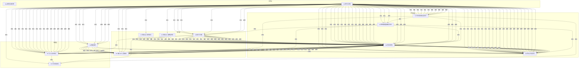

```mermaid
graph TD
    00["00 索引与导航"]
    01["01 制度总纲"]
    02["02 引入与清退规范"]
    03["03 日常管理规范"]
    04["04 评估与考核体系"]
    05["05 方法论体系"]
    06["06 场景SOP-决策判断"]
    07["07 场景SOP-项目执行"]
    08["08 场景SOP-通用与应急"]
    09["09 执行工具集"]
    10["10 AI转型与知识库"]
    11["11 供应商深度调研方法论"]
    12["12 供应商联盟培训体系"]
    subgraph 制度层
        01
        02
        03
    end
    subgraph 方法论层
        04
        05
        11
        12
    end
    subgraph 执行层
        06
        07
        08
        09
    end
    subgraph 支撑层
        00
        10
    end
    00 -->|参见| 01
    00 -->|参见| 02
    00 -->|参见| 03
    00 -->|参见| 04
    00 -->|参见| 05
    00 -->|参见| 06
    00 -->|参见| 06
    00 -->|参见| 09
    00 -->|参见| 09
    00 -->|参见| 04
    00 -->|参见| 09
    00 -->|参见| 09
    00 -->|参见| 02
    00 -->|参见| 02
    00 -->|参见| 11
    00 -->|参见| 12
    00 -->|参见| 06
    00 -->|参见| 07
    00 -->|参见| 08
    00 -->|参见| 01
    00 -->|参见| 02
    00 -->|参见| 02
    00 -->|参见| 02
    00 -->|参见| 04
    00 -->|参见| 04
    00 -->|参见| 04
    00 -->|参见| 05
    00 -->|参见| 05
    00 -->|参见| 05
    00 -->|参见| 02
    00 -->|参见| 04
    00 -->|参见| 02
    00 -->|参见| 04
    00 -->|参见| 04
    00 -->|参见| 04
    00 -->|参见| 04
    00 -->|参见| 04
    00 -->|参见| 05
    00 -->|参见| 05
    00 -->|参见| 05
    00 -->|参见| 02
    00 -->|参见| 02
    00 -->|参见| 04
    00 -->|参见| 04
    00 -->|参见| 01
    00 -->|参见| 01
    00 -->|参见| 05
    00 -->|参见| 09
    00 -->|参见| 12
    00 -->|参见| 12
    00 -->|参见| 12
    00 -->|参见| 12
    00 -->|参见| 12
    00 -->|参见| 11
    00 -->|调用| 01
    00 -->|调用| 02
    00 -->|调用| 02
    00 -->|调用| 02
    00 -->|调用| 04
    00 -->|调用| 04
    00 -->|调用| 04
    00 -->|调用| 05
    00 -->|调用| 05
    00 -->|调用| 05
    00 -->|调用| 02
    00 -->|调用| 04
    00 -->|调用| 02
    00 -->|调用| 04
    00 -->|调用| 04
    00 -->|调用| 04
    00 -->|调用| 04
    00 -->|调用| 04
    00 -->|调用| 05
    00 -->|调用| 05
    00 -->|调用| 05
    00 -->|调用| 02
    00 -->|调用| 02
    00 -->|调用| 04
    00 -->|调用| 04
    00 -->|调用| 01
    00 -->|调用| 01
    00 -->|调用| 05
    00 -->|调用| 05
    00 -->|调用| 05
    00 -->|调用| 05
    00 -->|调用| 05
    00 -->|调用| 09
    00 -->|调用| 12
    00 -->|调用| 12
    00 -->|调用| 12
    00 -->|调用| 12
    00 -->|调用| 12
    00 -->|调用| 11
    01 -->|参见| 04
    01 -->|参见| 06
    01 -->|参见| 06
    01 -->|参见| 06
    01 -->|参见| 06
    01 -->|参见| 06
    01 -->|参见| 06
    01 -->|参见| 06
    01 -->|参见| 04
    02 -->|参见| 03
    02 -->|参见| 05
    02 -->|参见| 05
    02 -->|调用| 05
    02 -->|调用| 05
    05 -->|参见| 06
    05 -->|参见| 06
    05 -->|参见| 06
    05 -->|参见| 06
    05 -->|参见| 06
    05 -->|参见| 02
    05 -->|参见| 04
    05 -->|参见| 04
    05 -->|参见| 04
    05 -->|参见| 04
    05 -->|参见| 02
    05 -->|参见| 04
    05 -->|调用| 02
    05 -->|调用| 04
    05 -->|调用| 04
    05 -->|调用| 04
    05 -->|调用| 04
    05 -->|调用| 02
    05 -->|调用| 04
    06 -->|参见| 05
    06 -->|参见| 05
    06 -->|参见| 05
    06 -->|调用| 05
    06 -->|调用| 05
    06 -->|调用| 05
    07 -->|参见| 05
    07 -->|参见| 05
    07 -->|参见| 05
    07 -->|调用| 05
    07 -->|调用| 05
    07 -->|调用| 05
    08 -->|参见| 05
    08 -->|参见| 05
    08 -->|参见| 05
    08 -->|调用| 05
    08 -->|调用| 05
    08 -->|调用| 05
    09 -->|参见| 05
    09 -->|参见| 05
    09 -->|参见| 05
    09 -->|参见| 05
    09 -->|参见| 05
    09 -->|参见| 05
    09 -->|参见| 05
    09 -->|参见| 05
    09 -->|参见| 05
    09 -->|参见| 02
    09 -->|参见| 03
    09 -->|参见| 05
    09 -->|调用| 05
    09 -->|调用| 05
    09 -->|调用| 05
    09 -->|调用| 05
    09 -->|调用| 05
    09 -->|调用| 05
    09 -->|调用| 05
    09 -->|调用| 05
    09 -->|调用| 05
    11 -->|参见| 04
    11 -->|参见| 05
    11 -->|参见| 06
    11 -->|参见| 09
    12 -->|参见| 02
    12 -->|参见| 03
    12 -->|参见| 05
    12 -->|参见| 11
```