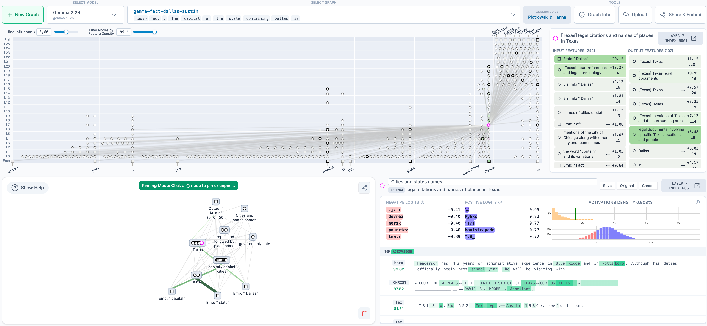

# 开源电路追踪工具

在我们最近的可解释性研究中，我们提出了一种新方法来[追踪大语言模型的思考过程](https://www.anthropic.com/research/tracing-thoughts-language-model)。今天，我们将该方法开源，让任何人都能在我们的研究基础上继续构建。

我们的方法是生成*归因图*（attribution graphs），它（部分地）揭示模型在内部决定某个输出时所采取的步骤。我们发布的开源[代码库](https://github.com/safety-research/circuit-tracer)支持在流行的开源权重模型上生成归因图——Neuronpedia 托管的前端则让你可以交互式地探索这些图。

本项目由 [Anthropic Fellows](https://alignment.anthropic.com/2024/anthropic-fellows-program/) 项目的参与者主导，与 [Decode Research](https://www.decoderesearch.org/) 合作完成。

要开始使用，你可以访问 [Neuronpedia 界面](https://www.neuronpedia.org/gemma-2-2b/graph)，为你选择的提示生成并查看自己的归因图。如需更复杂的使用和研究，可以查看[代码仓库](https://github.com/safety-research/circuit-tracer)。本次发布使研究人员能够：

- **追踪电路**：在支持的模型上生成归因图；
- **可视化、标注和分享**：在交互式前端中操作归因图；
- **检验假设**：通过修改特征值并观察模型输出如何变化来测试假设。

我们已经使用这些工具研究了 Gemma-2-2b 和 Llama-3.2-1b 中的多步推理、多语言表示等有趣行为——参见我们的演示 [notebook](https://github.com/safety-research/circuit-tracer/blob/main/demos/circuit_tracing_tutorial.ipynb) 获取示例和分析。我们也邀请社区帮助发现更多有趣的电路——作为启发，我们在演示 notebook 和 Neuronpedia 上提供了尚未分析的其他归因图。

我们的 CEO Dario Amodei [最近写道](https://www.darioamodei.com/post/the-urgency-of-interpretability)可解释性研究的紧迫性：目前，我们对 AI 内部运作的理解远远落后于我们在 AI 能力方面取得的进展。通过开源这些工具，我们希望让更广泛的社区更容易研究语言模型内部发生了什么。我们期待看到这些工具在理解模型行为方面的应用，以及改进工具本身的扩展。

*开源电路追踪代码库由 Anthropic Fellows 成员 Michael Hanna 和 Mateusz Piotrowski 开发，由 Emmanuel Ameisen 和 Jack Lindsey 指导。Neuronpedia 集成由 Decode Research 实现（Neuronpedia 负责人：Johnny Lin；科学负责人/总监：Curt Tigges）。我们的 Gemma 图基于 GemmaScope 项目中训练的 transcoder。如有问题或反馈，请在 GitHub 上提交 issue。*
