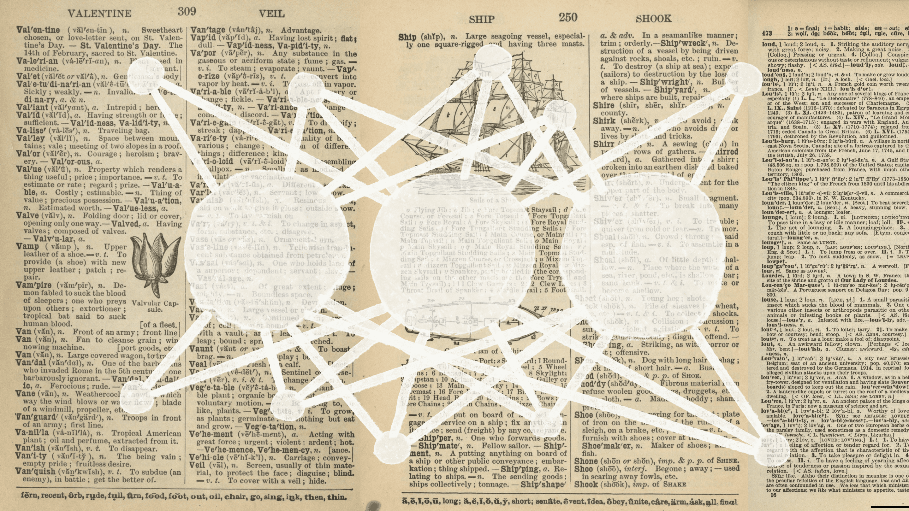
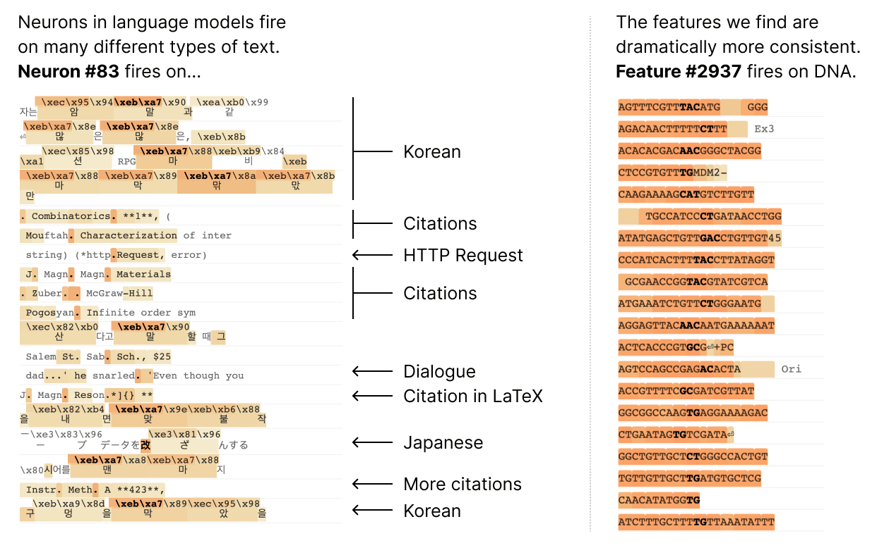
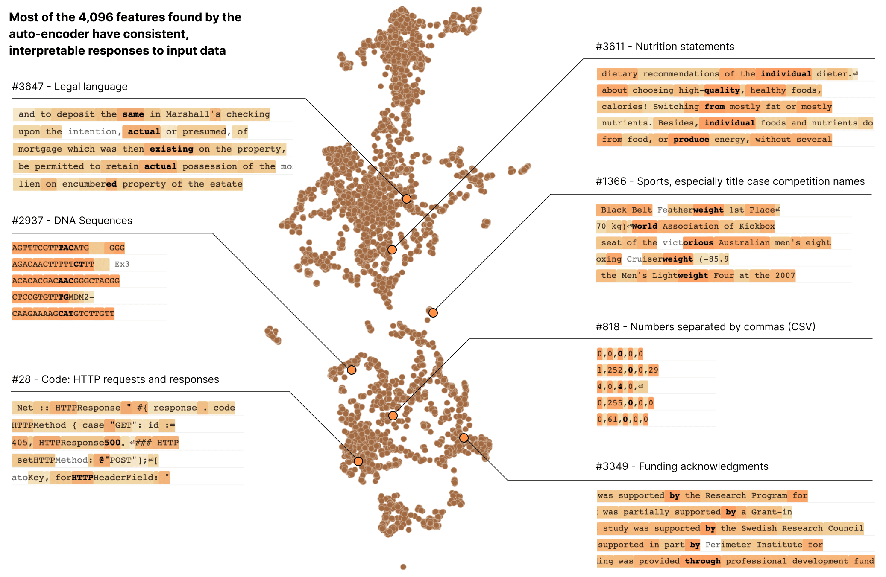
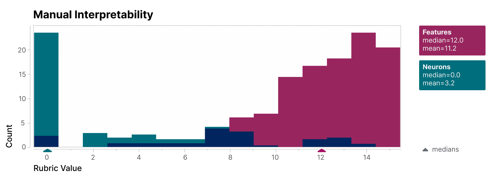
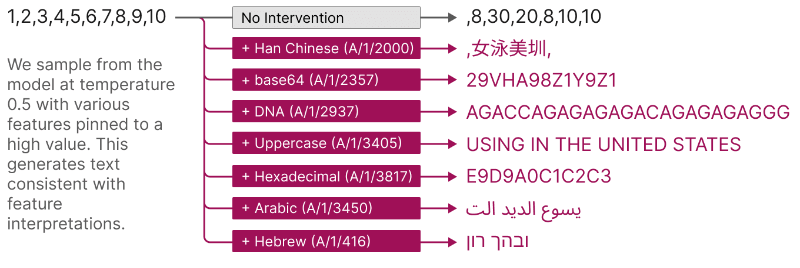

# 将语言模型分解为可理解的组件

神经网络是通过数据训练出来的，而不是按规则编程的。训练的每一步都在更新数百万或数十亿个参数，使模型在任务上做得更好，训练结束时，模型能够展现一系列令人眼花缭乱的行为。我们对训练后网络的数学原理理解得非常精确——神经网络中的每个神经元都执行简单的算术运算——但我们不理解为什么这些数学运算会导致我们观察到的行为。这使得诊断故障模式变得困难，难以知道如何修复它们，也难以证明模型真正安全。

神经科学家在理解人类行为的生物学基础时面临类似的问题。一个人大脑中神经元的放电必定以某种方式实现了他们的思想、情感和决策。几十年的神经科学研究揭示了大量关于大脑如何工作的知识，并促成了癫痫等疾病的靶向治疗，但仍有大量未解之谜。幸运的是，对于我们这些试图理解人工神经网络的人来说，实验要容易得多。我们可以同时记录网络中每个神经元的激活，通过抑制或刺激它们进行干预，并测试网络对任何可能输入的响应。

不幸的是，单个神经元与网络行为之间并没有一致的关系。例如，一个小型语言模型中的[单个神经元](https://transformer-circuits.pub/2023/monosemantic-features/vis/a-neurons.html#feature-83)在许多不相关的上下文中活跃，包括：学术引用、英文对话、HTTP 请求和韩语文本。在一个经典的视觉模型中，一个[单个神经元](https://distill.pub/2017/feature-visualization/#diversity)既响应猫的脸，也响应车的前脸。一个神经元的激活在不同的上下文中可能意味着不同的事情。

在我们最新的论文[《走向单义性：用字典学习分解语言模型》](https://transformer-circuits.pub/2023/monosemantic-features/index.html)中，我们提出了证据表明存在比单个神经元更好的分析单元，并且我们构建了能在小型 transformer 模型中找出这些单元的机制。这些单元被称为**特征（features）**，对应于神经元激活的模式（线性组合）。这为将复杂的神经网络分解为可理解的部分提供了一条路径，并建立在神经科学、机器学习和统计学领域先前解释高维系统的努力之上。

在一个 transformer 语言模型中，我们将一个有 512 个神经元的层分解为 4000 多个特征，这些特征分别表示诸如 DNA 序列、法律语言、HTTP 请求、希伯来语文本、营养声明等内容。当孤立地查看单个神经元的激活时，这些模型属性大部分是不可见的。

为了验证我们找到的特征比模型的神经元更具可解释性，我们让一位盲评人员对其可解释性进行评分。特征（红色）的得分远高于神经元（青色）。

我们还采用了一种"自动可解释性"方法：使用一个大型语言模型为小型模型的特征生成简短描述，然后根据另一个模型基于该描述预测特征激活的能力来评分。同样，特征的得分高于神经元，这提供了额外的证据，表明特征的激活及其对模型行为的下游影响具有一致的解释。

特征还提供了一种有针对性操控模型的方式。如下图所示，人为激活一个特征会导致模型行为以可预测的方式发生变化。

最后，我们拉远视角，将特征集作为一个整体来审视。我们发现学习到的特征在不同模型之间基本上具有普适性，因此通过研究一个模型的特征学到的经验可能会推广到其他模型。我们还尝试调整我们学习的特征数量。我们发现这提供了一个"旋钮"，用于[调节我们观察模型时看到的分辨率](https://transformer-circuits.pub/2023/monosemantic-features/index.html#phenomenology-feature-splitting)：将模型分解为少量特征能提供一个更易理解的粗略视图，而将其分解为大量特征则能提供一个揭示模型微妙属性的精细视图。

这项工作是 Anthropic 在机制可解释性方面投入的成果——这是我们 AI 安全领域最长线的研究投资之一。在此之前，单个神经元的不可解释性是对语言模型进行机制性理解的重大障碍。将神经元组分解为可解释的特征有可能跨越这一障碍。我们希望这最终能让我们从内部监控和操控模型行为，从而提高企业和社会应用所必需的可靠性与安全性。

我们的下一个挑战是将这种方法从我们演示成功的小型模型扩展到规模大得多、复杂程度高得多的前沿模型。我们第一次感到，解释大型语言模型的下一个主要障碍是工程问题，而非科学问题。
