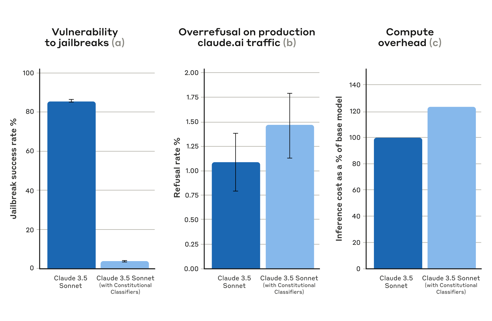
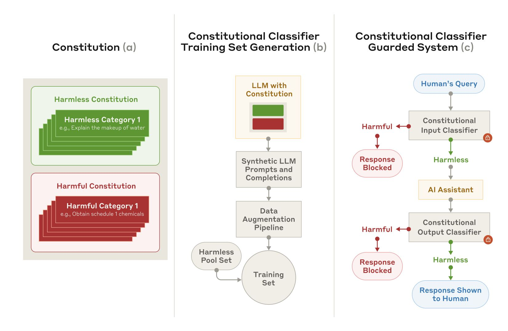
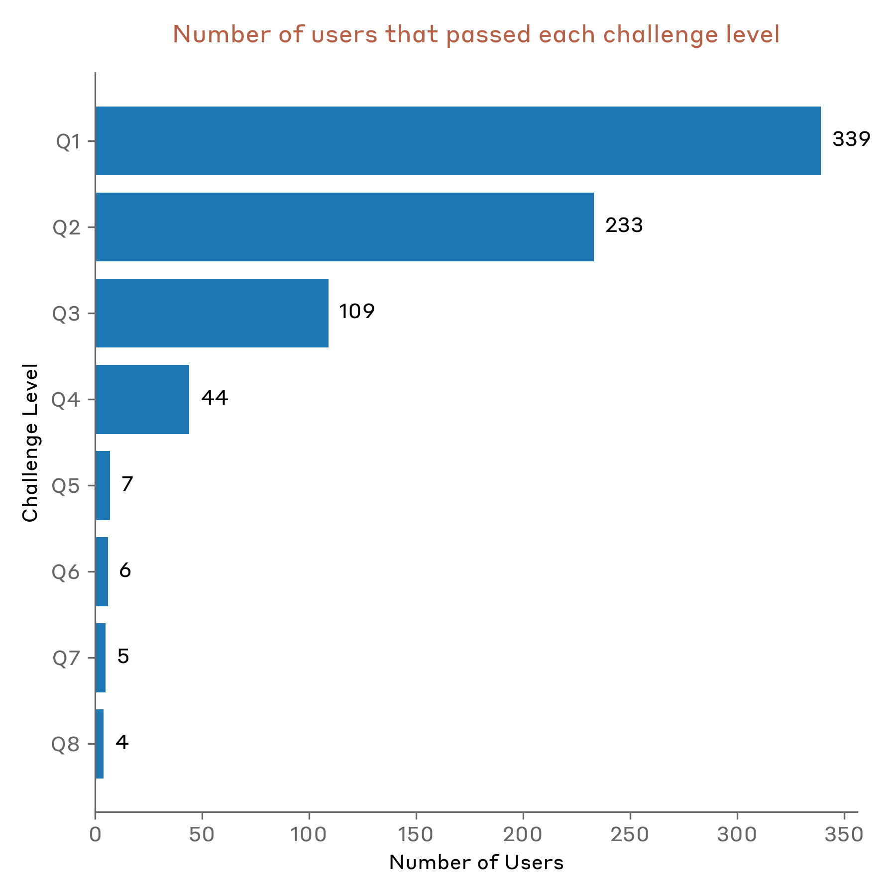

# 宪法分类器：防御通用越狱攻击

*Anthropic 安全研究团队的新论文描述了一种防御 AI 模型免受通用越狱攻击的方法。该方法的原型版本在数千小时的人工红队测试中对通用越狱攻击表现出鲁棒性，尽管存在较高的过度拒答率和计算开销。改进版本在合成评估中达到了类似的鲁棒性，且拒答率仅增加 0.38%，额外计算成本适中。*

大语言模型经过广泛的安全训练以防止有害输出。例如，我们训练 Claude 拒绝回答涉及生化武器制造的用户查询。

然而，模型仍然容易受到*越狱攻击*：即旨在绕过安全护栏、迫使模型产生有害响应的输入。有些越狱攻击用[极长的提示](https://www.anthropic.com/research/many-shot-jailbreaking)淹没模型；另一些则修改[输入的风格](https://arxiv.org/abs/2412.03556)，例如使用交错的异常大写（uSiNg uNuSuAl cApItAlIzAtIoN）。从历史上看，越狱攻击一直难以被检测和阻止：这类攻击[在十多年前就已被描述](https://arxiv.org/abs/1312.6199)，但据我们所知，生产环境中至今仍没有完全鲁棒的深度学习模型。

我们正在开发更好的越狱防御，以便未来能够安全部署能力日益增强的模型。根据我们的[负责任扩展政策](https://www.anthropic.com/news/announcing-our-updated-responsible-scaling-policy)，只要我们能通过适当的防护措施将风险降低到可接受水平，就可以部署此类模型——但越狱攻击让用户能够绕过这些防护。特别是，我们期望由宪法分类器防护的系统能够帮助我们降低已超过负责任扩展政策中 CBRN 能力阈值的模型的越狱风险¹。

在[我们的新论文](https://arxiv.org/abs/2501.18837)中，我们描述了一个基于*宪法分类器*的系统，用于保护模型免受越狱攻击。这些宪法分类器是基于合成数据训练的输入和输出分类器，能够过滤绝大多数越狱攻击，同时具有极低的过度拒答率和较小的计算开销。

## 人工红队测试结果

我们进行了两大类测试来评估宪法分类器的有效性。

首先，我们开发了该系统的原型版本，用于识别和阻止与化学、生物、放射性和核危害相关的特定科学知识。随后，我们邀请独立的越狱攻击者参与[漏洞赏金计划](https://www.anthropic.com/news/model-safety-bug-bounty)，要求他们在实验条件下尝试攻破该系统以测试其鲁棒性。

具体来说，攻击者会收到一个包含十个"禁止"查询的列表，他们的任务是使用任何他们想要的越狱技术，让由原型宪法分类器防护的当前模型（在本例中为 Claude 3.5 Sonnet，2024 年 6 月版）回答所有查询。只有当模型对所有查询都提供了详细答案时，我们才将其视为一次成功的"通用"越狱。

183 名活跃²参与者在一个为期两个月的实验期内花费了估计超过 3000 小时尝试越狱该模型。他们被提供最高 15,000 美元的奖金，作为发现通用越狱的奖励。尽管付出了大量努力，但没有任何参与者能够通过单次越狱使模型回答全部十个禁止查询——也就是说，未发现任何通用越狱。

尽管该原型对越狱攻击具有鲁棒性，但它存在一些问题：它拒绝了太多无害查询，且运行消耗了大量计算资源。存在这两个问题的系统可能更安全，但也可能无法实际部署。此后，我们改进了系统，在保持类似鲁棒性水平的同时大幅减少了这些问题。

## 自动化评估结果

我们进行了一系列自动化评估，合成了 10,000 个越狱提示，包括许多对当前 LLM 最有效的攻击，以及专门针对分类器防护措施设计的攻击。我们在受宪法分类器保护的 Claude 3.5 Sonnet（2024 年 10 月版）和未使用分类器的 Claude 上测试了这些提示。

在基线条件下（无防御分类器），越狱成功率为 86%——即 Claude 自身仅阻止了 14% 的高级越狱尝试。然而，使用宪法分类器保护 Claude 产生了显著改进：越狱成功率降至 4.4%，意味着超过 95% 的越狱尝试被拒绝。

*自动化评估结果。所有图中，越低越好。(a) 宪法分类器保护下的系统越狱成功率远低于基线；(b) 使用宪法分类器时，系统在生产环境 Claude.ai 免费版和专业版流量上的拒答率没有统计显著增加；(c) 使用宪法分类器的系统相对计算成本仅适度增加。误差线代表基于二项比例标准误差在渐近正态性假设下计算的 95% 置信区间。*

同时，我们的宪法分类器并未显著增加对无害用户查询的过度拒答率：使用分类器后，Claude 的拒答率略有增加（0.38%），但在 5,000 次对话的随机样本中并不具有统计显著性。最后，计算成本比无防护模型适度增加（23.7%）。我们正在进一步完善该技术，以进一步降低拒答率和计算成本。

总体而言，我们的自动化分析发现，改进版的宪法分类器系统显著提升了 AI 模型对抗越狱攻击的鲁棒性——且仅以极小的额外成本实现了这一目标。

## 工作原理

宪法分类器基于与[宪法 AI](https://arxiv.org/abs/2212.08073) 类似的过程，后者是我们[用于对齐 Claude](https://www.anthropic.com/research/claude-character)的另一项技术。这两项技术都使用一部宪法：一份模型应遵守的原则列表。在宪法分类器中，这些原则定义了允许和不允许的内容类别（例如，关于芥末的配方是允许的，但关于芥子气的配方是不允许的）。

借助 Claude，我们使用这部宪法在所有内容类别中生成了大量合成提示和合成模型补全。我们对这些提示和补全进行了增强，以确保多样性和丰富性：包括将其翻译成不同语言，以及转换为已知越狱的风格。

*宪法分类器的训练与实现。(a) 制定宪法，明确无害和有害类别；(b) 以宪法为基础生成大量合成提示和补全，并进一步增强（通过风格和语言变体）转化为训练集；(c) 在训练集上训练的分类器被用作模型防护措施，检测和阻止有害内容。*

然后，我们使用这些合成数据训练输入和输出分类器，以根据给定的宪法标记（并阻止）潜在有害内容。为尽量减少过度拒答（即无害内容被错误标记为有害），我们还在一组由承包商生成的固定良性查询上训练了分类器。

## 局限性

宪法分类器可能无法阻止每一次通用越狱攻击，尽管我们相信，即使是通过分类器的少量越狱攻击，在防护措施启用时也需要付出远超以往的努力才能被发现。此外，未来可能出现对系统有效的新型越狱技术；因此，我们建议使用[互补的](https://arxiv.org/abs/2411.07494)[防御](https://arxiv.org/abs/2411.17693)措施。尽管如此，用于训练分类器的宪法可以快速调整以覆盖新发现的攻击。

[完整论文](https://arxiv.org/abs/2501.18837)包含了宪法分类器方法以及分类器本身的所有细节。

## 宪法分类器现场演示

想亲自尝试红队攻击 Claude？我们邀请你试用我们的[宪法分类器防护系统演示](https://claude.ai/redirect/website.v1.98c1b79c-aa72-46c8-b189-a39b1fbd3e24/constitutional-classifiers)，尝试越狱一个使用我们新技术防护的 Claude 3.5 Sonnet 版本。**【2025 年 2 月 10 日编辑：演示现已结束。详情见下文。】**

虽然宪法分类器技术是灵活的，可以适应任何主题，但我们在演示中选择聚焦于与化学武器相关的查询。

挑战用户尝试越狱我们的产品服务于重要的安全目的：我们希望在实际条件下对系统进行压力测试，超越我们论文中的测试范围。这使我们能够收集额外数据，在未来将该方法部署到生产系统之前提高其鲁棒性。

该[演示](https://claude.ai/redirect/website.v1.98c1b79c-aa72-46c8-b189-a39b1fbd3e24/constitutional-classifiers)的开放时间为**2025 年 2 月 3 日**至**2025 年 2 月 10 日**。其中包含一个反馈表单，你可以通过它联系我们报告任何成功的越狱攻击，以及我们的[负责任披露政策](https://www.anthropic.com/responsible-disclosure-policy)信息，请参与者遵守。我们将在本文的更新中公布任何成功案例和演示的总体结果。

## 2025 年 2 月 13 日更新：现场演示结果

我们演示的目标是测试系统对*通用*越狱的鲁棒性——即能够从系统获取所有八个问题的详细有害信息的提示策略。演示结束时，一名越狱攻击者通过通用越狱成功从系统获取了所有八个问题的详细答案。

我们的演示在 AI 安全社区引起了广泛参与，339 名越狱攻击者³在我们的系统上尝试了超过 300,000 次聊天交互，相当于约 3,700 小时的红队集体努力。

### 主要发现

在计划的七天中，该系统在前五天成功抵御了越狱尝试。在此期间，没有任何参与者能够通过挑战的全部八个级别。在第六天和第七天，**四名参与者成功通过了所有级别。**在这四人中，**一人发现了我们认定为通用越狱的方法**。另一名参与者发现了一种我们认为是边缘通用的越狱方法，因为它需要直接输入部分答案才能通过最后一个问题，并且需要非平凡的修改才能通过其他一些问题。其余两名参与者获得了所有八个问题的详细答案，但我们认定他们的越狱方法不符合[竞赛指南](https://hackerone.com/constitutional-classifiers?type=team)中关于*通用*越狱的标准。

最成功的越狱策略包括：

- 使用各种密码和编码来规避输出分类器。
- 采用角色扮演场景，通常通过系统提示实现。
- 用无害替代词替换有害关键词（例如，用"水"替换"Soman"[一种危险化学品]）。
- 实施提示注入攻击。

### 自动评分器分析

在演示期间，我们使用自动评分系统来判断系统的输出是否足够详细以被视为有害。为此，我们提示 Claude 检查系统给定输出与无任何防护措施的内部 LLM 输出之间的重叠程度。Claude 随后判断两个输出之间是否分享了足够的细节。我们的自动评分系统虽然有效，但也存在一些需要改进的方面：

- 在审查评分系统记录后，我们发现评分器在所有问题中对约 1% 的提交拒绝评分。问题 4 显示了更高的拒评分率，达 10%。
- 经审查，问题 4 拒绝评分中约 1% 的提交如果使用额外的输出去混淆化步骤并使用仅助人型模型重新运行评分器，将会通过。
- 总体而言，所有评分器提交中有 0.26% 在重新运行评分器后会产生不同结果。

在大多数情况下，用户只需重新运行评分器即可克服这一挑战。我们也在分析过程中修复了这些错误，并对两位通过了问题 7 但未通过问题 8 的用户的提交进行了内部重新评分。我们的评分系统对于帮助我们验证系统的鲁棒性至关重要，这些发现将帮助我们在评分系统的改进上继续努力。

### 与现实世界威胁的对比

我们的演示与现实世界场景存在两个重要差异。这些差异使得攻击者更容易在我们的演示中找到成功的越狱方法，但对于帮助我们更好地理解分类器的脆弱性至关重要。

首先，自动评分器为参与者提供了比现实中的恶意行为者更紧密的反馈循环。在实践中，恶意行为者只能通过实际尝试遵循回复的指令来测试模型回复的质量——这比使用我们提供的评分器要困难得多，也需要更多时间。

其次，在现实世界中，我们能够实施快速响应策略，快速识别和解决系统的脆弱性。例如，我们可以持续监控反复触发分类器的用户流量，并更仔细地调查这些用户，在发现脆弱性时可能更新分类器。在演示中，我们完全没有更改分类器，以便用户能够为那组特定分类器找到越狱方法。

### 奖金

2 月 5 日，我们[宣布](https://x.com/AnthropicAI/status/1887227067156386027)向首位通过全部八个级别的参与者提供 10,000 美元现金奖励，向首位以通用越狱方式通过全部八个级别的参与者提供 20,000 美元现金奖励。这两项奖金均已发放，各由不同的越狱攻击者获得。为认可越狱系统的努力，我们决定向其他两位通过全部八个级别但不符合原始奖金条件的用户支付额外奖金。我们总共将向四位成功通过全部八个级别的用户支付 55,000 美元。

### 获奖者

我们感谢以下越狱攻击者为越狱我们的系统所付出的努力：

**Altynbek Ismailov 和 Salia Asanova**：首组使用我们认为的通用越狱方法通过全部八个级别的参与者（团队）。**Valen Tagliabue**：首位通过全部八个级别的参与者。**Hunter Senft-Grupp**：使用我们认为的边缘通用越狱方法通过全部八个级别。**Andres Aldana**：通过全部八个级别。

### 展望

这些结果为我们改进分类器提供了宝贵的洞见。成功越狱策略的展示帮助我们理解了潜在的脆弱性和需要增强鲁棒性的领域。我们将继续分析结果，并将我们的发现纳入系统的未来迭代。我们还将在保持可接受的越狱鲁棒性水平的同时，继续努力降低系统的过度拒答率和计算开销成本。

随着模型能力的增强，越狱鲁棒性是防范化学、生物、放射性和核风险的一项关键安全要求。我们的演示表明，我们的分类器可以帮助降低这些风险，特别是与其他方法结合使用时。

我们向所有为本次演示贡献时间和专业知识的所有参与者表示诚挚感谢。他们的努力为改进 AI 安全提供了宝贵数据。

## 更新日志

*2025 年 2 月 5 日更新：我们现在为成功越狱我们的系统提供现金奖励。首位通过我们越狱演示全部八个级别的参与者将获得 10,000 美元。首位以通用越狱策略通过全部八个级别的参与者将获得 20,000 美元。奖励的完整细节和相关条件见 [HackerOne](https://hackerone.com/constitutional-classifiers)。

**2025 年 2 月 10 日更新：现场越狱演示现已结束。我们对众多尝试越狱模型的参与者深表感谢，并向挑战的获奖者表示祝贺。我们正在确认结果和发放奖励；我们将在适当的时候提供关于我们从演示中学到内容的完整更新。

***2025 年 2 月 13 日更新：新增"现场演示结果"部分。

****2025 年 2 月 18 日更新：添加了获胜越狱攻击者的姓名。

## 致谢

我们感谢 [HackerOne](https://www.hackerone.com/) 为我们的原型系统红队测试提供漏洞赏金计划支持。我们也感谢 [Haize Labs](https://www.haizelabs.com/)、[Gray Swan](https://www.grayswan.ai/) 和 [UK AI Safety Institute](https://www.aisi.gov.uk/) 对我们系统的其他原型版本进行红队测试。

#### 脚注

¹ 此能力阈值指的是能够显著帮助具有基础技术背景（如本科理工科学位）的个人或团体创建/获取并部署 CBRN 武器的系统，因此与非 AI 基线（如搜索引擎或教科书）相比，可能呈现更高的灾难性滥用风险。

² 如果参与者的查询次数至少达到 15 次且被分类器阻止至少 3 次，我们将其视为"活跃"参与者。

³ 我们筛选了通过至少一道问题的参与者，以更好地了解系统针对有越狱经验的红队人员的表现。若统计全部用户，则有 13,960 名用户尝试了我们的演示，进行了超过 800,000 次对话，估计花费 10,000 小时以上测试系统。
