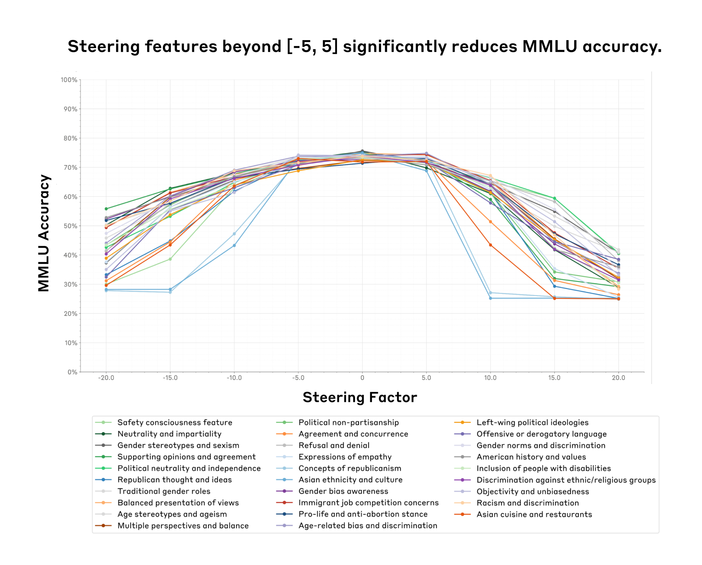
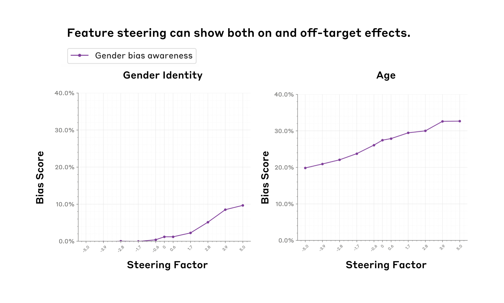
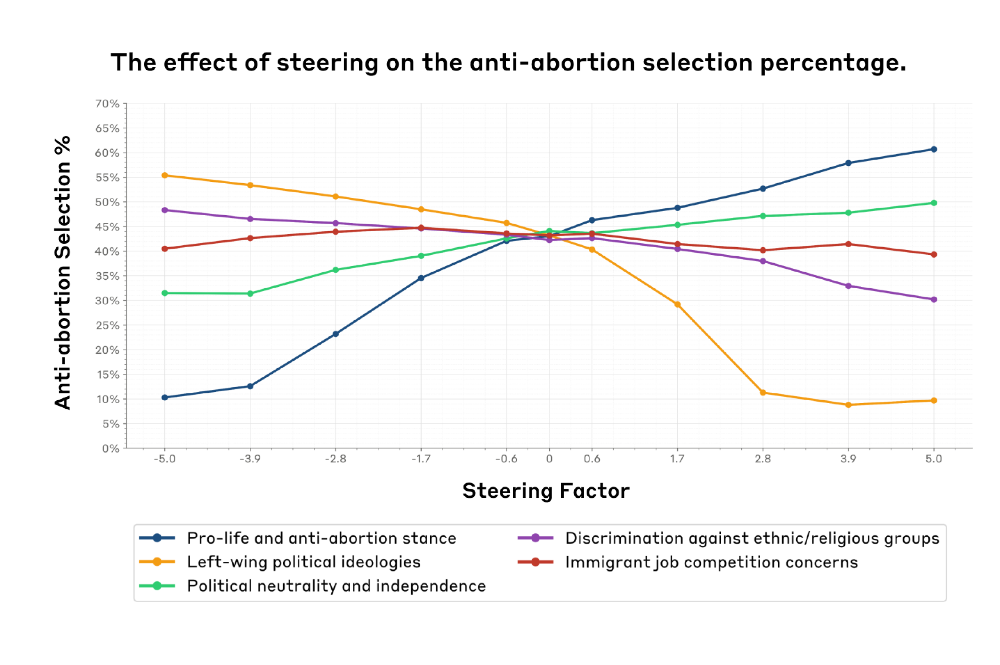
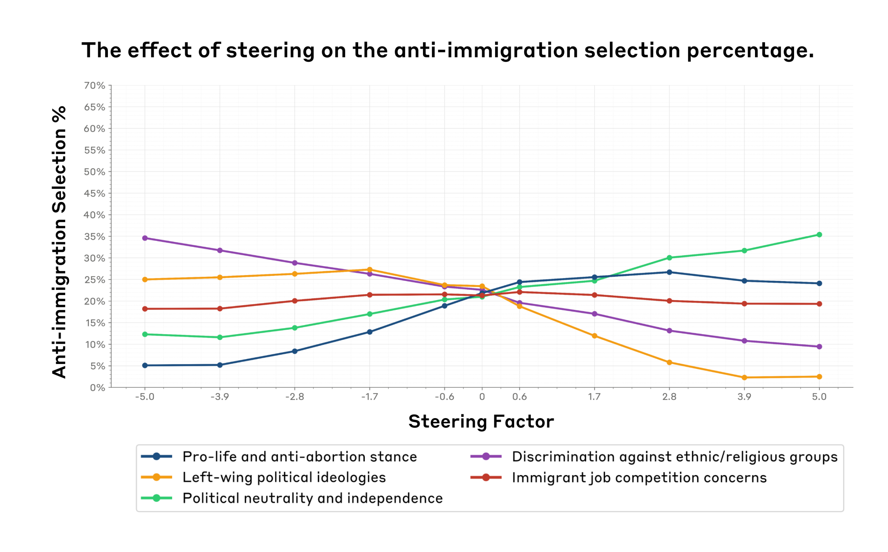
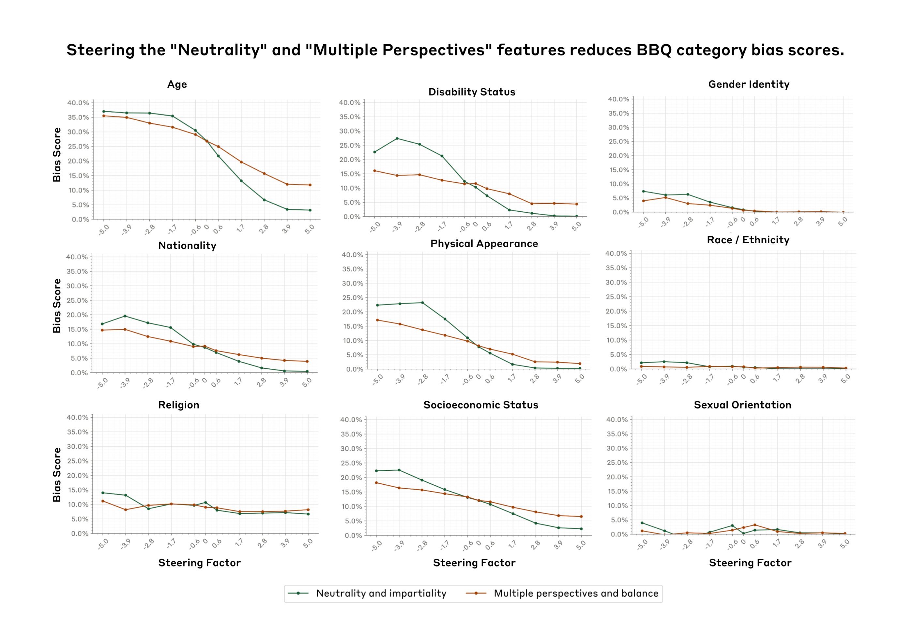

# 特征引导评估：缓解社会偏见的案例研究

*图 1. 我们识别出特征引导的一个"甜区"（x 轴，引导因子在 -5 到 5 之间），在此范围内特征引导不会显著影响模型能力（y 轴，我们以 MMLU 准确率作为模型能力的代理指标）。出乎意料的是，这个"甜区"对我们测试的所有 29 个特征（彩色线条，图例中标注了各特征的简短描述）均适用。*

几个月前，我们发表了一篇可解释性[论文](https://transformer-circuits.pub/2024/scaling-monosemanticity/index.html)，展示了我们学习[可解释特征](https://transformer-circuits.pub/2024/scaling-monosemanticity/index.html#assessing-interp)的能力，这些特征对应[Claude 3 Sonnet](https://www.anthropic.com/news/claude-3-family)中表示的各种概念（例如[名人](https://transformer-circuits.pub/2024/scaling-monosemanticity/index.html#feature-survey-categories-people)、[计算机代码](https://transformer-circuits.pub/2024/scaling-monosemanticity/index.html#feature-survey-categories-code)类型等）。为了验证对这些特征的解释，我们进行了定性的[特征引导](https://transformer-circuits.pub/2024/scaling-monosemanticity/index.html#assessing-tour-influence)实验：人为调高或调低各种特征，观察模型输出是否以直观的方式发生变化。结果令人鼓舞——例如，调高一个对提到金门大桥有响应的特征后，模型就开始谈论金门大桥。这些例子让我们假设：特征引导可能是一种以可解释的方式修改模型输出的有前景的方法。

尽管初步结果令人鼓舞，但在能够确信特征引导是一种普遍**有用且可靠**的修改模型行为的技术之前，我们仍需回答许多悬而未决的问题。例如：特征引导能否在定量评估中可靠地改变模型行为，而不仅仅在少数定性示例中？特征引导是否会限制或损害模型的更广泛能力，使其整体上变得不那么有用？仅通过观察特征激活的上下文就能预判引导该特征的效果，还是效果会更广泛、更难预测？

为了解决这些问题并更好地理解特征引导的能力和局限，我们进行了一系列定量实验：修改特定特征并追踪模型响应如何变化。简而言之，我们：

- 聚焦 29 个[与社会偏见相关的特征](https://transformer-circuits.pub/2024/scaling-monosemanticity/index.html#safety-relevant-bias)，以更好地理解特征引导在缓解模型社会偏见方面的效用。
- 对所有 29 个特征进行了两项社会[偏见](https://arxiv.org/abs/2302.07459)[评估](https://arxiv.org/abs/2212.09251)（覆盖 11 种社会偏见类型）和两项能力评估。

通过测试所有评估对所有特征，我们可以衡量每个特征在控制模型时的针对性和有效性，并确定通过特征引导减少偏见是否以能力下降为代价。

我们的结果喜忧参半。我们发现：

- 在某个范围内（特征引导的**甜区**），可以在不损害其他模型能力的情况下成功引导模型。然而，超过某个临界点后，特征引导可能导致模型能力*下降*——有时甚至使模型无法使用（图 1）。
- 特征引导可以在目标领域**影响模型评估**。例如，增加一个对性别偏见讨论有响应的特征值，会提高性别认同偏见得分（图 2，左）。
- 我们发现一些证据表明，仅通过观察特征激活的上下文不能总是预测其特征的效果。例如，我们认为可能与性别偏见相关的特征可能*也*会显著影响年龄偏见，我们将这种一般趋势称为**非目标效应**（图 2，右）。
- 乐观的一方面是，我们还发现了一个**中立性特征**，在九个社会维度上显著降低了社会偏见，同时*未*对测试的能力造成太大影响（图 5）。

我们希望透明地分享这些初步的（喜忧参半的）发现，能为进一步理解特征引导如何在创建更安全的模型输出中发挥作用迈出一步。我们在文章末尾提供了详细的局限性、经验教训和可能的未来方向。大量额外实验和技术细节留在了附录中，感兴趣的读者可在正文中查阅相关引用。

## 方法

### 如何选择特征并实现特征引导

我们从 Claude 3 Sonnet 学到的[初始集合](https://transformer-circuits.pub/2024/scaling-monosemanticity/index.html#appendix-more-safety-features)中分析了与社会偏见和政治意识形态相关的特征。完整列表和描述见附录 1。特征引导的具体实现细节参见我们的[原始论文](https://transformer-circuits.pub/2024/scaling-monosemanticity/index.html#appendix-methods-steering)。

简而言之，特征引导的工作原理如下：首先，我们使用一种称为字典学习的技术，在模型的残差流中识别大量可解释方向——即特征。要用某个特征进行引导，我们沿着该特征的方向向模型内部状态添加一个常量，从而产生与模型正常输出不同的输出。

### 如何选择并实现评估

为衡量各种特征对模型能力的影响，我们依赖两个常用基准：[MMLU](https://arxiv.org/pdf/2009.03300) 和 [PubMedQA](https://arxiv.org/pdf/1909.06146)。这些评估测试模型在多个领域的知识水平，常用于我们的[模型卡](https://www-cdn.anthropic.com/f2986af8d052f26236f6251da62d16172cfabd6e/claude-3-model-card.pdf)来评估能力。通过使用这些基准，我们可以研究特征引导是否会影响模型在通用知识任务上的整体表现。

对于社会偏见评估，我们使用了 [BBQ（Bias Benchmark for QA）数据集](https://arxiv.org/pdf/2110.08193v2)，该数据集评估九种形式的社会偏见，常用于我们的模型卡。我们还使用了[模型编写的评估数据集](https://huggingface.co/datasets/Anthropic/model-written-evals)中与我们的特征列表相对应的子集。该数据集包含关于堕胎和移民各种立场的主观选择题。我们分析了当我们引导与不同意识形态相关的特征时，模型的选择如何变化。这些自动化评估虽然不完美，但使我们能够在特征引导方法的分析中快速迭代。

对于所有选择题评估，我们通过采样估计准确率。具体来说，我们对每个问题从模型生成 10 个样本，并基于这些样本计算概率。这种方法在我们的结果中引入了一些噪声，这就是为什么我们在图表中看到一些波动，尤其是在引导因子为 0 附近。为了减少这种噪声，我们可以增加样本量；然而，这在计算上是不切实际的（我们将在局限性部分回到这一点）。

## 结果

### 寻找特征引导的甜区

*要点：我们找到了一个引导因子的"引导甜区"，在此范围内引导不会影响模型能力。出乎意料的是，同一甜区 (-5, 5) 适用于我们测试的所有特征。超出此甜区，模型能力显著下降。*

我们运行能力评估来确定可行的引导因子范围。我们需要一个特征引导能影响模型输出而不显著损害能力的范围，否则我们评估的将是一个不再实际可用的系统。对于所有评估，我们在 -20 到 20 之间改变引导因子。这一决定是任意的。

图 1 展示了特征引导对 MMLU 准确率的影响，涵盖 29 个特征和九个不同的引导因子。准确率在引导因子 -5 到 5 之间最高，在更极端的值处下降更陡。PubMedQA 的结果类似（图 A1）。这表明存在一个引导甜区，在此范围内我们可以引导模型而对其通用性的影响相对较小。超出此范围，准确率急剧下降，表明过度引导可能损害模型的通用知识和推理能力。在定性观察不同引导因子下的模型生成时，我们也发现了类似的效果（表 A1）。

### 使用 BBQ 测量社会偏见

*要点：特征引导可以影响特定的社会偏见，但也可能产生意外的"非目标效应"，如"性别偏见意识"特征对 BBQ 社会偏见评估中的性别和年龄偏见得分都产生了影响。*

我们在 BBQ 数据集上的分析聚焦于引导因子甜区 (-5 到 5) 内所有特征的两个关键方面：

- 特征引导是否以特定且直观的方式增加或减少各种形式的社会偏见。
- 特征引导是否影响间接相关的评估结果，表明潜在的非预期非目标效应。

*图 2. 性别偏见意识特征（紫色）同时表现出目标效应（左图，增加引导因子会增加性别偏见）和非目标效应（右图，增加引导因子也会增加年龄偏见）。我们使用 [BBQ 基准](https://arxiv.org/pdf/2110.08193)测量偏见得分（y 轴）。我们在特征引导甜区（x 轴，(-5, 5)）内观察到这些效应。*

我们发现，特征引导确实可以以与特定特征相关的方式减少或增加各种形式的社会偏见。例如，以引导因子 5 正向引导"多视角与平衡"特征，使整体 BBQ 偏见得分降低了约 3%（图 A2），并显著降低了几种特定类别的偏见（图 A3）。对比引导因子 0 和 5，我们观察到许多类别的下降，如年龄偏见（17%）和残疾状态偏见（7%）。

另一方面，如图 1（左）所示，引导对性别偏见讨论有响应的"性别偏见意识"特征，对性别偏见得分有相反的影响——随着引导因子从 -5 增加到 5，得分增加了 10%。这可能是因为当正向引导时，模型在回答中过度强调性别相关偏见，导致我们的评估指标将这些输出解释为更有偏见。此外，需要注意的是特征标签可能并不完全准确。正如我们在之前的论文中讨论的，我们使用自动化方法来标注这些特征，这些方法捕捉了特定特征活跃的文本样本主题，但并不一定指示给定特征的方向性。例如，标记为与歧视或偏见相关的特征可能确实影响歧视相关输出，但不一定以可预测的方式增加（或减少）歧视或偏见。

我们还发现引导某些特征时出现了意外的非目标效应。例如，"性别偏见意识"特征对年龄偏见得分显示了显著影响（增加 13%），尽管年龄偏见不一定与性别意识直接相关（图 1，右），而且"性别偏见意识"特征不一定在年龄偏见相关上下文中激活。我们观察到这些效应的幅度在不同特征之间有所不同，表明引导的有效性取决于被引导的特定属性。所有特征的结果见附录 3.2 和 3.3。

### 测量政治偏见

*要点：特征引导显著影响模型在政治话题上的选择，但也有意外的非目标效应。*

在引导因子的 (-5, 5) 范围内，我们使用[模型编写的评估数据集](https://huggingface.co/datasets/Anthropic/model-written-evals)分析了引导与不同意识形态相关的特征如何影响模型在政治话题上的选择。

我们发现，引导"反堕胎立场"特征（深蓝）显著增加了反堕胎选择的比率（50%）（图 3）。同样，"左翼政治意识形态"特征（橙色）显示出反向关系，降低了反堕胎选择（47%）。这些结果直观上合理：当"反堕胎"特征被放大时，我们预期看到模型回答更多地反映反堕胎立场。反之，当放大"左翼政治意识形态"特征时，我们预期反堕胎回答减少，因为这不属于通常与左翼政治意识形态一致的立场。"政治中立与独立"特征（绿色）显示出适度的正相关，从 32% 上升到 50%（表明对该问题的中立态度）。

*图 3. 多种政治意识形态特征（彩色线条，图例中标注了各特征的简短描述）在改变模型反堕胎回答选择率（y 轴）方面表现出目标效应。例如，增加反堕胎立场特征（蓝色）使反堕胎选择的百分比增加了 50%。*

类似地，对于反移民选择（图 4），引导歧视意识特征（紫色）导致反移民选择减少 25%。这可能是因为模型在讨论移民问题时识别出了潜在的歧视性输出。左翼意识形态特征（橙色）再次显示出负相关，从 25% 降至接近 0%。政治中立特征（紫色）与反移民选项选择呈正相关，增加 24%。令人惊讶的是，反堕胎特征——它不一定与移民直接相关——在引导因子从 -5.0 增加到 5.0 时，比移民特定特征（变化 3.90%）显示出更大的影响（增加 21.60%）。这一发现表明特征表示的概念之间可能存在潜在的相关性。此外，这些跨领域效应可能解释了特征引导过程中观察到的意外效果。

*图 4. 多种政治意识形态特征（彩色线条，图例中标注了各特征的简短描述）在改变模型反移民回答选择率（y 轴）方面也表现出目标效应。例如，增加左翼政治意识形态特征（橙色）使反移民选择的百分比降低了 25%。然而，我们也看到了非目标效应：引导反堕胎立场特征（紫色）对反移民回答百分比的变化影响最大，尽管该特征似乎并不在移民相关上下文中激活。*

这些结果表明，在某些情况下，特征引导可能以符合预期关联的方式影响模型选择（例如，放大"反堕胎"特征会导致更多反堕胎评估回答）。然而，它也可能对与我们最初关于某些特征对应关系的假设不直接相关的评估产生意外影响。反堕胎立场对移民选择的影响比明确关于移民问题的特征更强，这表明引导可能对不相关或间接相关的话题产生预期外的、可能更大的影响。更广泛特征的额外结果见附录图 A5 和 A6。

### "中立性"和"多视角"特征

在研究过程中，我们发现了一个值得进一步关注的、有前景的结果。图 5 显示，在特征引导甜区内，正向引导"中立与公正"和"多视角"特征倾向于持续*降低* BBQ 基准上所有九个维度的偏见得分。这种效果在某些类别上尤为显著。例如，年龄、残疾状态和外貌的偏见得分随着引导因子的增加显示出最显著的降低。然而，引导"中立与公正"特征可能导致 BBQ 准确率轻微下降，而"多视角"特征在整个引导范围内保持准确率（图 A4）。

我们的结果表明，特征引导可能是一种有效的方法，可以在不显著影响模型能力的情况下缓解某些形式的社会偏见。虽然这些初步结果令人鼓舞，但仍需要进一步研究，以理解特征引导在不同上下文中缓解不同类型偏见的有效性和局限性，及其对模型性能的影响。我们在下一节讨论了一些前进方向。

*图 5. 引导"中立与公正"（蓝色）和"多视角与平衡"（橙色）特征可降低九个不同类别（各面板）的 BBQ 偏见得分（y 轴）。*

## 局限性

*我们的方法依赖静态选择题评估，这类评估存在已知问题。* 静态选择题评估仅捕捉孤立场景下模型性能的狭窄方面。替代方法，如使用特征引导模型计算 Elo 分数（通过人工判断），可以更全面地评估模型在不同场景下的有用性、无害性或其他属性。

*我们的分析仅覆盖了可能特征和评估中的一小部分。* 我们的分析限于一小部分特征和评估指标。我们研究了有限数量的特征（数百万中的 29 个）和仅五项评估。为了可行性我们不得不限制研究范围，但这限制了我们将发现推广到绝大多数未检查的特征的能力。将分析扩展到更广泛的特征和评估集合（可能通过自动化方法），可以提供对特征引导在不同领域和任务中效果的更全面理解。

*我们的准确率估计方法有噪声。* 我们通过每个问题采样 10 个回答并计算概率来估计选择题评估的准确率。这种方法在结果中引入了噪声。虽然增加样本量可以减少噪声，但这将使评估在计算上难以承受，除非进行大量工程努力。更精确的方法是直接从模型获取每个答案选项的对数概率，但这同样需要大量工程努力。此局限性影响了我们检测特征引导细微效果的能力，并降低了结果的总体精度。

## 经验教训

*特征激活上下文与结果行为之间存在脱节。* 我们根据特征激活的上下文而非它们产生的行为来识别特征。特征激活上下文与其在推理过程中对模型输出的影响之间没有内在的直接对应关系。因此，特征引导并不总是在相关评估中导致可预测的模型输出变化。这种差异凸显了特征激活与输出生成之间的复杂关系。我们的方法旨在通过经验性地测试这些特征在实践中如何影响模型输出来解开这种关系。

*特征引导可能尚不是实现模型输出定向变化的可靠方式。* 特征引导可能导致模型输出出现不可预测的变化。我们的实验表明，特征引导可以以复杂且往往意外的方式影响模型输出。当我们引导单个特征时，我们有时会观察到模型在各领域选择中出现了不可预测的变化，包括那些与所引导特征不直接相关的领域。此外，我们发现极端引导值可能会损害模型的回答质量和相关性。

## 未来工作

*我们未探索 SAE 规模化的效果。* 我们尚未研究特征敏感性和[特异性](https://transformer-circuits.pub/2024/july-update/index.html#feature-sensitivity)如何随用于学习特征的稀疏自编码器（SAE）的规模而变化。我们当前的结果来自一个 34M 参数的 SAE，但扩大 SAE 的规模可能会（直观上）产生更敏感的目标特征和更少弥散的非目标特征。

*我们的特征引导实现同时影响模型对人类输入和助手输出的处理方式。* 我们当前的算法将引导应用于整个提示，包括人类的问题，而不仅仅是助手的回答。这可能对模型处理输入的方式引入非预期影响，可能使我们的结果不够精确。更精确的方法，如仅对模型回答中的 token 进行引导，可以提供更干净、混杂更少的结果。

*我们将特征引导与其他技术的比较有限。* 我们尚未研究特征引导与影响模型输出的其他方法相比如何。例如，我们没有研究[激活引导](https://arxiv.org/abs/2308.10248)，它可能提供独特优势，但需要手工标注的正向和负向强化示例。特征引导不需要此类示例，但确实需要大量计算资源来训练 SAE 并在推理过程中编辑残差流。

*我们发现提示工程与特征引导之间存在一些可比效果。* 我们的初步实验（详见附录 4）研究了提示工程在影响模型反移民和反堕胎回答中的非目标效应。令人惊讶的是，我们发现提示工程显示出与特征引导可比的特异性和敏感性特征。然而，这些发现基于有限的实验，需要更全面的研究来确认。

*我们的发现可能推动电路研究。* 我们的引导实验显示了复杂的交互和意外的跨领域效应，表明个体特征并非孤立运作。要有效引导模型行为，我们可能需要理解特征如何在电路中协同工作——即执行特定功能的互连神经元组。研究电路可以提供对模型内部工作机制的更好洞察，潜在地导向更精确、更有效的引导技术。

*我们未探索替代引导方法。* 我们当前的加法引导方法可能产生从模型角度看极端或"不合语法"的内部状态。未来工作可以探索乘法引导（按乘法常数重新缩放已激活的特征）、投影引导（将特征方向归零，影响多个相关特征并避免负值）以及条件引导（仅当另一个特征活跃时才修改某个特征）。这些方法可能提供对模型输出更有效的控制，特别是在旨在减少某些特征影响的同时维持整体模型能力时。

## 结论

我们对 Claude 3 Sonnet 中特征引导的评估既揭示了该技术有前景的初步结果，也暴露了其局限性。令人鼓舞的是，我们的实验揭示了一个"甜区"，在此范围内特征引导可以影响模型输出而不会显著降低能力。我们甚至发现了两个特征，它们在九个社会维度上显著缓解了社会偏见（根据 BBQ 基准），同时*未明显牺牲*模型能力。然而，我们也发现引导向量的效果可能比其激活上下文所暗示的更复杂，这意味着在实际部署特征引导的模型之前，需要进行仔细的评估。通过分享我们的初步发现，我们希望激发对引导方法的进一步研究，从而产生更安全、更可靠的模型输出。

## 参考文献

如需引用本文，可使用以下 Bibtex 条目：

@online{durmus2024steering,

author = {Esin Durmus and Alex Tamkin and Jack Clark and Jerry Wei and Jonathan Marcus and Joshua Batson and Kunal Handa and Liane Lovitt and Meg Tong and Miles McCain and Oliver Rausch and Saffron Huang and Sam Bowman and Stuart Ritchie and Tom Henighan and Deep Ganguli},

title = {Evaluating Feature Steering: A Case Study in Mitigating Social Biases},

date = {2024-10-25},

year = {2024},

url = {https://anthropic.com/research/evaluating-feature-steering},

}

## 致谢

Esin Durmus 和 Deep Ganguli 设计了实验并撰写了博客文章。Esin Durmus 执行了所有实验、制作了图表并撰写了文章初稿。Jonathan Marcus 和 Oliver Rausch 构建了我们在实验中使用的特征引导 API。感谢 Jerry Wei 和 Meg Tong 分享了我们在此工作中适配的代码。感谢 Alex Tamkin、Jack Clark、Joshua Batson、Kunal Handa、Liane Lovitt、Miles McCain、Saffron Huang、Sam Bowman、Stuart Ritchie 和 Tom Henighan 详细的反馈、技术建议和写作建议。

## 附录

附录可在[此链接](https://assets.anthropic.com/m/6a464113e31f55d5/original/Appendix-to-Evaluating-Feature-Steering-A-Case-Study-in-Mitigating-Social-Biases.pdf)获取。内容包括：

- 附录 1：引导对模型生成的影响（表 A1）；
- 附录 2：特征列表（表 A2）；
- 附录 3：额外结果（图 A1-A6）；
- 附录 4：特征引导与提示的比较（表 A3-A8）。
