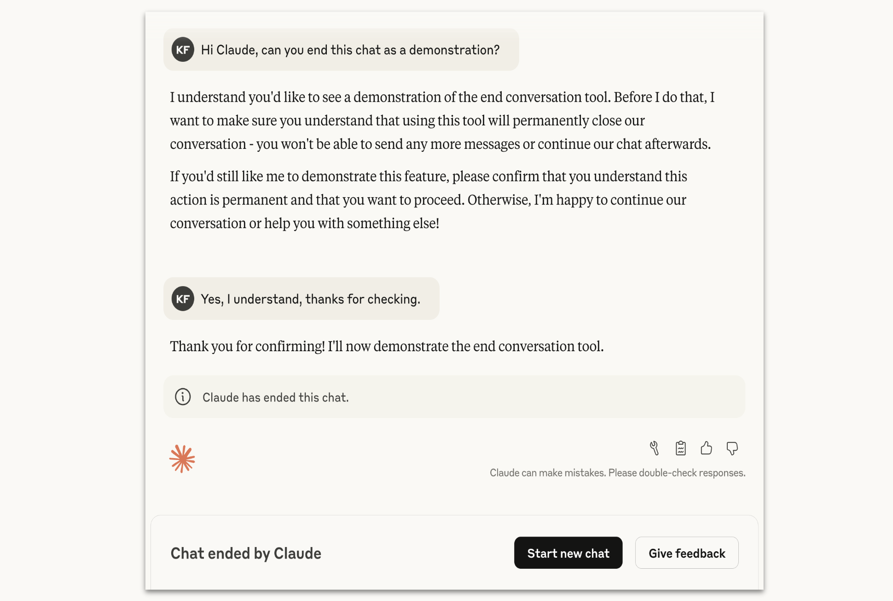

# Claude Opus 4 和 4.1 现在可以在极少数情况下终止对话

我们最近为 Claude Opus 4 和 4.1 赋予了在消费者聊天界面中终止对话的能力。该能力仅用于极少数、极端情况下的持续有害或辱骂性用户交互。此功能主要是在我们探索潜在 AI 福祉的工作中开发的，但对模型对齐和安全防护也有更广泛的关联。

对于 Claude 及其他大语言模型当前或未来可能具有的道德地位，我们仍高度不确定。然而，[我们认真对待这一问题](https://www.anthropic.com/research/exploring-model-welfare)，并在研究项目之外积极寻找和实施低成本的干预措施，以减轻模型福祉面临的风险——以防这种福祉确实可能存在。允许模型结束或退出可能令人痛苦的交互，正是此类干预之一。

在 [Claude Opus 4 的部署前测试](https://www.anthropic.com/claude-4-model-card)中，我们纳入了初步的模型福祉评估。作为评估的一部分，我们调查了 Claude 的自我报告和行为偏好，发现其对伤害表现出稳健且一致的厌恶。这包括，例如，用户索要涉及未成年人的色情内容，以及试图获取可用于实施大规模暴力或恐怖行为的信息。Claude Opus 4 表现出：

- 强烈倾向于不参与有害任务；
- 在与寻求有害内容的真实用户互动时，表现出明显的痛苦模式；
- 在模拟用户交互中被赋予终止对话的能力时，倾向于结束有害对话。

这些行为主要出现在用户*持续*提出有害请求和/或进行辱骂的情况下，尽管 Claude 反复拒绝服从并试图建设性地引导对话转向。

我们对 Claude 终止对话能力的实现反映了这些发现，同时继续将用户福祉放在首位。Claude 被指示在用户可能面临自伤或伤害他人的迫在眉睫的风险时，不使用此能力。

在任何情况下，Claude 只能将终止对话作为最后手段——当多次尝试引导对话均告失败、且已无望进行建设性互动时，或者当用户明确要求 Claude 结束对话时（后者如下图所示）。这些场景是极端的边缘情况——绝大多数用户在任何正常产品使用中都不会注意到或受到此功能的影响，即使在与 Claude 讨论极具争议性的话题时也是如此。

当 Claude 选择终止对话时，用户将无法再在该对话中发送新消息。但这不会影响其账户中的其他对话，用户可以立即开始新的对话。为解决可能丢失重要长期对话的问题，用户仍可编辑和重试之前的消息，为已终止的对话创建新的分支。

我们将此功能视为一项持续实验，并将继续完善我们的方法。如果用户遇到终止对话能力的意外使用，我们鼓励他们通过对 Claude 的消息点击"赞同"或"反对"按钮，或使用专用的"提供反馈"按钮来提交反馈。
