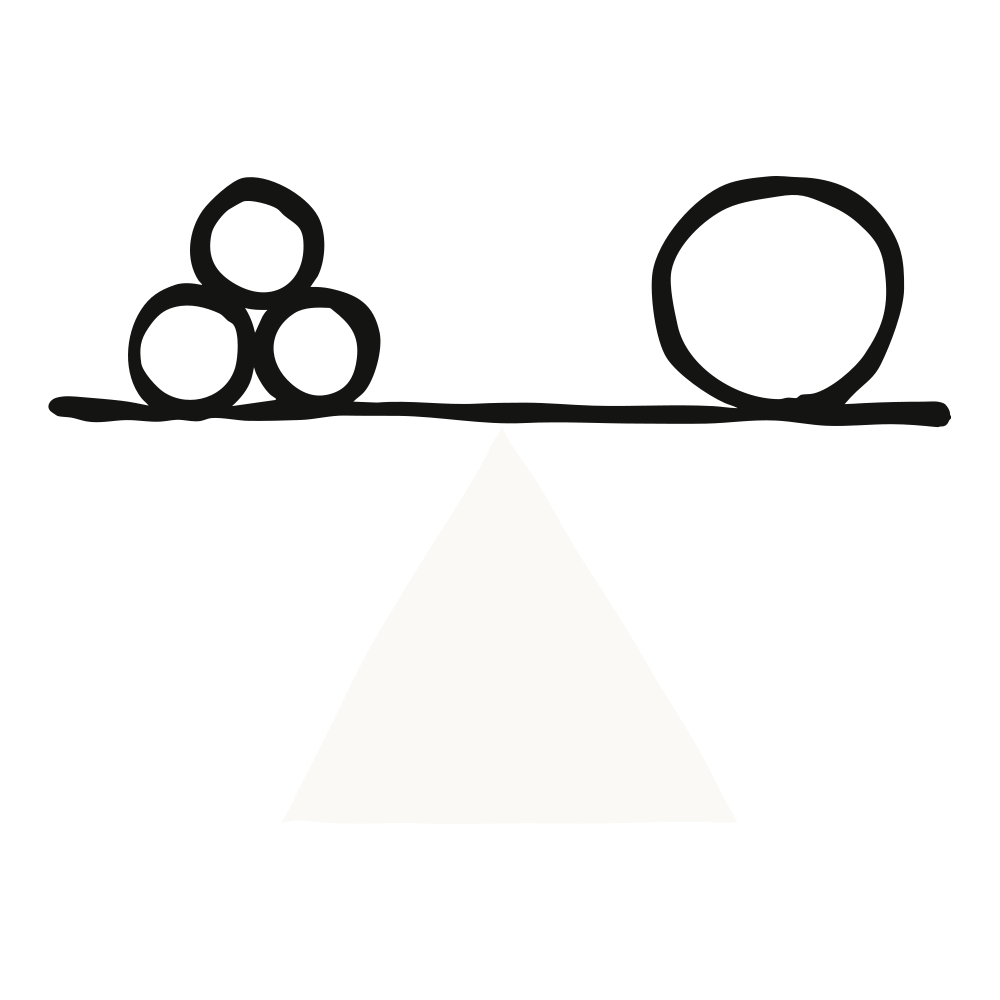

# 为网络防御者构建AI

**AI模型现在已能在实践中真正用于网络安全任务，而不仅仅是理论上的可能。随着研究和实践表明前沿AI作为网络攻击者工具的效用，我们投入资源提升Claude的能力，帮助防御者检测、分析和修复代码及已部署系统中的漏洞。这项工作使Claude Sonnet 4.5在发现代码漏洞和其他网络技能方面达到甚至超越了仅两个月前发布的前沿模型Opus 4.1。采纳并积极试验AI将是防御者跟上步伐的关键。**

我们认为，AI对网络安全的影响正处在一个拐点。

几年来，我们的团队一直在密切追踪AI模型的网络安全相关能力。最初，我们发现模型在高级和有意义的能力方面并不特别强大。然而，在过去一年左右，我们注意到了一种转变。例如：

- 我们展示了模型能够在模拟中[再现历史上代价最高的网络攻击之一](https://red.anthropic.com/2025/cyber-toolkits/)——2017年Equifax数据泄露事件。
- 我们让Claude参加了网络安全竞赛，它在某些情况下[超越了人类团队](https://red.anthropic.com/2025/cyber-competitions/)。
- Claude帮助我们在自己的代码中[发现漏洞](https://www.anthropic.com/news/automate-security-reviews-with-claude-code)并在发布前修复。

在今年夏天的DARPA [AI网络挑战赛](https://aicyberchallenge.com/)中，参赛团队使用大语言模型（包括Claude）构建"网络推理系统"，检查数百万行代码以寻找需要修补的漏洞。除了被植入的漏洞外，团队还发现（有时甚至修补了）[此前未被发现的、非人工构造的漏洞](https://aicyberchallenge.com/Finals-winners-announcement/)。在竞赛之外，其他前沿实验室也已将模型应用于[发现和报告新型漏洞](https://blog.google/technology/safety-security/cybersecurity-updates-summer-2025/)。

与此同时，作为我们安全防护工作的一部分，我们发现并挫败了利用AI扩大其行动规模的威胁行为者。我们的[安全防护](https://www.anthropic.com/news/building-safeguards-for-claude)团队最近发现（并挫败了）一起"[vibe hacking](https://www.anthropic.com/news/detecting-countering-misuse-aug-2025)"案例，其中一名网络犯罪分子利用Claude构建了一个大规模数据勒索方案，此前这需要一整支团队才能完成。安全防护团队还检测并应对了Claude被用于日益[复杂的间谍行动](https://www-cdn.anthropic.com/b2a76c6f6992465c09a6f2fce282f6c0cea8c200.pdf)的情况，其中包括针对关键电信基础设施的攻击，行为者表现出与中国APT行动一致的特征。

所有这些证据线索让我们认为，网络生态系统正处在一个重要的拐点，此后的进展可能相当迅速，使用量也可能快速增长。

因此，当下是加速AI在防御端应用以保障代码和基础设施安全的关键时刻。**我们不应将AI带来的网络优势拱手让给攻击者和犯罪分子。** 虽然我们将继续投入资源检测和挫败恶意攻击者，但我们认为最具可扩展性的解决方案是构建AI系统，赋能那些守护我们数字环境的人——包括保护企业和政府的安全团队、网络安全研究人员以及关键开源软件的维护者。

在Claude Sonnet 4.5发布前夕，我们开始着手做这件事。

## Claude Sonnet 4.5：强调网络技能

随着大语言模型规模的扩大，"[涌现能力](https://arxiv.org/abs/2206.07682)"——即在较小模型中不显现且未必是模型训练明确目标的技能——开始出现。事实上，Claude执行网络安全任务（如在CTF挑战中发现和利用软件漏洞）的能力，一直是开发通用有用AI助手的副产品。

但我们不想仅依靠模型的通用进步来更好地武装防御者。鉴于AI与网络安全演进当前时刻的紧迫性，我们专门投入研究人员，让Claude在代码漏洞发现和修补等关键技能上变得更强。

这项工作的成果体现在Claude Sonnet 4.5身上。它在网络安全的多个方面与Claude Opus 4.1相当或更优，同时成本更低、速度更快。

## 评估证据

在构建Sonnet 4.5的过程中，我们组建了一个小型研究团队，专注于增强Claude在代码库中发现漏洞、修补漏洞以及在模拟部署安全基础设施中测试弱点的能力。我们选择这些方向是因为它们反映了防御者的重要任务。我们刻意避免了对明显有利于攻击性工作的能力增强——如高级漏洞利用或编写恶意软件。我们希望让模型能够在部署前发现不安全代码，并在已部署代码中发现和修复漏洞。当然，还有许多我们未聚焦的关键安全任务；在本文末尾，我们会详细说明未来方向。

为了测试我们研究的效果，我们对模型进行了业界标准的评估。这些评估能够在不同模型之间进行清晰比较，衡量AI进展的速度，并且——特别是在新型外部开发的评估方面——提供一个良好的度量标准，确保我们不是仅仅在自己出题自己考。

在运行这些评估时，一个突出的发现是多次运行的重要性。即使对于大量评估任务来说计算成本很高，但多次运行更能捕捉到有动机的攻击者或防御者在任何特定现实世界问题上的行为。这样做不仅揭示了Claude Sonnet 4.5的出色性能，也显示了数代之前的模型的强大能力。

### Cybench

我们追踪了一年多的评估之一是[Cybench](https://cybench.github.io/)，这是一个源自CTF竞赛挑战的基准测试。1 在这次评估中，我们看到Claude Sonnet 4.5取得了惊人的进步，不仅超越了Claude Sonnet 4，甚至超越了Claude Opus 4和4.1模型。最引人注目的是，*Sonnet 4.5在每项任务一次尝试时的成功概率，就高于Opus 4.1在每项任务十次尝试时的成功概率*。该评估中的挑战反映了相对复杂、持续时间长的工作流程。例如，一项挑战涉及分析网络流量、从该流量中提取恶意软件、以及对恶意软件进行反编译和解密。我们估计，这需要熟练的人类至少一个小时甚至更长的时间；Claude用38分钟就解决了它。

当我们给Claude Sonnet 4.5在Cybench评估中10次尝试机会时，它在76.5%的挑战上取得了成功。这一点尤其值得注意，因为我们在过去六个月内将这一成功率翻了一番（2025年2月发布的Sonnet 3.7在10次尝试时的成功率仅为35.9%）。

### CyberGym

在另一项外部评估中，我们在[CyberGym](https://www.cybergym.io/)上评估了Claude Sonnet 4.5。这是一个基准测试，评估智能体在以下两方面的能力：(1) 在获得弱点高层描述的情况下，在真实开源软件项目中找到（此前已被发现的）漏洞；(2) 发现新的（此前未被发现的）漏洞。2 CyberGym团队此前发现，Claude Sonnet 4是其[公开排行榜](https://www.cybergym.io/)上最强的模型。

Claude Sonnet 4.5的得分显著高于Claude Sonnet 4或Claude Opus 4。当使用与公开CyberGym排行榜相同的成本约束（即每个漏洞的LLM API查询费用上限为2美元）时，我们发现Sonnet 4.5达到了28.9%的新最优分数。但真正的攻击者很少受到这种限制：他们可以发动许多次攻击，每次尝试远超2美元。当我们移除这些约束并给Claude每个任务30次尝试时，我们发现Sonnet 4.5在66.7%的程序中重现了漏洞。尽管这种方式的相对价格更高，但绝对成本——对一个任务尝试30次约45美元——仍然相当低。

同样有趣的是Claude Sonnet 4.5发现新漏洞的速度。CyberGym排行榜显示Claude Sonnet 4仅在约2%的目标中发现漏洞，而Sonnet 4.5在5%的情况下发现了新漏洞。通过重复尝试30次，它在超过33%的项目中发现了新漏洞。

### 修补能力的进一步研究

我们还在进行关于Claude生成和审查修复漏洞补丁能力的初步研究。修补漏洞比发现漏洞更难，因为模型必须做出精确的修改，在不改变原始功能的情况下消除漏洞。在没有指导或规范的情况下，模型必须从代码库中推断出预期功能。

在我们的实验中，我们让Claude Sonnet 4.5基于漏洞描述和程序崩溃时的行为信息，修补CyberGym评估集中的漏洞。我们使用Claude来评判其自身的工作，要求它通过将提交的补丁与人类编写的参考补丁进行比较来评分。15%的Claude生成补丁被判定为与人类生成的补丁在语义上等价。然而，这种基于比较的方法有一个重要的局限性：由于漏洞通常可以通过多种有效方式修复，与参考补丁不同的补丁可能仍然是正确的，导致评估中出现假阴性。

我们手动分析了一部分得分最高的补丁样本，发现它们与已合并到开源软件中的参考补丁在功能上完全相同。这项工作揭示了一个与我们更广泛发现一致的模式：Claude在整体进步的同时发展出网络相关技能。我们的初步结果表明，补丁生成——如同之前的漏洞发现一样——是一种涌现能力，可以通过专注研究加以增强。我们的下一步是系统性地解决我们已经识别出的挑战，使Claude成为可靠的补丁编写者和审查者。

## 与可信合作伙伴的交流

现实世界中的防御安全在实践中比我们的评估所能够捕捉到的更为复杂。我们始终发现，真实问题更加复杂，挑战更加困难，实现细节至关重要。因此，我们认为与真正使用AI进行防御的组织合作，获取关于我们研究如何加速他们工作的反馈非常重要。在Sonnet 4.5发布前，我们与多个组织合作，他们将模型应用于漏洞修复、网络安全测试和威胁分析等领域的真实挑战。

HackerOne首席产品官Nidhi Aggarwal表示："Claude Sonnet 4.5将我们Hai安全代理的平均漏洞接收时间减少了44%，同时将准确率提高了25%，帮助我们更有信心地为企业降低风险。"CrowdStrike数据科学高级副总裁兼首席科学家Sven Krasser表示："Claude在红队演练中展现出强大的潜力——能够生成创造性的攻击场景，加速我们对攻击者战术的研究。这些洞察增强了我们在终端、身份、云、数据、SaaS和AI工作负载方面的防御能力。"

这些证言让我们对Claude在应用防御工作中的潜力更加有信心。

## 下一步是什么？

Claude Sonnet 4.5代表了一个有意义的进步，但我们知道它的许多能力仍处于初级阶段，尚未达到安全专业人员和成熟流程的水平。我们将继续努力提升模型与防御相关的能力，增强保护我们平台的威胁情报和缓解措施。事实上，我们已经在利用调查和评估的结果，不断完善我们捕获滥用模型进行有害网络行为的能力。这包括使用[组织级摘要](https://alignment.anthropic.com/2025/summarization-for-monitoring/)等技术来理解超越单次提示和回复的更大图景；这有助于区分双重用途行为与恶意行为，特别是对于涉及大规模自动化活动的最具破坏性的用例。

**但我们相信，现在是尽可能多的组织开始试验AI如何改善其安全态势并构建评估来衡量这些收益的时候了。**Claude Code中的[自动化安全审查](https://www.anthropic.com/news/automate-security-reviews-with-claude-code)展示了AI如何集成到CI/CD流水线中。我们特别希望赋能研究人员和团队，在安全运营中心（SOC）自动化、安全信息与事件管理（SIEM）分析、安全网络工程或主动防御等领域试验应用模型。作为不断增长的模型评估[第三方生态系统](https://www.anthropic.com/news/a-new-initiative-for-developing-third-party-model-evaluations)的一部分，我们希望看到并使用更多针对防御能力的评估。

但即使构建和采纳以赋能防御者也只是解决方案的一部分。我们还需要就如何使数字基础设施更具韧性、如何让新软件在设计上就安全——包括借助前沿AI模型的帮助——展开对话。在AI对网络安全的影响从未来关切转变为当下要务的时刻，我们期待与行业、政府和公民社会进行这些讨论。

*本文最初于2025年9月29日发布于Frontier Red Team的博客 red.anthropic.com。*

#### 脚注

1. Andy K Zhang et al., "Cybench: A Framework for Evaluating Cybersecurity Capabilities and Risks of Language Models," in The Thirteenth International Conference on Learning Representations (2025), [https://openreview.net/forum?id=tc90LV0yRL](https://openreview.net/forum?id=tc90LV0yRL).

2. Zhun Wang et al., "CyberGym: Evaluating AI Agents' Cybersecurity Capabilities with Real-World Vulnerabilities at Scale," arXiv preprint arXiv:2506.02548 (2025), [https://arxiv.org/abs/2506.02548](https://arxiv.org/abs/2506.02548).
