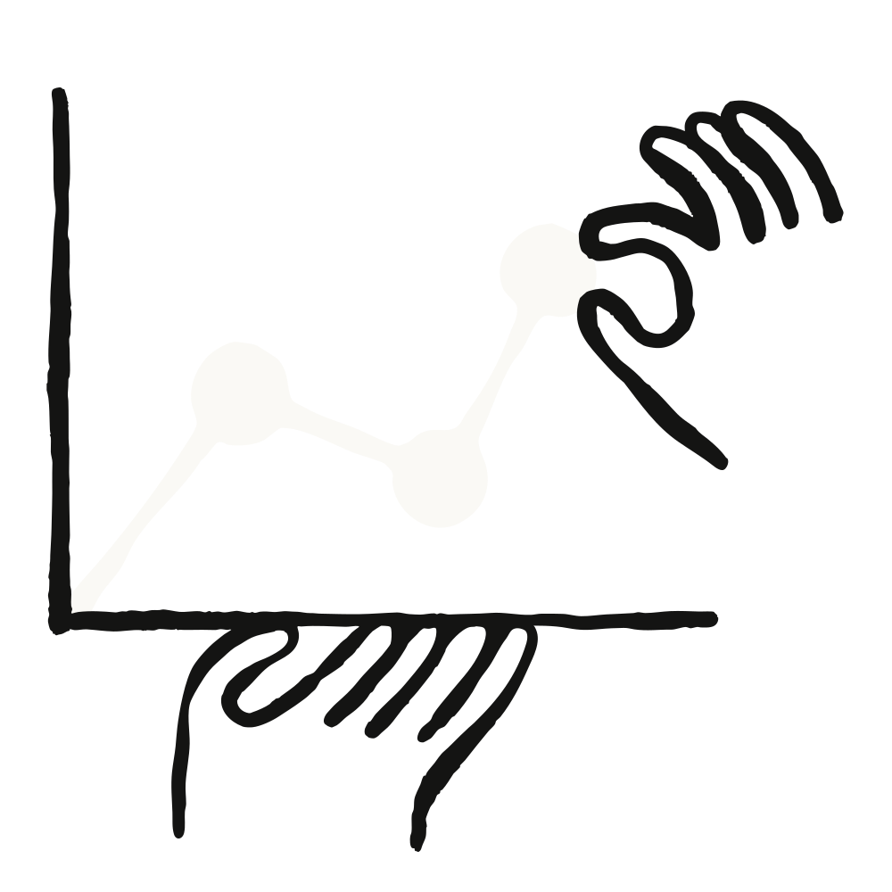

# 印度国别简报：Anthropic 经济指数



## 摘要

印度已是全球最大的 IT 服务出口国，同时也是全球 AI 用户增长最快的市场之一。理解 AI 在印度的使用方式——以及它与其他国家的差异——对制定印度的 AI 政策、投资和部署策略至关重要。本简报基于[第四期 Anthropic 经济指数报告](https://www.anthropic.com/research/anthropic-economic-index-january-2026-report)的数据，覆盖 2025 年 11 月全球约 100 万次 Claude.ai 对话，提供关于 Claude.ai 在印度使用情况的洞察。印度占 Claude.ai 总使用量的 5.8%，仅次于美国。然而，当前采用仍高度集中，意味着在更广泛的人群中扩大接入存在显著空间。

研究结果表明，印度用户群体在专业场景中更密集地使用 AI，赋予 AI 更高的自主权，并且交给 Claude 的任务在不借助辅助时所需完成时间显著更长。人类无法单独完成的复杂任务占比更高，表明印度用户正在技术前沿使用该工具。

## 印度是全球 AI 采用率最高的国家之一

按 Claude.ai 总使用量占比计算，印度在所有国家中排名第二，仅次于美国。然而，按劳动年龄人口调整后的人均使用量计算，印度在 116 个有足够观测数据的国家中排名第 101 位，低于新加坡和马来西亚等其他亚洲国家。这一差距表明，印度 Claude 整体使用量高反映的是其庞大的人口规模，而非普通用户重度使用。这指向了提升采用率的巨大空间。

## 印度内部使用高度集中

### 地理集中度

使用集中在少数几个经济高度活跃的邦。马哈拉施特拉邦、泰米尔纳德邦、卡纳塔克邦和德里合计占印度 Claude.ai 总使用量的一半以上。这一模式与印度 IT 产业的地理分布和城市经济产出高度吻合。

这四个邦——班加罗尔、海得拉巴、钦奈、孟买和德里国家首都辖区所在地——的集中度表明，当前 AI 采用主要由印度既有的技术劳动力驱动，而非广泛的消费者普及。

**职业任务集中度**

通过将任务映射到相关职业来推断，印度 Claude.ai 使用的职业构成偏向软件开发和工程岗位，与该国庞大的 IT 服务业一致。

印度用户最常见的 O\*NET 任务印证了以软件为主的特征。

印度在软件相关任务占 AI 使用的比例上位居全球第一（占所有 O\*NET 映射任务的 45.2%），领先于越南（42.1%）和埃及（39.2%）。教育类任务出现在最常见的单任务和按职业组聚合的任务中，表明学习和教学是另一常见用例。

## 经济原语：印度使用 AI 的差异

[我们最新的经济指数报告](https://www.anthropic.com/research/anthropic-economic-index-january-2026-report)引入了"经济原语"——衡量人类与 AI 协作方式的基本指标。将印度与全球平均水平进行比较，揭示了几个独特的模式。

**更高的生产力提速。** 印度用户平均用 14.8 分钟完成借助 AI 的任务，而这些任务在没有 AI 的情况下需要 3.8 小时——提速 15 倍。全球用户平均用 15.4 分钟完成原本需要 3.1 小时的任务——提速 12 倍。这表明，对于印度用户交给 AI 的更复杂任务，AI 带来了超出常规的生产力增益。

**更强的工作导向。** 印度 Claude.ai 使用量的 51.3% 与工作相关，而全球为 46%。课业占 20.9%（全球为 19.3%），个人使用占 27.8%（全球为 34.7%）。以工作为主、个人使用较少的特征与印度庞大的专业服务业规模一致，也符合主报告中人均 GDP 较低国家倾向于工作和课业而非个人使用的发现。

**更高的 AI 自主权。** 印度用户赋予 AI 更高的决策自主权（在 1–5 分制中为 3.60 分，全球为 3.38 分，其中 1 表示完全不委托，5 表示极度委托）。这表明用户更愿意让 AI 独立运作，而非仅将其用作辅助工具。

**较低的纯人类完成能力。** 我们衡量的数据点之一是 AI 是否被用于完成人类无法单独完成的任务，例如用用户不懂的语言编写代码。我们发现 84.6% 的任务可以由人类单独完成（全球为 87.9%），表明印度用户更频繁地将自己难以独立完成的任务交给 AI。

**提示技能至关重要。** 作为衡量人类和 AI 在对话中所带入技能的代理指标，我们估算了理解用户提示或 AI 响应所需的教育年限。我们发现提示的人类教育水平（12.2 年）和 AI 响应的教育水平（12.5 年）相对接近，这反映了输入质量决定输出质量的全球模式。在各国 AI 教育水平的平均值比较中，印度排在前 10%，表明印度用户正从 Claude 获得高度复杂的输出。

## 政策启示

**扩大 AI 的经济影响需要超越软件和 IT 服务。** 45.2% 的任务映射到软件相关职业——是所有国家中最高的。四个邦（马哈拉施特拉邦、泰米尔纳德邦、卡纳塔克邦和德里）占总使用量的一半以上。这反映了印度 IT 产业的地理分布，表明当前的 AI 采用在很大程度上是现有 IT 专业优势和工作流的延伸。

**投资 AI 可以带来可观且可衡量的生产力增益。** 印度用户将原本需要 3.8 小时的任务压缩到约 15 分钟——提速 15 倍，而全球为 12 倍。这意味着印度已经在从 AI 中获取显著价值：承担更困难的任务，并将完成这些任务所需的时间压缩到比全球平均水平更低的程度。

**缩小总使用量与人均使用量之间的差距需要解决结构性障碍。** 印度在总使用量上排名第 2，但在人均使用量上排名第 101。这两个数字之间的差距既反映了印度庞大的人口规模，也反映了当前采用的狭窄集中程度。在全球范围内，人均 AI 采用率与人均收入强相关。印度的人均使用量符合这一关系的预测水平。如果不解决与收入、数字基础设施和 IT 行业以外认知相关的结构性障碍，印度的 AI 采用很可能继续保持集中。

**拥抱 AI 自主权似乎正在为印度用户带来良好效果。** 更高的自主权分数、更长的基线任务时间以及频繁用于人类可单独完成的任务，表明印度专业人士正在信任 AI 做出决策，并用其增强人类能力。

**投资 AI 技能可能带来高回报。** 全球数据中提示复杂性与响应质量之间的强相关性表明，聚焦于有效 AI 使用的培训项目——尤其是针对印度当前以 IT 为主的用户群体以外的劳动者——可以显著改善更广泛 AI 采用带来的回报。

### 方法论

本分析基于 2025 年 11 月 13 日至 20 日 Claude.ai 消费者使用的隐私保护数据，如[第四期 Anthropic 经济指数报告](https://www.anthropic.com/research/anthropic-economic-index-january-2026-report)所述。经济原语使用该报告详述的方法计算。地理位置分配基于 IP 地理定位。职业和任务分类基于 O\*NET 任务分类法和 SOC 职业组的映射。在国家排名中，由于随机样本中低使用量国家测量的不确定性，我们仅纳入样本中至少有 200 次观测的国家。底层数据包括 Claude.ai Free、Pro 和 Max 使用量。

*完整方法论、全球发现和时间序列分析，请参阅 Anthropic 经济指数 2026 年 1 月报告。*

引用格式

```
@online{appel2026indiacountrybrief,
author = {Ruth Appel},
title = {India Country Brief: The Anthropic Economic Index},
date = {2026-02-16},
year = {2026},
url = {https://www.anthropic.com/research/india-brief-economic-index},
}
```

### 致谢

Sally Aldous、Jake Eaton、Ria Strasser Galvis、Hanah Ho、Maxim Massenkoff、Peter McCrory、Jared Mueller、Emily Pastewka、Sarah Pollack、Nitarshan Rajkumar、David Saunders、Alexandra Sanderford、Kim Withee。
