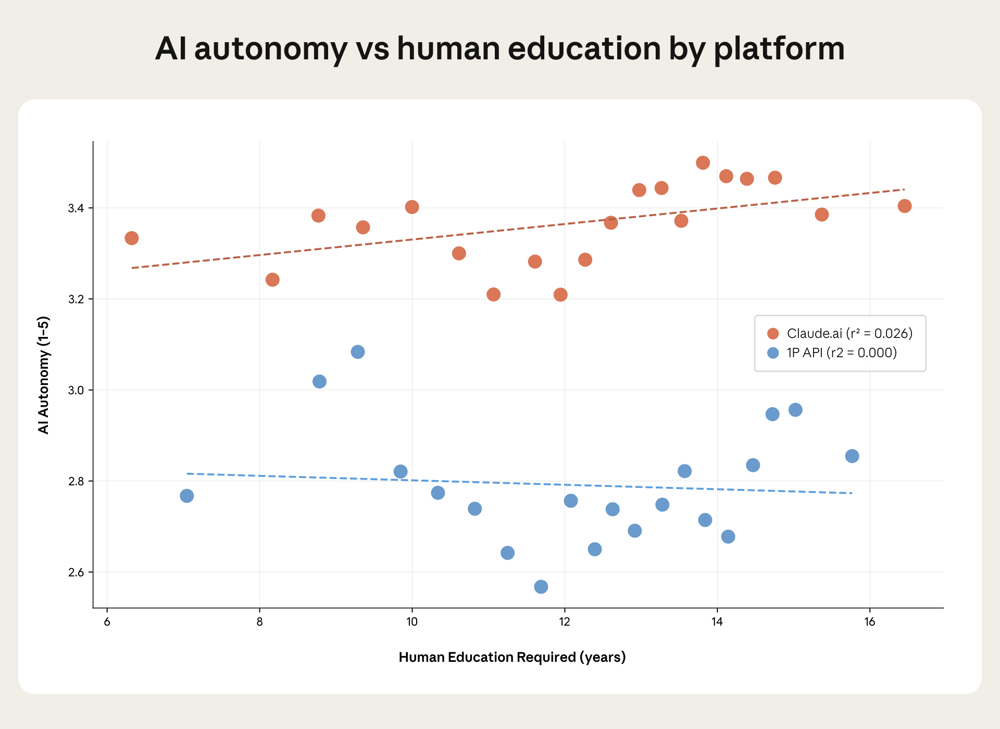
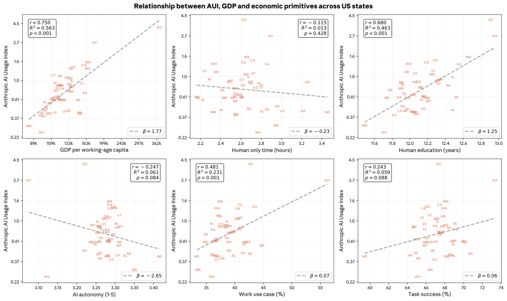
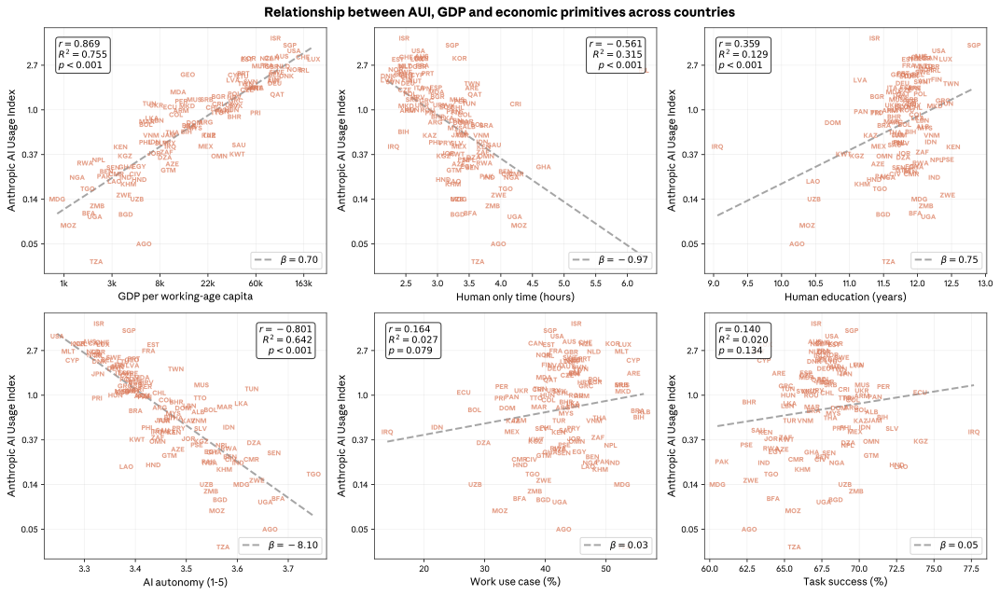
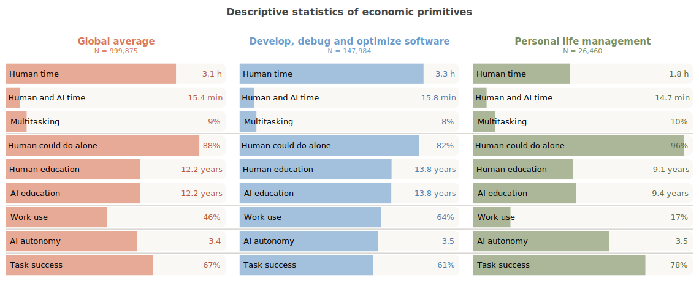
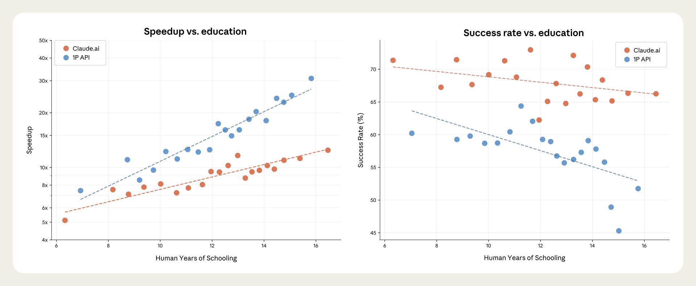
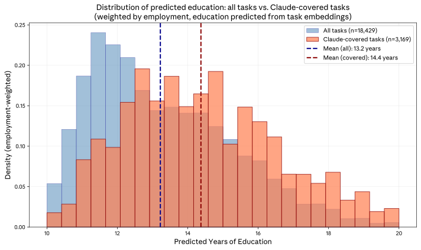

# Anthropic 经济指数报告：经济基础度量

## 引言

### AI 如何重塑经济？

本报告引入新的 AI 使用度量，以丰富地描绘 2025 年 11 月——Opus 4.5 发布前夕——与 Claude 的交互图景。这些"基础度量"（primitives）是对 Claude 使用方式的简单、基础性衡量，通过向 Claude 提出关于匿名化 Claude.ai 和第一方（1P）API 对话记录的具体问题而生成，涵盖与 AI 经济影响相关的五个维度：用户与 AI 技能、任务复杂度、赋予 Claude 的自主程度、Claude 的成功率，以及 Claude 是用于个人、教育还是工作目的。

结果揭示了显著的地理差异、AI 任务边界的真实世界估算，以及重新评估 Claude 宏观经济影响的基础。

随本报告发布的数据是迄今为止最全面的，涵盖 AI 使用的五个新维度、消费者和企业使用情况，以及 Claude.ai 的国家和地区细分。

### 自上次报告以来的变化

在第一章中，我们回顾了此前于 2025 年 9 月发布的[经济指数报告](https://www.anthropic.com/research/anthropic-economic-index-september-2025-report)中的发现。我们发现：

**Claude 使用仍集中在某些任务上，其中大部分与编码相关。**虽然我们在 Claude.ai 上观察到超过 3,000 种独特的工作任务，但前 10 种最常见任务占抽样对话的 24%，较上次报告略有上升。增强模式（用户学习、迭代任务或从 Claude 获取反馈的对话）在 Claude.ai 上略超对话总数的一半。相比之下，自动化使用在 1P API 流量中仍占主导地位，反映了其程序化特性。**全球使用持续不均，而美国各州趋于收敛。**美国、印度、日本、英国和韩国在 Claude.ai 整体使用中领先。全球范围内，不均衡的采用率仍可由人均 GDP 很好地解释。在美国内部，劳动力构成在塑造不均衡采用方面起关键作用，计算机和数学专业人员占比较高的州系统性地呈现更多 Claude 使用。

虽然集中度仍然显著，但自上次报告以来，Claude 使用在美国各州之间已明显变得更加均匀分布。如果持续下去，人均使用量将在 2 到 5 年内在全国范围内均等化。

### 引入并分析新的经济基础度量

在第二章中，我们讨论引入新经济基础度量的动机，包括它们的选择和操作化方式及其局限性。我们还提供证据表明，与外部基准相比，我们的基础度量捕捉了潜在使用模式的方向性准确方面。在第三章和第四章中，我们使用这些基础度量进一步研究对采用和生产力的影响。我们发现：

**Claude 使用随采用率和收入提高而多样化。**虽然 Claude 最常被用于工作，但课程作业使用在人均 GDP 最低的国家占比最高，而富裕国家则显示出最高的个人使用率。这与简单的采用曲线故事一致：欠发达国家的早期采用者往往是具有特定高价值应用的技术用户，或将 Claude 用于教育，而成熟市场则看到使用向休闲和个人目的多样化。**Claude 在大多数任务上成功，但在最复杂的任务上成功率较低。**我们发现 Claude 通常能成功完成交给它的任务，其回应的教育水平往往与用户输入相匹配。Claude 在更复杂的任务上遇到困难：随着人类完成任务所需时间的增加，Claude 的成功率下降，这与[衡量 AI 能够可靠执行的最长任务的知名评估](https://arxiv.org/abs/2503.14499)类似。**当考虑成功率时，工作对 AI 的暴露程度呈现不同面貌。**我们还使用成功率基础度量来更好地理解工作对 AI 的暴露，通过用成功率和每项任务在岗位中的重要性来加权任务覆盖度，计算 Claude 能够执行的各职业份额。对于数据录入员和数据库架构师等某些职业，Claude 在大量工作内容上表现出熟练度。**Claude 被用于比更广泛经济中更高技能的任务。**我们在 Claude 使用中观察到的任务往往比较广泛经济中的任务需要更多教育。如果我们假设 AI 辅助的任务在工作职责中的占比减少，移除它们将留下技能要求较低的工作。但这种简单的任务置换不会均匀影响白领工作者——对某些职业，它移除了技能密集度最高的任务，对另一些则是技能密集度最低的。

如果我们移除观察到 Claude 正在执行的任务，旅行社将经历去技能化，因为复杂的规划工作被常规的购票和收款所取代。而物业经理则会经历技能提升，因为记账任务被合同谈判和利益相关者管理所取代。

### 理解 AI 对经济影响的新窗口

这些结果为理解 AI 当前如何影响经济提供了新窗口。了解任务的成功率可以更准确地描绘哪些任务可能被自动化、某些岗位可能受到多大影响，以及劳动生产力将如何变化。按用户教育水平衡量差异化表现，可以揭示不平等效应。

事实上，输入和输出教育水平之间的密切关系表明，教育程度较高的国家可能更有能力从 AI 中受益，这与采用率本身无关。

此次数据发布旨在帮助研究人员和公众更好地理解 AI 的经济含义，并研究这一变革性技术已经产生影响的多种方式。

**图 1.1：各平台前 10 大任务使用份额随时间变化，Claude.ai 和 1P API。**

## 第一章：自上次报告以来的变化

### 概述

由于前沿 AI 模型能力正在快速提升且采用迅速，定期评估个人和企业如何使用此类系统的变化——以及这种使用对更广泛经济的含义——非常重要。[^1]

在本章中，我们分析 Claude 使用和扩散模式从 2025 年 8 月到 2025 年 11 月（Opus 4.5 发布前夕）的变化。我们提出四个观察：

**使用仍高度集中在特定任务上：**
Claude.ai 上观察到的前十种最常见任务占使用量的 24%，高于上次报告的 23%。对于第一方（1P）API 企业客户，任务集中度增加更为显著：前十种任务现在占流量的 32%，高于上次报告的 28%。

**增强模式再次在 Claude.ai 上超越自动化：**
在上次报告中，我们注意到自动化使用已上升至超过 Claude.ai 上的增强使用，这可能反映了模型能力的提升和用户对 LLM 熟悉度的增加。2025 年 11 月的数据表明，Claude.ai 上广泛回归增强使用：被归类为增强的对话份额跃升 5 个百分点至 52%，而被视为自动化的份额下降 4 个百分点至 45%。[^2] 此期间的产品变更——包括[文件创建功能](https://claude.com/blog/create-files)、[持久记忆](https://claude.com/blog/memory)和[用于工作流定制的 Skills](https://claude.com/blog/skills)——可能将使用模式转向更具协作性、人机协同的交互。

**在美国内部，使用率较低的州采用增速相对更快：**
在美国内部，人均使用量仍然主要由劳动力与更广泛的 Claude 使用的匹配程度所塑造：例如，计算机和数学职业工作者占比较高的州往往具有更高的使用量。事实上，美国排名前五的州占所有使用量的近一半（50%），尽管它们仅占劳动年龄人口的 38%。

尽管如此，有早期迹象表明采用率在区域间快速收敛：上次报告中使用量较低的州，其使用量增长相对更快。如果持续下去，人均使用量将在 2 到 5 年内全国均等化，这一扩散速度大约是 20 世纪具有经济影响的技术传播速度的 10 倍。[^3]

虽然这与 AI 的快速采用和扩散一致，但这一估计存在不确定性，因为它基于三个月期间观察到的变化。未来数月和数年，扩散可能最终进展得更慢。

**全球使用几乎没有显示出区域收敛增加或减少的迹象。**
在全球范围内，Claude 人均使用量——以 Anthropic AI 使用指数（AUI）衡量——仍然高度不均衡，并与 GDP 强相关。这些差距是稳定的：我们没有看到低使用国家迎头赶上或高使用国家进一步拉开的证据。

### 任务和相关职业使用模式的变化

尽管前沿 LLM 拥有与现代经济各方面相关的令人印象深刻的能力范围，Claude 使用仍然高度集中在少数任务上。与近一年前相比，消费者在 [Claude.ai](http://claude.ai) 上的使用略微更加集中：2025 年 11 月，分配给十种最普遍 O\*NET 任务的对话份额为 24%，比 8 月高 1 个百分点，比 2025 年 1 月的 21% 有所上升。2025 年 11 月最普遍的任务——修改软件以纠正错误——单独占使用量的 6%。

在上一份 Anthropic 经济指数报告中，我们开始通过研究 1P API 客户中的 Claude 使用来追踪企业采用模式。API 记录中前十种最常见任务从 8 月的 28% 增长到 11 月的 32%。少数任务集中度上升表明，最高价值的应用持续产生超大的经济价值，即使模型在更广泛的任务范围上变得更有能力。与 [Claude.ai](http://claude.ai) 一样，API 客户中最常见的任务是修改软件以纠正错误，占十分之一的记录。

**图 1.2：Claude.ai 和 API 使用随时间变化。**
每个面板显示 Claude.ai 上抽样对话和 1P API 记录中与各标准职业分类（SOC）主要组别任务相关的份额。

事实上，计算机和数学任务——如修改软件以纠正错误——继续在整体 Claude 使用中占主导地位，占 Claude.ai 对话的三分之一和 1P API 流量的近一半。这种主导地位在 Claude.ai 上有所减弱：Claude.ai 上分配给此类（主要是编码相关）任务的对话份额从 2025 年 3 月 40% 的峰值下降到 2025 年 11 月的 34%。同时，1P API 流量中分配给计算机和数学任务的对话份额从 8 月的 44% 微升至 2025 年 11 月的 46%（图 1.2）。

2025 年 11 月 Claude.ai 使用的第二大份额是教育指导与图书馆类别。这主要对应课程作业和复习帮助，以及教学材料开发。自第一份报告以来，此类使用稳步上升，从 2025 年 1 月 Claude.ai 对话的 9% 上升到 11 月的 15%。

艺术、设计、娱乐、体育和媒体任务在 Claude.ai 上的使用份额在 2025 年 8 月至 11 月间增加，因为 Claude 在越来越多的对话中被用于写作任务，主要是文案编辑以及虚构作品的写作和润色。设计与写作相关任务的普遍性跃升逆转了此前报告中的持续下降趋势。对于 Claude.ai 和 API 客户，Claude 被用于生命、物理和社会科学相关任务的对话/记录份额均出现下降。

对于 API 客户来说，最值得注意的发展可能是与办公室和行政支持相关任务的记录份额增加，从 8 月上升 3 个百分点至 2025 年 11 月的 13%。由于 API 使用以自动化为主，这表明企业越来越多地使用 Claude 来自动化常规后台工作流，如电子邮件管理、文档处理、客户关系管理和日程安排。[^4]

### 增强模式再次在 Claude.ai 上占主导

AI 如何影响经济不仅取决于 Claude 被用于什么任务，还取决于用户访问和参与底层模型能力的方式。自第一份报告以来，我们将对话分类为五种交互类型之一，并将其归纳为两个更广泛的类别：自动化和增强。[^5]

图 1.3 绘制了自一年前我们首次开始收集此数据以来，自动化与增强使用的演变。2025 年 1 月，Claude 的增强使用占主导：56% 的对话被归类为增强，而 41% 为自动化。[^6] 2025 年 8 月，更多对话被归类为自动化而非增强。

这是一个值得注意的发展，因为它表明模型能力和平台功能的快速改进与用户越来越多地将任务完全委托给 Claude 同时发生。这在被归入自动化的"指令式"协作模式中尤为明显。指令式对话是用户给 Claude 一个任务，Claude 以最少的来回完成它。从 2025 年 1 月到 2025 年 8 月，此类指令式对话的份额从 27% 上升到 39%。[^7]

三个月后，指令式对话的份额在 2025 年 11 月下降了 7 个百分点至 32%，增强模式再次在 Claude.ai 上比自动化更为普遍。然而，自动化份额与近一年前我们首次开始追踪这一指标时相比仍然较高，这表明即使 8 月的飙升夸大了其实现速度，潜在趋势仍然朝向更大的自动化。

虽然我们看到 Claude.ai 上软技能使用的某些转变迹象——设计、管理和教育现在更高——但 11 月回归增强使用的转变是广泛的（图 1.4）。增强使用的上升主要由用户与 Claude 迭代完成任务（"任务迭代"）驱动，而非要求 Claude 解释概念（"学习"）。见图 1.5，了解与三种最常见交互模式相关的常见词汇，按 O\*NET 任务和自下而上的请求描述。

**图 1.3：各平台协作模式份额随时间变化，Claude.ai 和 1P API。**

**图 1.4：指令式、任务迭代和学习协作份额按标准职业分类（SOC）主要组别。**

**图 1.5：O\*NET 任务标题和自下而上请求分组中各关键协作类型的突出词汇。**

### 持续的区域集中

在上次报告中，我们引入了 Anthropic AI 使用指数（AUI），这是衡量 Claude 在给定地理区域相对于其劳动年龄人口规模是否被过度或不足代表的指标。AUI 定义为：

> AUI = (某国 Claude 使用份额) / (某国劳动年龄人口份额)

AUI 高于 1 表示该国使用 Claude 的强度超过仅凭人口预测的水平，而 AUI 低于 1 表示使用量低于预期。例如，丹麦的 AUI 为 2.1，意味着其居民使用 Claude 的比率大约是其在全球劳动年龄人口中所占份额所暗示的两倍。

关于全球 Claude 使用的一个关键事实是其地理集中性：少数国家占使用量的超大体量。从全球视角看，2025 年 8 月至 11 月间这方面几乎没有变化。事实上，图 1.6 左面板显示，上次报告与本报告之间各国 AUI 集中度基本未变。

相比之下，2025 年 8 月至 11 月，美国各州之间的使用变得更加均匀分布：基尼系数（衡量平等程度的标准指标）从 0.37 下降到 0.32。虽然在解释短期变化时需要谨慎，但这是朝向完全平等（所有州 AUI 等于 1，基尼系数为 0）的相对较大变化。如果美国基尼系数每三个月再次下降 0.05，那么使用量的均等化将在大约两年内达到。

**图 1.6：全球和美国内部的 AUI 集中度，本报告与上次报告对比。**
全球和美国内部 Anthropic AI 使用指数（AUI）的洛伦兹曲线，2025 年 8 月和 11 月。曲线越接近 45 度线，表示集中度越低。

是什么塑造了美国内部和全球的使用模式？在上次报告中，我们强调了收入差异在全球发挥的关键作用：各国之间 Claude 使用的差异主要由人均 GDP 的差异解释。在第三章中，我们将重新审视收入在塑造使用强度以及全球使用模式方面的重要性。

在美国内部，收入作为使用预测因素不那么清晰。相反，似乎最重要的是每个州劳动力构成以及劳动力与 Claude 任务层面能力匹配的程度。计算机和数学职业工作者占比较高的州——如华盛顿特区、弗吉尼亚和华盛顿州——往往具有更高的人均使用量。数量上，一个州此类技术工作者占比每增加 1%，人均使用量增加 0.36%（图 1.7）。仅此一项就解释了跨州 AUI 变异的近三分之二。

**图 1.7：美国各州 AUI 与计算机与数学职业工作者占比。**
该图显示美国各州计算机与数学职业工作者占比与 Anthropic AI 使用指数（AUI）高度相关。

### 美国低使用州 Claude 扩散更快的迹象

虽然劳动力构成差异似乎在塑造美国区域采用方面发挥作用，但早期证据表明 Claude 的扩散速度远快于历史先例的预测。历史上，具有经济影响的技术需要大约半个世纪才能在美国实现完全扩散（[Kalanyi et al., 2025](https://academic.oup.com/qje/article-abstract/140/2/1299/7959830)）。相比之下，将 2025 年 11 月的 Claude 采用率与三个月前相比，我们估计美国各州人均采用率的均等化——以 AUI 衡量——可能在 2 到 5 年内达到。这一估计存在高度不确定性，因为估计精度无法排除更慢的扩散速度。

我们通过一个简单扩散模型的视角生成这一估计。我们将扩散建模为向人均使用均等化（每个州 AUI = 1）的共同稳态的比例收敛：

> log(AUI_s,t) = α + β · log(AUI_s,t-1)

在此模型下，AUI 偏离稳态（AUI = 1）的对数偏差每三个月按 β 因子缩小，意味着半衰期为 ln(0.5)/ln(β) 个季度。例如，对于季度数据，β = 0.99 意味着约 17 年的半衰期。

通过普通最小二乘法（OLS）朴素估计该方程得到 β̂ ≈ 0.77。按各州劳动力加权的加权最小二乘法（WLS）得到 β̂ ≈ 0.76（图 1.8）。两者在常规水平上均与 1 有统计显著差异。按面值计算，这些估计意味着每个州 AUI 弥合到 1 的大部分差距只需两年多。

**图 1.8：美国各州 Anthropic AI 使用指数（AUI），2025 年 8 月（V3）与 2025 年 11 月（V4）。**

以这种方式估计收敛的一个担忧是，我们的 AUI 估计受到抽样噪声和其他与扩散无关的变异影响。为解决此问题，我们通过两阶段最小二乘法（2SLS）估计模型，以各州劳动力构成（以其与整体 Claude 使用模式的接近度衡量）作为 2025 年 8 月 log AUI 的工具变量。

2SLS 估计意味着适度较慢的收敛：未加权时 β̂ ≈ 0.89，按各州劳动年龄人口加权时 β̂ ≈ 0.86。但这些估计精度较低，仅前者在 10% 水平上统计显著区别于 1。尽管意味着比 OLS 更慢的收敛，2SLS 估计仍意味着快速扩散：每个州 AUI 的对数偏差在四到五年内缩小 90%。

话虽如此，我们的估计仅基于三个月的数据。虽然 2SLS 规范可能有助于解决抽样噪声，但仍存在相当大的不确定性。我们将在未来报告中重新审视扩散速度问题。

[^1]: 与此前报告一样，所有分析基于隐私保护方法。我们分析来自 Claude.ai Free、Pro 和 Max 对话的 100 万随机抽样对话（我们也称其为"消费者数据"）以及来自第一方（1P）API 流量的 100 万条记录（我们也称其为"企业数据"）。两个样本均来自 2025 年 11 月 13 日至 20 日。

[^2]: Claude.ai 上既未被归类为自动化也未被归类为增强的对话份额从 3.9% 降至 3.0%。

[^3]: 参见 [Kalanyi et al (2025)](https://academic.oup.com/qje/article-abstract/140/2/1299/7959830)："第二，随着技术成熟和相关岗位数量增长，招聘在地理上扩散。这个过程非常缓慢，需要大约 50 年才能完全分散。"

[^4]: 通过 1P API 流量的自下而上分析，我们看到 Claude 被用于"生成个性化 B2B 冷销售邮件"（0.47%）、"分析邮件并为商务信函起草回复"（0.28%）、"构建和维护发票处理系统"（0.24%）、"将邮件分类到预定义标签"（0.23%）和"管理日历安排、会议协调和预约预订"（0.16%）。

[^5]: 在高层面上，我们区分自动化和增强两种 Claude 使用模式。自动化包含以任务完成为重点的交互模式：指令式——用户给 Claude 一个任务，Claude 以最少来回完成；反馈循环——用户自动化任务并根据需要向 Claude 提供反馈。增强聚焦于协作式交互模式：学习——用户向 Claude 询问各类主题的信息或解释；任务迭代——用户与 Claude 协作迭代任务；验证——用户请 Claude 对其工作提供反馈。

[^6]: 这些交互模式并不相互穷尽。在某些情况下，Claude 判断抽样对话不符合五种交互模式中的任何一种。

[^7]: 在本报告中，我们使用 Sonnet 4.5 进行分类，而在上一份经济指数报告中我们使用 Sonnet 4。我们此前发现不同模型可能产生不同的分类结果，尽管这些影响往往较温和。

[^8]: 我们在线附录见 [https://huggingface.co/datasets/Anthropic/EconomicIndex](https://huggingface.co/datasets/Anthropic/EconomicIndex)。
## 第二章：引入经济基础度量

Anthropic 经济指数的优势不仅在于展示 AI 被使用的量，更在于展示它是*如何*被使用的。在之前的报告中，我们展示了 Claude 被用于哪些任务，以及人们如何与 Claude 协作。这些数据已帮助外部研究人员分析劳动力市场变化（例如 [Brynjolfsson, Chandar & Chen, 2025](https://digitaleconomy.stanford.edu/publications/canaries-in-the-coal-mine/)）。

在本期 Anthropic 经济指数中，我们通过提供五个经济"基础度量"的洞察来扩展外部研究人员可用的数据广度。所谓基础度量，是指我们通过让 Claude 回答关于样本中匿名化对话记录的特定问题而生成的、对 Claude 使用方式的简单基础性衡量。一些基础度量包含多个此类问题，另一些则使用单一指标。

由于 AI 能力发展如此迅速且经济影响将不均匀地经历，我们需要广泛信号来揭示 Claude 不仅是如何被使用的，还要了解这项技术将产生什么影响。

### 对经济影响重要的 AI 使用维度

本报告在已有的协作模式（用户是用 Claude 自动化还是增强任务）之外，引入了五个新的经济基础度量。这些基础度量捕捉人机对话的五个维度：1）任务复杂度，2）人类与 AI 技能，3）工作、课程作业或个人使用场景，4）AI 的自主程度，5）任务成功率（见表 2.1）。AI 自主性与我们现有的自动化/增强区分有所不同。例如，"将这段文字翻译成法语"是高自动化（指令式，最少来回），但低 AI 自主性（任务几乎不需要 Claude 做决策）。

**表 2.1：本报告新增的经济基础度量。**
该表展示除之前报告的协作模式（自动化/增强）外，本报告新增的经济基础度量。

**任务复杂度**捕捉任务在其复杂度上的差异，包括需要多长时间完成以及有多困难。O\*NET 中的一个"调试"任务可能指 Claude 修复函数中的小错误，也可能指全面重构整个代码库——这对劳动力需求有非常不同的含义。我们通过估算无 AI 时人类完成任务的时间、与 AI 协作完成任务的时间，以及用户是否在单次对话中处理多个任务来衡量复杂度。

**人类与 AI 技能**涉及自动化如何与技能水平交互。如果 AI 不成比例地替代需要较少专业知识的任务，同时补充高技能工作，这可能是技能偏向型技术变革的另一种形式——增加对高技能工人的需求，同时取代低技能工人。我们衡量用户是否可以在没有 Claude 的情况下完成任务，以及理解用户提示和 Claude 回应各需要多少年教育。

**使用场景**区分专业、教育和个人使用。劳动力市场效应最直接来自工作场所使用，而教育使用可能标志着未来劳动力正在培养 AI 互补技能。

**AI 自主性**衡量用户将决策委托给 Claude 的程度。我们最新报告记录了用户完全委托任务的"指令式"使用上升。追踪自主性水平——从主动协作到完全委托——有助于预测自动化进程。

**任务成功率**衡量 Claude 对任务是否成功完成的评估。任务成功率有助于评估任务是否可以有效自动化（任务能否被自动化？）和高效自动化（自动化一项任务需要多少次尝试？）。也就是说，任务成功率对自动化劳动任务的可行性和成本都很重要。

### 选择和验证新度量

我们数据中捕捉的 AI 使用新维度，得益于我们近期关于 [Claude 生产力效应](https://www.anthropic.com/research/estimating-productivity-gains)的工作、外部研究人员的反馈、通过人力资本和专业知识的视角研究 AI 经济影响的最新文献（[Vendraminell et al., 2025](https://www.hbs.edu/ris/Publication%20Files/26-011_04dcb593-c32b-4e4e-80fc-b51030cf8a12.pdf)），以及我们经济研究团队内部的研讨。我们的主要选择标准包括：预期的经济相关性、维度的互补性，以及 Claude 能否在方向性准确的前提下对该维度进行对话分类。

我们认为，多个简单的基础度量，即使各自有些噪声且不完全精确，也能共同提供关于 AI 如何被使用的重要信号。因此，我们主要检验了方向性准确性。

对于分类有无 AI 的任务时长，我们使用了之前[生产力工作](https://www-cdn.anthropic.com/e5645986a7ce8fbcc48fa6d2fc67753c87642c30.pdf)中略作修改的版本。对于通过[隐私保护工具](https://arxiv.org/abs/2412.13678)实现的净新增分类器[^9]，我们的验证过程如下：我们设计了多个潜在度量来捕捉任务复杂度等概念。对于 Claude.ai，我们在用户向 Claude.ai 提供反馈并因此我们有权查看底层对话记录的小部分对话上，评估分类器性能与人类研究员评估的对比。对于第一方 API（1P API）数据，我们使用内部数据和合成数据的混合来验证分类器。两种数据源都不能完全代表 Claude.ai 或 1P API 流量，但它们允许我们在确保隐私的同时检查分类器在类似真实使用数据上的工作情况。

根据初步表现，我们修改了需要调整的分类器，或丢弃了表现不佳的分类器。有趣的是，我们发现在某些情况下（例如衡量任务成功率），与人类评级相比，简单分类器的表现优于精细复杂的分类器。然后，我们比较了带和不带思维链提示的分类器版本性能，并决定仅对三个维度（人类时间估算、人类与 AI 协作时间估算和 AI 自主性）保留思维链提示，因为我们发现它显著提升了性能。我们为五个基础度量选择了最终的九个新分类器，这些分类器都具有方向准确性，即使可能在一定程度上偏离人类评级。

### 基础度量的价值在于它们能预测什么

我们的目标是创建易于实现且组合起来能提供潜在重要经济信号的分类器。虽然我们对新度量的方向性准确性非常有信心（例如，理解人类提示所需平均教育年限更高的任务可能更复杂），但这些度量都不应被视为精确或确定的（例如，Claude.ai 可能在一定程度上低估许多任务所需的人类教育年限）。

即便如此，这些基础度量丰富了我们对人们如何使用 AI 的理解。系统性的关系在基础度量、区域和任务之间涌现——我们将在第三章和第四章深入探索这些模式。这些关系直观且一致的事实表明，基础度量捕捉了个人和企业使用 Claude 的相关方面。

外部基准强化了这一点。在我们的[生产力工作](https://www.anthropic.com/research/estimating-productivity-gains)中，Claude 的时间估算与实际花在软件工程任务上的时间相关。图 2.1 显示，我们的人类教育度量与实际各职业的工人教育水平相关。这些验证表明各个基础度量方向性正确——组合它们可能提供额外的分析价值，例如用任务成功率丰富生产力估算，或构建新的职业暴露度量。

**图 2.1：理解人类提示所需教育年限与至少拥有学士学位的工人占比。**
教育数据来自"25 岁及以上工人的教育程度按详细职业"（BLS），基于 2022 年和 2023 年美国社区调查微数据。[^10]

最终，最强有力的验证将来自基础度量捕捉劳动力市场结果中有意义变异的实际能力。我们发布的数据使外部研究人员能够以新方式分析经济变化。早期工作令人鼓舞——之前报告中的自动化/增强区分已被外部研究人员用于分析劳动力市场变化（[Brynjolfsson, Chandar & Chen, 2025](https://digitaleconomy.stanford.edu/publications/canaries-in-the-coal-mine/)）。

### 基础度量凸显使用场景的差异

为说明基础度量如何区分不同类型的 AI 使用，我们考察两个对比鲜明的请求集群：软件开发（"帮助跨多种编程领域调试、开发和优化软件"）和个人生活管理（"协助个人生活管理和日常任务"）。图 2.2 展示了每个集群的基础度量概况及全球平均值。

**图 2.2：整体及两个示例请求集群的经济基础度量描述性统计。**

**任务复杂度。**Claude 估算，软件开发请求需要一名合格专业人员约 3.3 小时无 AI 完成——接近全球平均 3.1 小时。个人生活管理任务估算更简单，平均 1.8 小时。估算的人机协作时间在两类任务中相似（约 15 分钟），表明这一基础度量在这两类任务间的变异小于其他基础度量。

**人类与 AI 技能。**软件开发请求需要更专业的知识：人类提示和 AI 回应均被估算需要约 13.8 年教育才能理解，而个人生活管理请求为 9.1-9.4 年。Claude 估算，用户能够自行完成个人生活管理请求的概率为 96%，而软件开发请求为 82%——表明 Claude 为技术工作提供更关键的支持。

**使用场景。**Claude 将 64% 的软件开发请求归类为工作相关，而个人生活管理仅为 17%。这说明 Claude 可以用于截然不同的目的。整体来看，Claude.ai 使用为 46% 工作、19% 课程作业和 35% 个人。

**AI 自主性。**两个集群显示出相似的估算自主性水平（在 1 到 5 的量表上约 3.5），接近全球平均值。这意味着软件开发和个人生活管理任务平均而言赋予 Claude 相似的决策自主权。

**任务成功率。**Claude 评估个人任务成功完成的概率为 78%，而软件开发为 61%。更困难的任务——需要更专业知识且用户不易独立完成的任务——显示出更低的估算成功率。

### Claude.ai 与 API 用户之间的任务和基础度量差异

与上次报告一样，我们发现 Claude.ai 对话与 1P API 数据中的任务和基础度量存在重大差异。部分反映了交互性质：Claude.ai 对话记录可以包含多轮对话，而我们分析的 API 数据仅限于单个输入-输出对。这是因为 API 请求独立到达，没有将其链接到之前交换的元数据。这意味着我们只能将它们作为孤立的用户-助手对进行分析，而不是完整的对话轨迹。

总体而言，API 使用压倒性地是工作相关（74% 对 46%）和指令式（64% 对 32%），四分之三的交互被归类为自动化，而 Claude.ai 上不到一半（见图 1.3）。

相比之下，Claude.ai 用户参与更多来回交互：任务迭代和学习模式更为常见，任务往往更长——无论是人类与 AI 协作的时间（15 分钟对 5 分钟）还是估算人类单独完成任务所需的时间（3.1 小时对 1.7 小时）。Claude.ai 还显示出更高的任务成功率（67% 对 49%），这可能反映了多轮对话的好处，用户可以在其中澄清、修正方向并迭代达成解决方案。Claude.ai 用户还平均给予 AI 更多自主权，并且更可能带来他们无法独自完成的任务。

这些差异也反映在任务的职业分布中。API 使用高度集中在计算机与数学任务（52% 对 36%），与其用于程序化、自动化友好的工作流（如代码生成和数据处理）一致。办公室与行政任务在 API 中也更普遍（15% 对 8%），反映了适合委托的常规业务操作。相比之下，Claude.ai 上有显著更多的教育指导任务（16% 对 4%）——课程作业帮助、辅导和教学材料开发——以及更多的艺术、设计和娱乐任务（11% 对 6%）。Claude.ai 还有更长的尾部分布，涉及社区与社会服务以及医疗从业者等面向人类的类别，用户在其中寻求建议、咨询或个人事务信息。

这些模式表明，1P API 部署集中在适合系统性自动化的任务上，而 Claude.ai 服务于更广泛的使用场景，包括学习、创意工作和个人协助。

第四章将更深入地探索任务层面的变异。

[^9]: 分类器是将给定输入（如用户对话）分配特定输出（如使用场景"工作"）的模型。在本报告中，我们使用 Claude 作为分类器，即提示 Claude 选择特定输出，然后将 Claude 的回应作为输出（提示见 表 2.1）。

[^10]: 在本报告中，我们使用分箱散点图展示二元关系。我们将观测值基于 x 变量分为 20 个等量分箱，然后绘制每个分箱的平均 x 和 y 值。
## 第三章：Claude 使用方式的地域差异

### 概述

在本章中，我们使用 100 万条 Claude.ai 对话的隐私保护分析[^11]，分析 Claude 使用模式的地域差异[^12]。我们提出五个观察：

**Claude 主要用于工作，但使用场景随采用率而多样化：**工作和个人使用场景在高收入国家更常见，而课程作业使用场景在低收入国家更常见。这与我们之前报告的发现相呼应，并与[微软近期的研究](http://microsoft.com/en-us/research/wp-content/uploads/2025/12/New-Future-Of-Work-Report-2025.pdf)一致。**GDP 和人类教育在全球和美国内部都能预测采用率：**在国家层面，人均 GDP 每增加 1%，人均 Claude 使用量增加 0.7%。人类教育——Claude 对理解人类提示所需正规教育年限的估算——在两个层面均与 Anthropic AI 使用指数正相关。**其他基础度量在全球与美国层面预测采用率的方式不同：**在国家层面，更高的使用量与更短的任务和更少的 AI 自主性相关。在美国州层面，这些关系不具统计显著性，尽管工作使用与采用率正相关。**基础度量之间的关系取决于背景：**任务成功率在国家间与人类教育负相关，但在美国各州内正相关。然而，当控制其他基础度量时，美国的关系变得不显著。**人类如何提示，Claude 就如何回应：**人类提示和 AI 回应的教育水平几乎完全相关（两个层面的 r > 0.92）。人均使用量较高的国家也显示出更多的增强模式——将 Claude 用作协作者而非完全委托决策。

### Claude 主要用于工作，但使用场景随采用率多样化

我们的数据，基于对 100 万条 Claude.ai 对话的[隐私保护](https://www.anthropic.com/research/clio)分析[^12]，揭示了 Claude 如何被采用方面的显著地理差异。Claude 在全球和美国各地均主要用于工作。然而，使用场景存在地理差异。在全球层面，巴尔干地区和巴西的工作使用相对份额最高（见图 3.1），印度尼西亚的课程作业份额最为突出。在美国州层面，纽约在将 Claude 相对最主要用于工作方面表现突出。

**图 3.1：全球 Claude.ai 工作使用份额。**
被归类为工作（而非个人或课程作业）的对话在给定国家中的份额。[^13][^14]

使用场景差异与一国的人均收入相关，而人均收入又与人均 AI 采用率相关。我们观察到，Claude 的工作使用场景和个人使用场景在高收入国家更常见，而课程作业使用场景在低收入国家更常见（见图 3.2）。有趣的是，这些发现与[微软近期的研究](http://microsoft.com/en-us/research/wp-content/uploads/2025/12/New-Future-Of-Work-Report-2025.pdf)趋于一致，该研究表明 AI 用于学校与较低的人均收入相关，而 AI 用于休闲与较高的人均收入相关。

**图 3.2：人均收入预测各国 Claude 的使用方式。**
每个图展示特定使用场景（工作、课程作业或个人）在 Claude.ai 对话中的份额与对数人均 GDP 之间的二元关系。

多种因素可能促成了这些模式：

- 个人使用场景可能随着 AI 采用率提高和更多样化的用户使用 AI，或现有用户探索更广泛的 AI 应用而变得愈加普遍。相比之下，人均采用率较低（与人均收入较低相关）的国家可能集中在特定使用场景，如编码或课程作业。
- 各国支付 Claude 的能力不同，课程作业使用场景可能比工作领域（如软件工程）的复杂使用场景更适合免费 Claude 使用。
- 高收入国家的用户可能拥有其他资源，如空闲时间和持续的互联网接入，使得非必需的个人使用场景成为可能。

### 国际和美国采用率在经济基础度量上的差异

本报告引入的经济基础度量使我们能够分析可能驱动差异采用的一些因素。在分析 Anthropic AI 使用指数（AUI）与核心经济基础度量以及 GDP 之间的关系时，我们观察到某些模式在国家层面和美国州层面均成立。例如，我们复现了之前报告的发现，即 GDP 与 AUI 强相关（见图 3.3 和 3.4）。在国家层面，人均 GDP 每增加 1%，人均 Claude 使用量增加 0.7%。人类教育（理解对话中人类书面提示需要多少年教育）在国家层面和美国州层面均与 Anthropic AI 使用指数显著正相关。

**图 3.3：国家层面 Anthropic AI 使用指数与五个核心经济基础度量及人均 GDP 的关系。**
每个图展示 Anthropic AI 使用指数自然对数与核心经济基础度量以及对数人均 GDP 之间的二元关系。

**图 3.4：美国州层面 Anthropic AI 使用指数与五个核心经济基础度量及人均 GDP 的关系。**
每个图展示 Anthropic AI 使用指数自然对数与核心经济基础度量以及对数人均 GDP 之间的二元关系。[^15][^16]

然而，AUI 与基础度量之间的关系在国家层面和美国州层面之间常常不同。例如，在国家层面，AUI 与人类无 AI 完成任务所需时间以及 AI 被赋予多少决策自主权负相关。在美国州层面，这些关系不具统计显著性——可能也由于美国州的样本量较小。此外，我们观察到美国州层面 AUI 与 Claude.ai 工作使用正相关，但在国家层面不成立。

重要的是，基础度量本身不必然是因果因素——我们不知道收入或教育是否真正在驱动采用，还是它们是其他潜在条件的代理变量。这些因素中的许多高度相关。例如，在美国州层面，人类教育年限在单独看时显示与 Anthropic AI 使用指数强相关，但一旦控制 GDP 和其他基础度量，这种关系就消失了——表明教育可能捕捉了由经济发展和其他因素更好解释的变异。

### 制度因素塑造任务成功与教育年限的关系

经济和制度背景——如教育水平在地理范围内的差异程度——与 AI 的使用方式相关。有趣的是，我们观察到任务成功率在国家层面与人类教育负相关，但在美国州层面正相关。然而，州层面的正相关在控制其他基础度量后变得不显著（见图 3.5）。这意味着一个观察层面的关系模式（国家）与另一个观察层面（美国州）相矛盾。跨国来看，受过教育的人群可能尝试更困难的任务，因此成功率较低。在同质化背景下，教育可能不会提高任务成功率。

**图 3.5：任务成功与人类教育的关系。**
左图展示任务成功与理解对话中人类提示所需教育年限之间的二元相关性。右图展示偏回归，其中额外控制了人均 GDP、AI 自主性、自动化百分比、工作和课程作业使用场景份额、人类无 AI 时间、人类与 AI 协作时间、多任务处理和人类能力。

### 人类如何提示，Claude 就如何回应

我们发现人类与 AI 教育之间存在非常高的相关性，即理解人类提示或 AI 回应所需的教育年限（国家：r = 0.925，p < 0.001，N = 117；美国各州：r = 0.928，p < 0.001，N = 50）。这凸显了技能的重要性，并表明人类如何提示 AI 决定了它能够多有效。这也凸显了模型设计和训练的重要性。虽然 Claude 能够以高度复杂的方式回应，但它往往仅在用户输入复杂提示时才这样做。

模型如何被训练、微调和受指令影响它们如何回应用户。例如，一个 AI 模型可能有一个系统提示，指示它始终使用中学生都能理解的简单语言，而另一个 AI 模型可能仅以需要博士教育才能理解的复杂语言回应。对于 Claude，我们观察到一种更动态的模式：用户如何提示 Claude 与 Claude 如何回应相关。

### 更高的收入和使用量与更多的增强模式相关

人均使用量较高的国家（往往也是人均收入较高的国家）显示出更低的自动化和更少的委托给 Claude 的决策自主权。也就是说，高收入国家更多地将 AI 用作助手和协作者，而非让其独立工作。这种关系在美国州层面不显著，可能是因为美国内部的收入差异和使用场景多样性比全球更有限。这呼应了我们第三份经济指数报告中的发现，即 Anthropic AI 使用指数较高的国家往往以更具协作性的方式（增强）使用 Claude，而非让其独立运作（自动化）。

### 结论

数据中显著的地理差异表明，Claude 在全球各地以不同的方式被使用。GDP 在国家层面和美国州层面均能预测 Anthropic AI 使用指数，人类教育——用户提示的复杂程度——在两个层面也与采用率相关。

其他关系取决于背景。在国家层面，更高使用量与更短的任务和更少的 AI 自主性相关；在美国内部，这些模式不成立。任务成功和人类教育在全球与美国之间呈现相反的关系。

人类与 AI 教育年限近乎完美的相关性强调了一个事实：用户如何提示 Claude 塑造了它的回应方式。结合使用率较高国家更多以协作方式使用 Claude 的发现，这暗示有效使用 AI 所需的技能本身可能分布不均。

通过衡量与 Claude 对话的特征，我们发现了与人力资本等更广泛经济因素的重要关系。这些关系可能有助于预测劳动力市场结果，并为平稳过渡到需要不同技能组合的 AI 驱动型经济提供信息。

[^11]: 出于隐私原因，我们的自动分析系统过滤掉任何少于 15 条对话和 5 个独立用户账户的单元格——例如国家和（国家，任务）交叉。对于自下而上的请求集群，我们有更高的隐私过滤要求：至少 500 条对话和 250 个独立账户。

[^12]: 本章数据涵盖 2025 年 11 月 13 日至 20 日的 100 万条 Claude.ai Free、Pro 和 Max 对话，从该时期所有对话中随机抽样。我们随后排除了被标记为潜在信任和安全违规的内容。观察单位是与 Claude 在 Claude.ai 上的对话，而非用户，因此可能包含来自同一用户的多条对话，尽管我们[过去的工作](https://doi.org/10.48550/arXiv.2412.13678)表明，随机抽样对话与按用户分层抽样不会产生实质性不同结果。国家和美国州层面的聚合地理统计根据每条对话的 IP 地址进行评估和制表。

[^13]: 世界地图基于 Natural Earth 的世界地图，对有争议领土采用 ISO 标准观点。除灰色显示（"Claude 不可用"）的国家外，我们也不在乌克兰的克里米亚、顿涅茨克、赫尔松、卢甘斯克和扎波罗热地区运营。

[^14]: "无数据"适用于部分数据缺失的国家。某些领土（如西撒哈拉、法属圭亚那）拥有各自的 ISO-3166 编码。
## 第四章：任务与生产力

在本章中，我们考察时间节省、成功率和自主性如何因任务类型而异，以及这对岗位和生产力潜在影响的意义。

这些模式揭示，更复杂的任务产生更大的时间节省，但这与可靠性之间存在权衡。在一个受 [Autor and Thompson (2025)](https://economics.mit.edu/sites/default/files/2025-06/Expertise-Autor-Thompson-20250618.pdf) 启发的简单任务移除练习中，Claude 倾向于覆盖高教育任务的特性对大多数职业产生净去技能化效应，因为 AI 处理的任务往往是岗位中技能含量更高的组成部分。

Claude 使用覆盖了越来越多职业中有意义比例的任务。我们将成功率纳入一个更丰富的岗位覆盖模型；一些覆盖度适中的职业因 AI 在其最耗时工作上成功而产生巨大影响。将生产力估算按任务可靠性调整后，隐含收益大致减半，从未来十年年劳动生产力增长约 1.8 个百分点降至约 1.0 个百分点。然而，这些估算反映的是当前模型能力，所有迹象表明，在越来越长运行时间任务上的可靠性将会改善。

### 任务加速中的权衡

我们的估算表明，总体而言，数据中更复杂的任务从 AI 中获得更大的时间节省（或"加速"）。我们通过让 Claude 同时估算人类单独工作所需时间以及人类与 AI 协作所需时间得出这一结论，这在我们[之前的工作](https://www.anthropic.com/research/estimating-productivity-gains)中已验证。加速比即人类单独时间除以人类与 AI 协作时间。因此，将 1 小时任务缩短到 10 分钟将产生 6 倍加速。

下图 4.1 左面板给出了平均加速比与我们核心任务复杂度度量——理解输入所需的人类教育年限——之间的关系，均在 O\*NET 任务层面[^17]。它显示，在 Claude.ai 对话中，需要 12 年学校教育（高中教育）的提示享有 9 倍加速，而需要 16 年学校教育（大学学位）的提示达到 12 倍加速。这意味着生产率提升在需要更高人力资本的使用场景中更为显著，与白领工人更可能采用 AI 的证据一致（例如 [Bick et al 2025](https://www.nber.org/system/files/working_papers/w32966/w32966.pdf)）。

在任务复杂度的整个范围内，API 用户的加速比更高。这可能反映了 API 数据的性质（仅限于单轮交互）以及 API 任务已专门为自动化而选择的事实。

**图 4.1：加速比（面板 a）和成功率（面板 b）与人类教育年限。**
左面板展示加速比与人类教育年限的二元关系分箱散点图，均在 O\*NET 任务层面并按平台拆分。虚线显示线性回归拟合。右面板展示相同关系，但 y 轴为成功率。

然而，结果也捕捉到一种权衡。更复杂的任务成功率更低，如右面板所示。例如，在 Claude.ai 上，需要低于高中教育的任务（如回答关于产品的基本问题）达到 70% 的成功率，但对于大学水平的对话（如制定分析计划），这一数字降至 66%。尽管如此，通过排除低成功率任务或按成功概率折现加速比来考虑成功率差异，并不能消除教育梯度：复杂任务仍表现出更大的净生产率收益。

考察教育梯度含义的一种方式是观察不同教育水平输入所需的理解水平上自动化的份额。如果高教育任务显示相对更多的自动化，这可能预示着白领工人更大的暴露风险。然而，这里的信息并不明确：自动化份额与撰写提示所需的人类教育水平基本无关（附录图 A.1）[^18]。在 Claude.ai 和 1P API 上，各教育水平的任务均以大致相等的份额显示自动化模式。

在什么情境下用户更多地委托给 Claude？Claude.ai 用户在处理更复杂任务时给予 AI 稍多的自主性。相比之下，API 使用在所有复杂度水平上显示一致较低的自主性。

**图 4.2：AI 自主性与人类教育。**
该图展示 AI 自主性与所需人类教育的二元关系分箱散点图，均在 O\*NET 任务层面。虚线显示线性回归拟合。

注意这些分布并不覆盖相同的任务集合。API 使用覆盖经济中更窄范围的任务，如第一章集中度图所示。API 数据中经历大量使用的高教育任务包括安全分析、测试与质量保证以及代码审查，而 Claude.ai 用户更可能进行迭代式、指导性的会话。

### 真实使用中的任务边界

**图 4.3：任务成功率与人类单独完成时间。**
该图展示任务成功率（%）与人类单独完成任务所需时间的二元关系分箱散点图，均在 O\*NET 任务层面并按平台拆分。虚线显示线性回归拟合。

近期关于 AI"任务边界"的研究（[Kwa et al., 2025](https://metr.org/blog/2025-03-19-measuring-ai-ability-to-complete-long-tasks/)）发现，AI 成功率随任务时长下降：更长的任务对模型来说更难完成。然而，随着每一代新模型的推出，这种下降已经变得更平缓，因为模型在越来越长的任务上取得成功。METR 主要将任务边界操作化为模型至少达到 50% 成功率的最大时长，该指标的成长已成为 AI 进步的关键指标。

图 4.3 使用我们的基础度量展示了类似的衡量。该图显示任务层面的成功率与所需人类时间的关系，均在 O\*NET 任务层面。在 API 数据中，成功率从不到一小时任务的约 60% 下降到估算人类需 5 小时以上任务的约 45%。拟合线在 3.5 小时处穿过 50% 成功率的水平线，表明 API 调用在 3.5 小时的任务上达到 50% 成功率。METR 软件工程基准中的类比时间估算为 Sonnet 4.5 约 2 小时，Opus 4.5 约 5 小时。（本报告数据早于 Opus 4.5 的发布。）

Claude.ai 数据讲述了一个不同的故事。成功率作为任务长度的函数下降速度慢得多。使用线性拟合外推，[Claude.ai](http://claude.ai) 将在约 19 小时处达到 50% 成功率。这可能反映了多轮对话如何有效地将复杂任务分解为更小步骤，每一轮提供反馈循环，允许用户修正方向。

值得注意的一点是，与 METR 设置的根本区别在于选择效应。METR 构建一个基准，其中一组固定任务被分配给模型。在我们的数据中，用户选择将哪些任务带给 Claude。这意味着观察到的成功率不仅反映模型能力，还反映用户对什么会奏效的判断、为 Claude 设置问题的成本，以及任务成功后的预期时间节省。

如果用户回避他们预期会失败的任务，观察到的成功率将高估对全部潜在任务分布的真实能力。这种选择效应可能在两个平台上都运作，但方式不同：API 客户选择适合自动化的任务，而 Claude.ai 用户选择可能从迭代中受益的任务。也由于这种选择效应，并不能保证更强大的模型在这张图上会显示改善，因为用户可能通过提供更困难的问题表述来响应新模型。

像 METR 这样的受控基准衡量自主能力的前沿。我们的真实世界数据可以衡量*有效*任务边界，反映模型能力和用户行为的混合，并扩展到编码任务之外。两种方法都发现，AI 在需要人类数小时工作的任务上可以是有效的。

### 用有效 AI 覆盖率重新审视职业渗透

我们[早期的工作](https://assets.anthropic.com/m/2e23255f1e84ca97/original/Economic_Tasks_AI_Paper.pdf)发现，36% 的工作在其至少四分之一的任务上有 AI 使用，约 4% 达到 75% 的任务覆盖率。然而，这一度量仅基于任务在我们数据中的出现。本报告引入的基础度量可以帮助更好地刻画 AI 如何变化职业的工作内容。[^19]

首先，我们发现任务覆盖率正在增加。跨报告合并来看，49% 的工作在其至少四分之一的任务上已出现 AI 使用。但纳入该任务在岗位中的占比以及 Claude 的平均成功率后，所呈现的受影响职业组合有所不同。

我们将有效 AI 覆盖率定义为工作者一天中可由 Claude 成功执行的比例。它计算为任务成功率的加权和，其中每个任务的权重是其占工作者时间的份额，按任务发生频率调整。成功率来自我们的基础度量，小时估算来自[我们之前关于生产力影响的工作](https://www.anthropic.com/research/estimating-productivity-gains)，频率估算来自 O\*NET 数据（被调查工人表示他们执行该任务的频率）。

下图显示有效 AI 覆盖率（y 轴）与单纯任务覆盖率（x 轴）的差异。两者高度相关，但存在关键差异。在图右侧，覆盖率高的职业——几乎所有任务都以某种频率出现在 Claude 数据中——通常落在 45 度线下方。这表明即使 90% 的任务覆盖率也不必然表示巨大的岗位影响，因为 Claude 可能在关键的已覆盖任务上失败，或错过最耗时的任务。

**图 4.4：有效 AI 覆盖率与任务覆盖率。**
该图展示有效 AI 覆盖率（%）与任务覆盖率的散点图，在职业层面衡量。有效 AI 覆盖率追踪工作者时间加权职责中 AI 可以成功执行的比例，基于 Claude.ai 数据。

聚焦来看，几个职业在有效 AI 覆盖率与任务覆盖率之间显示出巨大差异。例如，数据录入员拥有最高的有效 AI 覆盖率之一。这是因为虽然他们九项任务中只有两项被覆盖，但他们最大的任务——从源文档读取和录入数据——在 Claude 上有很高的成功率。AI 在他们花费最多时间的事情上表现出色。

医疗转录员和放射科医生也因被覆盖的任务恰好是他们最耗时、最高频的工作而排名上升。对于放射科医生，他们前两大任务——解读诊断影像和准备解释性报告——具有高成功率。这些职业的任务覆盖率低，因为 AI 无法完成其岗位描述中的动手或行政工作，但它在主导其工作日的核心知识工作上取得成功。

微生物学家落在 45 度线下方，表明有效 AI 覆盖率低于仅凭任务覆盖率的预测。Claude 覆盖了他们一半的任务，但不是他们最耗时的：使用专业实验室设备的动手研究。

这一度量可以说提供了岗位层面 AI 渗透的更真实图景。然而，其含义取决于这些 Claude 对话实际上取代或增强了多少本应由人类完成的工作。对于数据录入员，AI 很可能确实替代了之前手动执行的任务。但当一次 Claude 对话对应教师进行一次讲座时，这如何转化为工作中讲座时间的减少就不那么清楚了。在未来工作中，我们可以利用 1P API 数据来理解这些任务中哪些正在被集成到生产工作流中。

### AI 对岗位任务内容的影响

除了工作者一天中有多少可以由 AI 成功执行之外，一个单独的问题是哪些任务被覆盖，以及这些任务往往是高技能还是低技能的岗位组成部分。近期研究已考察岗位内任务组合的变化，以理解 AI 对工资和就业的影响（[Autor and Thompson 2025](https://economics.mit.edu/sites/default/files/2025-06/Expertise-Autor-Thompson-20250618.pdf)；[Hampole et al 2025](https://www.nber.org/papers/w33509)）。一个关键洞见是，自动化的影响不仅取决于有多少任务被覆盖，还取决于*哪些*任务被覆盖。

为观察当我们移除 AI 能够执行的任务时岗位如何变化，我们首先构建一个衡量每项任务所需技能水平的度量。O\*NET 不提供任务层面的教育要求，因此我们训练了一个模型，从任务嵌入中预测教育年限，使用 BLS 的职业层面教育作为目标[^20]。这样，一个低教育职业可能仍有一项高技能任务，如果它看起来像那些倾向于存在于高教育职业中的任务。

数据显示，Claude 倾向于覆盖需要更高教育水平的任务。经济中所有任务的平均预测教育年限为 13.2 年。对于我们在数据中看到的任务，平均预测约高一年，为 14.4 年（相当于副学士学位）。这与早期报告中职业层面的结果一致，显示白领职业中有更多 Claude 使用。

**图 4.5：所有任务与 Claude 覆盖任务的教育水平分布。**
该图展示两个直方图。蓝色柱给出 O\*NET 数据库中所有任务的预测任务层面所需教育的分布，按就业加权。橙色柱展示相同的分布，但限制为出现在 Claude.ai 数据中的任务。

接下来，我们计算移除 AI 覆盖的任务如何改变剩余部分的平均教育水平。总体而言，净一阶影响是使岗位去技能化，因为 AI 移除了需要相对更高水平教育的任务。一个经历此类去技能化的岗位是技术作家，它失去了诸如"分析特定领域的发展以确定修订需求"（18.7 年）和"审查已出版材料并建议修改或更改范围、格式"（16.4 年）等任务，剩下"绘制草图以说明指定材料"（13.6 年）和"观察生产、开发和实验活动"（13.5 年）等任务。旅行社也经历去技能化，因为 AI 覆盖了"规划、描述、安排和销售旅游套餐行程"（13.5 年）和"计算旅行和住宿成本"（13.4 年）等任务，而"打印或请求交通承运人票据"（12.0 年）和"为交通和住宿收款"（11.5 年）等任务仍然存在。若干教学职业经历去技能化，因为 AI 处理评分、指导学生、撰写资助申请和进行研究等任务，却无法完成亲自授课和管理课堂的动手工作。

一些岗位看到平均教育水平上升。房地产经理经历技能提升，因为 AI 覆盖了常规行政任务——维护销售记录（12.8 年）、对照市场租金率审查租金（12.6 年）——而需要更高层次专业判断和面对面互动的任务仍然存在，如获得贷款、与建筑事务所谈判以及与董事会会面。

这些模式说明了在未来几年中，岗位的任务内容如何可能随 AI 而演变。如果教育水平可以像 [Autor and Thompson](https://economics.mit.edu/sites/default/files/2025-06/Expertise-Autor-Thompson-20250618.pdf) 分析中的专业知识那样被解读，他们的框架可能预测技术作家和旅行社的工资将下降、就业将增加；相反，房地产经理将专门从事复杂谈判和利益相关者管理，就业收缩而工资上升。[^21]

然而，我们基于教育的度量与 Autor 和 Thompson 的专业知识概念有所不同：他们的框架会将某些任务标记为高专业知识，而我们的则指定为低教育——例如，电工任务"将电线连接到断路器、变压器或其他组件"。这些预测基于当前的 Claude 使用模式，而随着模型在新能力上训练和用户发现新应用，这些模式将发生变化——可能改变哪些任务被覆盖以及净效应是去技能化还是技能提升。

### 重新审视 Claude 使用的总体生产力影响

在早期工作中，我们[估算 AI 的广泛采用可能在未来十年内使美国劳动生产力增长每年提高 1.8 个百分点](https://www.anthropic.com/research/estimating-productivity-gains)。在此我们重新审视该分析，纳入本报告引入的任务成功率基础度量和对任务互补性的更丰富处理。

基于我们 100 万条 [Claude.ai](http://claude.ai) 对话样本中至少具有 200 次观察的任务相关的加速比[^22]，我们复现了之前的发现，即当前代 AI 模型和当前使用模式意味着未来十年每年 1.8 个百分点的生产力效应。[^23]

纳入 1P API 数据后，我们可以评估隐含劳动生产力效应是否因企业 Claude 部署模式而异。两股对立力量在起作用：API 使用更集中于更窄的任务和职业组合（尤其是编码相关工作），这倾向于降低隐含效应；但任务层面加速比在 API 任务中平均更高，如图 4.1 所示。这些力量基本抵消：API 样本同样意味着未来十年劳动生产力增长提高 1.8 个百分点。

此分析的一个突出批评是它未能考虑模型可靠性。如果工作者必须验证 AI 输出，生产力收益将小于原始加速比所暗示的。为评估这一渠道在数量上的重要性，我们纳入了本报告引入的任务成功率基础度量，在聚合前将任务层面时间节省乘以任务特定成功率。[^24]

这一调整产生了有意义的影响：基于 Claude.ai 使用，隐含生产力增长从每年 1.8 个百分点降至 1.2 个百分点；基于 API 流量降至 1.0 个百分点。然而，即使考虑可靠性后，隐含影响仍然具有经济意义——未来十年每年 1.0 个百分点的持续增长将使美国生产力增长率回归 1990 年代末和 2000 年代初的水平。

第二个批评涉及任务互补性。如果某些任务是必需的且不能轻易被替代，那么无论其他任务的加速有多大，总体生产力效应都将受到约束。教师可以借助 AI 更高效地准备课程计划，但这不影响他们在课堂中与学生相处的时间。

为操作化这一思想，我们对如何在职业内聚合任务层面时间节省施加一些结构，但在其他方面像主要分析一样加总职业效率收益。具体而言，我们假设在每个职业内，任务按常替代弹性（CES）聚合器组合，每个任务按估算花费的时间加权。[^25]

关键参数是任务间的替代弹性 σ。当替代弹性小于 1 时，任务是互补的，那些未被 AI 加速的任务成为更广泛生产力收益的瓶颈。或者，当替代弹性大于 1 时，工作者可以将精力分配到更有生产力的任务上——从而在职业层面放大总体时间节省。替代弹性等于 1 是复制以上主要分析的特例。

图 4.6 报告了不同任务可替代性取值下此练习的结果。如预期，当替代弹性等于 1 时，隐含生产力效应与基线分析相同：Claude.ai 和 API 样本均意味着未来十年劳动生产力增长提高约 1.8 个百分点每年。

当任务是互补的时，隐含总体劳动生产力影响急剧下降，因为经济效益被 AI 加速最少的任务所瓶颈。例如，在 σ = 0.5 时，隐含总体劳动生产力效应为每年 0.7-0.9 个百分点——约为基线估算的一半。额外按任务成功调整进一步将隐含生产力效应降低至 [Claude.ai](http://claude.ai) 的 0.8 个百分点和 API 的 0.6 个百分点。

另一方面，当替代弹性大于 1 时，基于 Opus 4.5 之前使用模式的隐含劳动生产力显著更高。例如，在 σ = 1.5 时，隐含劳动生产力效应上升至每年 2.2-2.6 个百分点，与 AI 提供最大加速的任务上更大程度的专业化一致。

在两种情况下，基于 API 流量的隐含生产力影响对任务可替代性程度更敏感。这与 API 流量更集中在更少任务和相关职业中这一事实一致：当任务是互补时，这种集中放大瓶颈问题；当它们是替代时，它放大任务专业化的生产力收益。

此分析表明，自动化的生产力效应可能最终受到暂时无法被 AI 自动化的瓶颈任务的约束。而越来越强大的 AI 的劳动力市场影响也可能受到此类力量的类似影响。例如，[Gans and Goldfarb (2026)](https://www.nber.org/papers/w34639) 认为，岗位内瓶颈任务的存在意味着部分 AI 自动化可以导致劳动收入增加，因为此类任务的经济价值上升（至少在一个岗位被*完全*自动化之前）。

### 结论

本章的要点是，AI 对经济的影响不太可能是均匀的。正如我们的有效 AI 覆盖框架所示，对不同工作者的劳动力市场影响将取决于前沿 AI 工具在其最核心任务上的可靠性。

但劳动力市场效应也可能取决于 AI 能够熟练处理的任务相对于经济其他部分的技能要求。事实上，我们发现从经济中移除 Claude 已经能够处理的任务会产生净去技能化效应：留给人类的任务比 AI 处理的任务具有更低的教育要求。

虽然这极具启发性，但可能遗漏了一个重要细节：Claude 被使用的最复杂任务往往也是它最挣扎的任务。这并非取代高技能专业人士，反而可能强化他们互补性专业知识在理解 AI 工作和评估其质量方面的价值。

与这些变革性劳动力市场效应相对应的是对增长和生产力的更广泛影响。一方面，将任务可靠性纳入我们的分析后，基于当前 Claude 使用模式的隐含劳动生产力增长效应有所削弱。如果瓶颈任务约束生效，隐含影响将进一步减弱。另一方面，模型能力的持续增长表明，任务覆盖率和任务成功率都可能提高，而这反过来可能增加生产力影响。

[^17]: 当我们研究基础度量与 O\*NET 之间的相关性时，我们限制在至少出现在 100 条对话中的任务，以减少测量误差。在覆盖率分析中，我们使用所有高于隐私阈值 15 的任务。

[^18]: 在线附录见 [https://huggingface.co/datasets/Anthropic/EconomicIndex](https://huggingface.co/datasets/Anthropic/EconomicIndex)。

[^19]: 另见 [Tomlinson et al (2025)](https://arxiv.org/pdf/2507.07935) 了解相关的 AI 适用性评分。

[^20]: 我们使用预训练的句子转换器（all-mpnet-base-v2）为每个任务陈述生成嵌入，并用岭回归预测教育。

[^21]: 另一方面，一些历史证据表明，当自动化工作任务的技术出现在专利数据中时，受暴露职业的就业和工资随后下降（[Webb 2020](https://www.michaelwebb.co/webb_ai.pdf)）。

[^22]: 当我们首次评估 Claude 使用的总体生产力影响时，我们依赖 2025 年秋季 10 万条 Claude.ai 对话样本。基于我们观察到加速比的任务集，我们估算未来十年劳动生产力可能每年提高 1.8 个百分点。将样本扩展到 100 万观察值意味着我们需要确定如何处理非常罕见出现的任务——考虑到使用遵循幂律分布（如我们在过去报告中记录的那样），这些任务非常常见。我们选择 0.02% 的阈值，因为它在 Claude.ai 对话样本中复现了我们之前的结果。

[^23]: 如前，此结果基于将 [Hulten 定理](https://doi.org/10.3982/ECTA15202)应用于任务层面生产力冲击，并假设对应的一次性全要素生产率增长在十年过程中与资本深化效应一起实现。

[^24]: 作为提醒，对于聚合到隐含劳动生产力，我们计算任务层面效率收益作为无 AI 人类时间与有 AI 人类时间之间的对数差。

[^25]: 我们使用 CES（常替代弹性）生产函数将任务层面时间节省聚合为经济范围内的生产力影响。
## 结语

这份第四期 Anthropic 经济指数报告引入了经济基础度量——AI 使用的基础特征——展示了消费者和企业如何使用 Claude。我们使用 Claude 来估算使用在这些维度上的差异程度；这些度量具有方向性准确性，即使个别分类不完美，综合起来也能提供重要信号。

我们的发现对 AI 如何重塑经济和劳动力市场具有重要含义。值得注意的是，Claude 往往在需要更高教育的任务上被更多使用，并似乎提供更大的生产力提升。如果这些任务对美国工作者而言收缩，净效应可能是使岗位去技能化。但这些影响关键取决于任务间的互补性，以及某项任务上生产力的提高是否会增加对其的需求。

在全球层面，人均收入与使用模式之间的强关系——高收入国家以协作方式使用 Claude，而低收入国家专注于课程作业和特定应用——表明 AI 的影响将由现有制度结构中介，而非均匀展开。地理扩散模式强化了这一图景。在美国内部，人均使用量略有收敛；全球范围内，扩散更慢。结合收入驱动的 AI 使用方式差异，这提出了 AI 将缩小还是扩大国际经济差距的问题。

与本报告中记录的模式同等重要的是本次及后续报告中的潜在变化。随着 AI 能力的提升，Claude 的成功率可能提高，使用模式可能显示更大的自主性，用户可能处理新的和更复杂的任务，而可自动化的任务可能从交互式聊天升级到 API 部署。我们将随时间追踪这些动态，提供 AI 在经济中作用的纵向视图。

基于此前的发布，本期显著扩展了我们共享使用数据的广度和透明度，包括新维度的任务层面分类和首次全球区域细分。我们发布这些数据，以使研究人员、记者和公众能够调查关于 AI 经济影响的新问题，为政策回应形成实证基础。

用户尝试 AI 的意愿，以及政策制定者是否创建推进安全与创新的监管环境，将塑造 AI 如何变革经济。要让 AI 惠及全球用户，仅扩大访问是不够的——培养能够实现有效使用的人力资本，特别是在低收入经济体中，至关重要。

## 作者与致谢

**第一作者组***：
Ruth Appel, Maxim Massenkoff, Peter McCrory
*报告的主要作者*

**第二作者组**：
Miles McCain, Ryan Heller, Tyler Neylon, Alex Tamkin

### 致谢

Xabi Azagirre, Tim Belonax, Keir Bradwell, Andy Braden, Dexter Callender III, Sylvie Carr, Miriam Chaum, Ronan Davy, Evan Frondorf, Deep Ganguli, Kunal Handa, Andrew Ho, Rebecca Jacobs, Owen Kaye-Kauderer, Bianca Lindner, Kelly Loftus, James Ma, Jennifer Martinez, Jared Mueller, Kelsey Nanan, Kim O'Rourke, Dianne Penn, Sarah Pollack, Ankur Rathi, Zoe Richards, Alexandra Sanderford, David Saunders, Michael Sellitto, Thariq Shihipar, Michael Stern, Kim Withee, Mengyi Xu, Tony Zeng, Xiuruo Zhang, Shuyi Zheng, Emily Pastewka, Angeli Jain, Sarah Heck, Jared Kaplan, Jack Clark, Dario Amodei

### 引用

\`\`\`
@online{anthropic2026aeiv4,
author = {Ruth Appel and Maxim Massenkoff and Peter McCrory and Miles McCain and Ryan Heller and Tyler Neylon and Alex Tamkin},
title = {Anthropic Economic Index report: economic primitives},
date = {2026-01-15},
year = {2026},
url = {https://www.anthropic.com/research/anthropic-economic-index-january-2026-report},
}
\`\`\`
