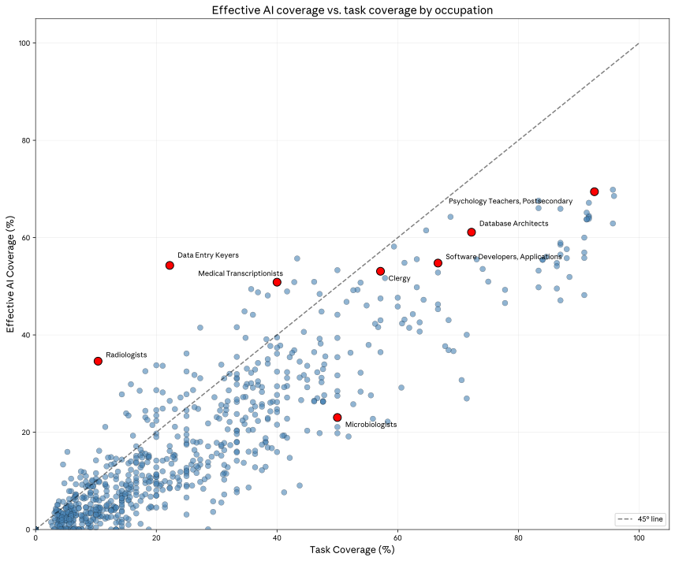
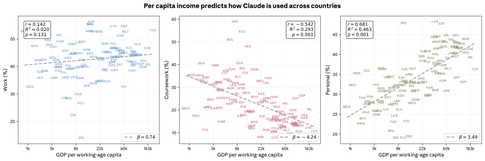

# Anthropic经济指数：理解AI使用的新基石

人工智能真的让人们在工作中变快了吗？AI最擅长支持哪类任务？它又可能如何改变人们职业的本质？

在Anthropic，我们正在持续测量真实世界的AI使用来回答这些问题。我们的隐私保护[分析方法](https://www.anthropic.com/research/clio)让我们能够深入了解[Claude.ai](http://claude.ai/redirect/website.v1.6b08c2cb-d676-49ea-a3d5-4d257df65e79)上的对话（主要捕捉消费者使用）以及我们第一方API上的对话（主要捕捉企业使用）。[1] 在过往报告中，我们已按[职业和工资水平](https://www.anthropic.com/news/the-anthropic-economic-index)评估了AI任务，更深入地研究了[软件开发](https://www.anthropic.com/research/impact-software-development)，并按[国家和美国各州](https://www.anthropic.com/research/economic-index-geography)研究了AI使用情况。

我们现在为经济指数增加了一个新的细节层次。在第四份报告中，我们引入了所谓的**经济基元**：一套五项简单的基础测量指标，用于追踪Claude随时间推移的经济影响。我们的初始集合包括任务复杂度、技能水平、使用目的（工作、教育或个人使用）、AI自主性以及任务成功率。[2] 我们通过让Claude对本期报告样本中的每个对话回答一组通用问题来推导出这些基元。

这些基元提供了AI潜在经济影响的先行指标，并使我们能够回答关于AI如何已在改变工作的更复杂问题。我们的最新报告采样了2025年11月的对话（主要使用Claude Sonnet 4.5），利用基元探索了一系列我们原本无法回答的问题——包括Claude的任务级成功率如何随任务复杂度变化，以及Claude迄今为止的使用是否可能预示着对许多职业的净去技能化效应。

完整第四份经济指数报告见[此处](/research/anthropic-economic-index-january-2026-report)。以下是结果摘要。

**我们从经济基元中学到了什么**

我们将经济基元应用于关于单个任务、职业以及我们所观察到的变化的可能总体影响的问题。（完整方法论——包括我们如何测试基元准确性的详细信息——见[完整报告](anthropic.com/research/anthropic-economic-index-january-2026-report)第二章。）

### 任务

**AI加速了哪些任务？加速了多少？**

我们发现更复杂的任务被Claude加速最多。我们通过Claude估计的理解对话输入所需受教育年限来衡量：在Claude.ai上，需要高中教育（12年）的提示任务被加速了9倍，而需要大学学位（16年）的任务被加速了12倍。（在API上，加速比更大。）这些结果表明AI的生产力提升目前集中在需要较高人力资本的任务上，这与白领专业人士更可能在工作中使用AI的[证据](https://www.nber.org/papers/w32966)一致。

在按任务成功率调整后，这一趋势仍然存在——尽管力度减弱。Claude成功完成需要大学学位的任务的概率为66%，而需要高中以下教育的任务为70%。这降低了但并未消除总体效应：Claude对任务加速的影响随复杂度的增长比复杂度与成功率下降之间的相关性更为陡峭。

**加速比和成功率与受教育年限的关系。** 左侧图表显示了加速比与受教育年限之间关系的散点图，以O*NET任务级别测量。虚线表示最佳拟合线。右侧图表显示了与成功率的关系。

**Claude能在多长时间跨度上支持任务？**

[METR](https://metr.org/)对AI[任务时间跨度](https://metr.org/blog/2025-03-19-measuring-ai-ability-to-complete-long-tasks/)的测量表明，更长的任务对AI模型来说更难完成。但随着模型变得更好，AI模型能工作的时间长度正在稳步增加：这一测量已成为AI进展的关键指标。

我们能够使用经济基元来补充METR的分析。在下图中，我们展示了Claude的任务级成功率相对于人类完成相同任务所需时间的关系，涵盖[Claude.ai](http://claude.ai/redirect/website.v1.6b08c2cb-d676-49ea-a3d5-4d257df65e79)和我们的API：

**任务成功率与纯人工时间。** 该图展示了任务成功率（%）与人类单独完成该任务所需时间之间的关系，均在O*NET任务级别测量并按平台拆分。虚线表示线性回归的拟合结果。

METR的基准测试表明Claude Sonnet 4.5（我们分析中的模型）在2小时的任务上达到50%的成功率。相比之下，我们自己的API数据显示Claude在耗时近两倍（约3.5小时）的任务上达到50%的成功率，而在Claude.ai上，持续时间则更长——约19小时。但这可能并不像看起来那么不一致：我们的方法论与METR的方法在一些重要方面有所不同。在我们的样本中，用户可以将复杂任务分解为更小的步骤，产生一个允许Claude纠正航向的反馈循环。而且，与固定的任务集合不同，我们的样本包含了一种选择性偏差：用户会将那些他们更有信心能成功的任务交给Claude。

我们的分析展示了Claude的*有效*时间跨度可能与在一致任务集合的研究中发现的结果有何不同。我们将在后续报告中追踪这一指标。

**Claude的工作性质在不同国家之间有何不同？**

我们发现Claude在不同经济发展阶段的国家中完成非常不同类型的任务。在人均GDP较高的国家，Claude更频繁地用于工作或个人使用——而光谱另一端国家更可能将其用于教育课程。这符合一个直白的"采用曲线"叙事：低收入国家显示AI使用在教育上的份额很大而在少数工作任务上较小，随着国家变得更富裕，AI使用向个人目的多样化。

这些结果与[微软](http://microsoft.com/en-us/research/wp-content/uploads/2025/12/New-Future-Of-Work-Report-2025.pdf)最近的研究一致，该研究将AI在教育中的使用与较低的人均收入相关联，将AI在休闲中的使用与较高收入相关联。我们[最近与卢旺达政府和ALX（一家技术培训提供商）的合作](https://www.anthropic.com/news/rwandan-government-partnership-ai-education)正是基于这一考量：参与者从培养AI素养开始，我们正在试点一个项目，为部分毕业生提供为期一年的Claude Pro访问权限，支持他们从教育用途向更广泛的应用范围过渡。

**人均收入预测各国Claude使用方式。** 每个图显示了Claude.ai对话中特定使用类型（工作、课程或个人）的份额与人均GDP对数之间的关系。

### 职业

**覆盖度**

在我们的[第一份报告](https://www.anthropic.com/news/the-anthropic-economic-index)中，使用2025年1月的数据，我们发现样本中36%的职业有至少四分之一的任务在使用Claude。汇总多份报告的数据后，这一比例已升至49%。但一旦我们考虑Claude的*成功率*（根据工人执行该任务的频率和任务耗时加权），我们得到了一幅关于哪些职业受AI使用影响最大的不同图景。

下图中，我们在*x*轴上绘制了之前的职业任务覆盖度测量值，在*y*轴上绘制了新的调整后测量值。虽然两者确实相关，但我们现在发现一些职业（如数据录入员和放射科医生）受AI影响的程度远超仅靠任务覆盖度所暗示的，而其他职业（如教师和软件开发者）受影响程度相对较低。

**有效AI覆盖与任务覆盖。** 该图展示了任务有效AI覆盖（%）与任务覆盖之间的关系，在职业层面测量。有效AI覆盖追踪的是基于Claude.ai数据，工人时间加权职责中AI能够成功执行的份额。任务覆盖是在Claude.ai使用中出现的任务份额。虚线表示有效AI覆盖份额等于任务覆盖的位置。

话虽如此，即使是我们修订后的评估仍然有限：我们只评估在Claude.ai上执行的任务，而这些对话如何映射到现实世界的变化并不总是清晰。这是我们计划在未来深入研究的领域。

**任务内容**

我们进一步问：AI覆盖的任务是代表了某个职业中较高技能还是较低技能的组成部分。使用我们创建的每个任务所需技能水平的估计值，我们发现Claude相对更可能覆盖需要*更高*教育水平的任务——具体来说，需要平均14.4年教育的任务（相当于美国副学士学位），而经济平均值为13.2年（如下图）。这与我们此前的发现一致，即Claude更频繁地被白领工人使用。

**所有任务与Claude覆盖任务的受教育程度。** 蓝色柱状图给出了O*NET数据库中所有任务的预测任务级所需教育分布，按就业加权。橙色柱状图显示了相同数据，但限制为在Claude.ai数据中出现的任务。

作为一个实验，我们估计了如果移除这些Claude覆盖的任务将如何改变人们职业的任务构成。作为一阶效应，这平均而言会*去技能化*职业，因为它会移除那些较高教育的任务。技术文档撰写人、旅行代理人和教师等职业将受到影响（我们在[报告](anthropic.com/research/anthropic-economic-index-january-2026-report)中有进一步讨论），而少数职业（如房地产经理）则会出现相反方向的效应。

我们并不必然*预测*这种去技能化会发生：即使AI完全自动化了它目前支持的任务，劳动力市场也可能以本分析未考虑的方式动态调整。（当然，随着模型改进，AI覆盖的任务构成也会变化。）话虽如此，我们认为这提供了一个有用的信号，说明AI在近期可能对职业产生的最直接影响。[3]

**总体影响**

在我们早期的研究中，我们[估计](https://www.anthropic.com/research/estimating-productivity-gains)AI的广泛采用可能在未来十年内使美国劳动生产率增长每年提高1.8个百分点——大约是趋势增长率的两倍。我们的新基元让我们能够重新审视这一分析。

仅基于任务加速比的估计，我们复现了1.8个百分点增长率的早期发现（即使加入了API数据）。但当我们考虑任务*可靠性*时——即按任务*成功*的概率调整任务级时间节省的估计——我们对[Claude.ai](http://claude.ai/redirect/website.v1.6b08c2cb-d676-49ea-a3d5-4d257df65e79)上完成的任务的估计下降了约三分之一（至每年1.2个百分点），对API上通常更具挑战性的任务下降稍多（至1.0个百分点）。

即使是年劳动生产率增长提高1个百分点也仍然值得注意：它会使美国生产率增长回到1990年代末和2000年代初的水平。而且，正如我们在[早期研究](https://www.anthropic.com/research/estimating-productivity-gains)中提到的，这一总体估计没有考虑AI模型变得远比现在更强大、或者工作中的AI使用变得远比现在更复杂的可能性——这些可能将数字推高得多。事实上，自我们的调查以来，随着Claude Opus 4.5的发布，Claude已变得更为强大。

**既有指标的更新**

除了基元之外，我们还收集了一轮关于此前报告中一直在追踪的指标的新数据。这使我们能够识别出2025年1月至11月间AI使用的趋势。在此，我们主要发现了与之前分析结果相比仅有微小变化，此前分析指向了Claude使用分布不均。

首先，我们发现Claude的使用仍然高度集中在某些任务中：尽管我们的样本包含Claude.ai上3,000个独特的工作任务，前十个任务占到24%，这一比例从2025年1月的21%稳步上升。更具体地说，计算机和数学任务继续主导Claude使用：它们约占Claude.ai上所有对话的三分之一，占我们API流量的近一半。

其次，我们的新报告发现，增强（52%的对话）已超过自动化（45%），成为[Claude.ai](http://claude.ai/redirect/website.v1.6b08c2cb-d676-49ea-a3d5-4d257df65e79)上与Claude交互的最流行模式。这与我们8月样本中观察到的情况（当时自动化以49%对47%领先）发生了逆转，但当我们以更长的时间窗口评估这一问题时，我们仍能看到*自动化*在任务份额中的缓慢上升：去年1月增强以55%对41%领先，3月以55%对42%领先。

第三，我们的最新分析显示AI使用的地理集中度（如[上次讨论](https://www.anthropic.com/research/economic-index-geography)）仍然明显。美国、印度、日本、英国和韩国仍在整体Claude.ai使用中领先，采用率仍然主要由人均GDP解释。话虽如此，在美国我们观察到了更大的变化：Claude使用在美国各州之间已变得明显更均匀分布。事实上，如果这一趋势持续，我们的模型预测Claude使用将在两到五年内在全国范围内均衡化。我们在[报告](anthropic.com/research/anthropic-economic-index-january-2026-report)中更详细地讨论了这一模型。

**结论**

我们最新经济指数报告最直接的结论是，AI对全球劳动力的影响仍然是高度不均衡的：AI使用仍集中在特定国家和职业中，并且它对某些职业的影响方式与其他职业非常不同，任务覆盖度的证据即表明了这一点。

更一般地说，这份报告为我们提供了一个新的基线，可以据此比较我们未来的调查。随着Claude的改进，我们预期它将被要求承担更难的任务，并且可能取得更大的成功。我们还预期，随着任务变得更可靠，它们可能从[Claude.ai](http://claude.ai/redirect/website.v1.6b08c2cb-d676-49ea-a3d5-4d257df65e79)转移到API（即从主要消费者转移到主要企业）——如果这发生了，将为我们提供另一个经济影响即将到来的可能指标，考虑到企业采用对AI生产力效应的重要性。通过我们的基元，我们将能够测量诸如此类的变化如何开始影响现实世界的结果，包括人们工作的性质，以及在这个快速技术转型时期哪些人（以及在哪些地方）最可能受到影响。

与此同时，研究人员、记者和公众可以使用我们的数据来为自己的研究和思考提供信息，并为我们可能需要的潜在政策回应提供实证基础。关于上述每个领域的更多详细信息，请参阅我们的[完整报告](/research/anthropic-economic-index-january-2026-report)。

#### 脚注

- 与之前的报告一样，我们所有的分析都基于隐私保护分析。在整份报告中，我们分析了来自Claude.ai免费版、Pro版和Max版对话（我们也称之为"消费者数据"，因为它主要代表消费者使用）的100万条随机抽样对话，以及来自我们第一方（1P）API流量（我们也称之为"企业数据"，因为它主要代表企业使用）的100万条记录。
- 更具体地说，
**任务复杂度**捕捉了任务可能在其复杂度上的差异，包括完成任务所需的时间以及任务的难度。O*NET中的"调试"任务既可以指Claude修复函数中的一个小错误，也可以指全面重构一个代码库——对劳动力需求的影响截然不同。我们通过估计无AI时人类完成任务的时间、有AI时完成任务的时间、以及用户是否在单个对话中处理多个任务来衡量复杂度。**人类与AI技能**探讨了自动化如何与技能水平相互作用。如果AI不成比例地替代需要较少专业知识的任务，同时补充高技能工作，这可能是另一种形式的技能偏向型技术变革——增加对高技能工人的需求，同时取代低技能工人。我们测量用户是否本可以在没有Claude的情况下完成任务，以及理解用户提示和Claude响应所需的受教育年限。**使用案例**区分专业、教育和个人使用。劳动力市场效应最直接地来自工作场所使用，而教育使用可能预示着未来劳动力正在构建AI互补技能。**AI自主性**衡量用户将决策权委托给Claude的程度。我们的最新报告记录了上升的"指令式"使用，即用户完全委托任务。追踪自主性水平——从积极协作到完全委托——有助于预测自动化节奏。**任务成功率**衡量Claude对是否成功完成任务的自我评估。任务成功率有助于评估任务是否可以有效自动化（任务能否完全自动化？）和高效自动化（自动化一项任务需要多少次尝试？）。也就是说，任务成功率对自动化劳动任务的可行性和成本都很重要。

- 确实，一些[历史证据](https://www.michaelwebb.co/webb_ai.pdf)表明，当自动化工作任务的 technologies 出现在专利数据中时，受影响职业的就业和工资随后会下降。
