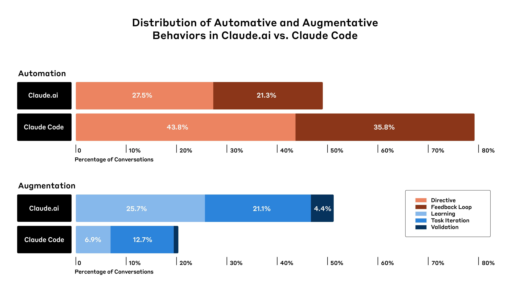
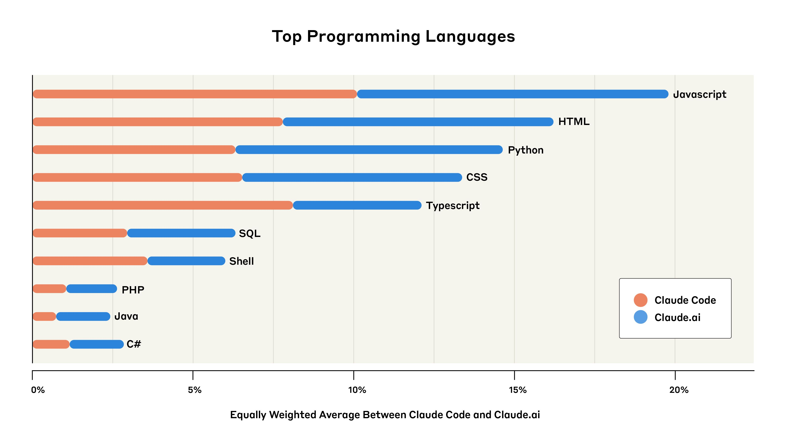
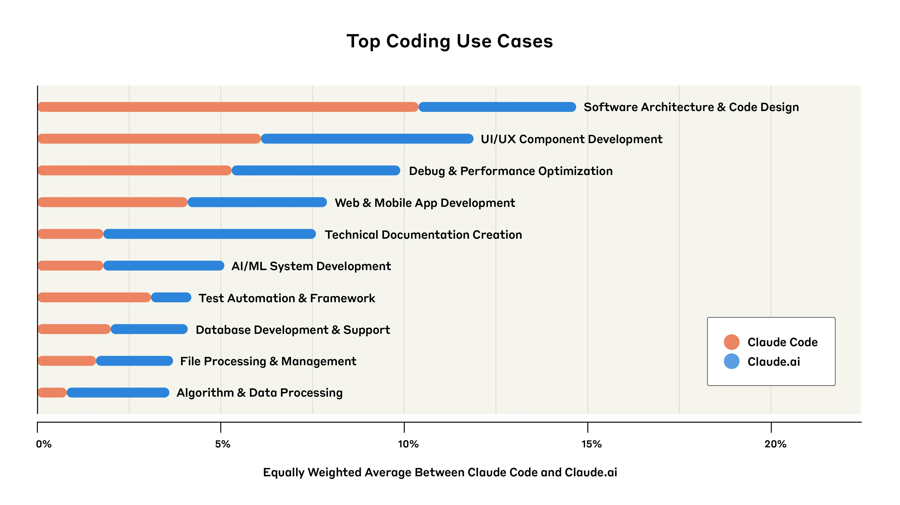
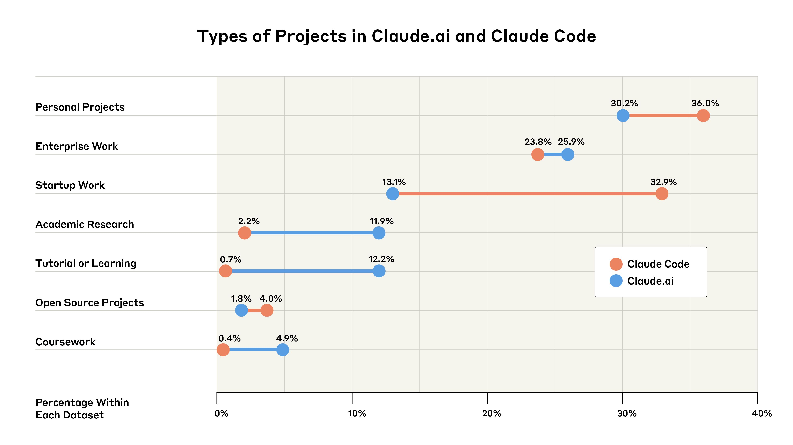
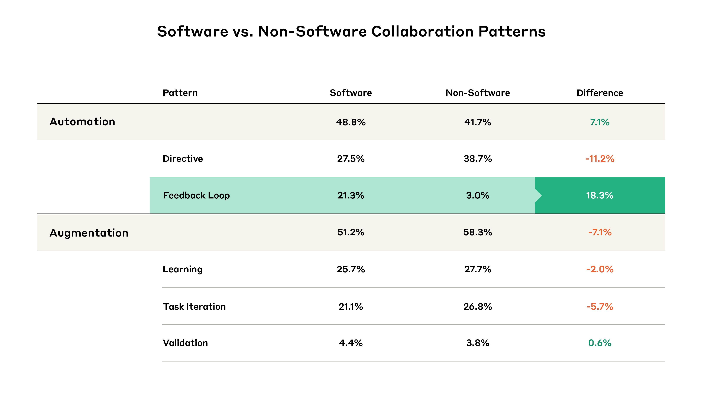

# Anthropic 经济指数：AI 对软件开发的影响

计算机编程相关工作在现代经济中占比虽小，但影响力巨大。过去几年，能够辅助甚至自动化大量编码工作的 AI 系统的引入，已经深刻改变了这一领域。

在我们[此前的经济指数研究](https://www.anthropic.com/news/the-anthropic-economic-index)中，我们发现美国计算机相关职业的从业者对 Claude 的使用比例极不成比例：也就是说，与计算机相关任务的 Claude 对话数量，远超根据相关岗位从业人数所做的预测。[教育领域](https://www.anthropic.com/news/anthropic-education-report-how-university-students-use-claude)也呈现同样的模式：涉及大量编程的计算机科学学位，其 AI 使用比例显著偏高。

为更深入地理解这些变化，我们分析了 [Claude.ai](http://claude.ai/redirect/website.v1.6b08c2cb-d676-49ea-a3d5-4d257df65e79)（大多数人使用 Claude 的"默认"方式）和 [Claude Code](https://docs.anthropic.com/en/docs/agents-and-tools/claude-code/overview)（我们的新型专用编程"智能体"，能够使用多种数字工具自主完成一系列复杂任务）上的 50 万次编程相关交互。

我们发现了三个关键模式：

**编程智能体更多用于自动化。**Claude Code 上 79% 的对话被识别为"自动化"——即 AI 直接执行任务——而非"增强"，即 AI 与人类协作并提升人类能力（21%）。相比之下，Claude.ai 上仅 49% 的对话被归类为自动化。*这可能意味着，随着 AI 智能体日益普及、更多智能体式 AI 产品被构建，我们应该预期看到更多的任务自动化。*

**开发者普遍使用 AI 构建面向用户的应用程序。**JavaScript 和 HTML 等 Web 开发语言是我们数据集中最常见的编程语言，用户界面和用户体验任务是最主要的编程用途之一。*这表明，以构建简单应用程序和用户界面为核心的工作，可能比纯粹的后端开发更早受到 AI 系统的冲击。*

**创业公司是 Claude Code 的主要早期采用者，企业则相对滞后。**在初步分析中，我们估计 Claude Code 上 33% 的对话服务于创业公司相关工作，而仅 13% 被识别为企业级应用。*这种采用差距表明，灵活的组织正在使用前沿 AI 工具，而传统企业则存在鸿沟。*

### 我们如何分析 Claude Code 和 Claude.ai 上的对话

我们使用[隐私保护分析工具](https://www.anthropic.com/research/clio)分析了总计 50 万次 Claude 交互（分布在 Claude Code 和 Claude.ai 之间1），该工具将用户对话提炼为更高层次的匿名洞察。此处，我们用它来识别对话主题（例如"UI/UX 组件开发"），或者——如下文所述——将对话归类为聚焦于"增强"还是"自动化"。

### 开发者如何与 Claude 交互？

在以往的经济指数报告中，我们将"自动化"（AI 直接执行任务）与"增强"（AI 与用户协作执行任务）区分开。此次我们发现，Claude Code 的自动化率显著更高——79% 的对话涉及某种形式的自动化，而 Claude.ai 上为 49%。

我们还进一步将自动化和增强细分为若干子类型（如[此前研究](https://www.anthropic.com/news/the-anthropic-economic-index)所述）。"反馈循环"模式——Claude 自主完成任务但借助人工验证（例如用户将任何错误信息反馈给 Claude）——在 Claude Code 上的出现频率（占交互的 35.8%）几乎是 Claude.ai（21.3%）的两倍。"指令式"对话——Claude 以最少的用户交互完成任务——在 Claude Code 上的比例也更高（43.8%，Claude.ai 为 27.5%）。所有增强模式——包括用户从 AI 模型获取知识的"学习"模式——在 Claude Code 上的比例均显著低于 Claude.ai。

这些结果揭示了专用编程智能体（此处为 Claude Code）与用户与大型语言模型交互的"标准"方式（即通过类似 Claude.ai 的聊天界面）之间的差异。随着更多智能体式产品的发布，我们可能会看到 AI 融入人们工作的方式出现分化。至少在编程领域，这可能意味着更多的任务自动化。

这也引发了关于 AI 使用日益普及时开发者将在多大程度上继续参与的问题。重要的是，我们的结果确实表明，即使在自动化中，人类仍然频繁参与："反馈循环"交互仍然需要用户输入（即使那只是将错误信息粘贴回 Claude）。但这一模式能否持续到未来并不确定，届时能力更强的智能体系统可能需要越来越少的用户输入。

### 开发者在用 Claude 构建什么？

总体而言，我们发现开发者普遍使用 Claude 构建网站和移动应用的用户界面与交互元素。虽然没有单一语言占主导地位，但以 Web 开发为主的 JavaScript 和 TypeScript 合计占所有查询的 31%，HTML2 和 CSS（其他面向用户代码的语言）合计又占了 28%。

后端开发语言（用于后台逻辑、数据库和基础设施，以及 API 和 AI 开发）也有体现：值得注意的是 Python 占查询的 14%。然而，Python 具有双重用途——既用于后端开发，也用于数据分析。结合 SQL（另一种数据导向语言，占查询的 6%），这些语言可能包含大量超出传统后端开发的数据科学和分析应用。

这些模式进一步延伸到涉及 Claude 的常见编程任务类型。前五大任务中有两项聚焦于面向用户的应用开发："UI/UX 组件开发"和"Web 与移动应用开发"分别占对话的 12% 和 8%。这类任务越来越适用于一种被称为"氛围编程"（vibe coding）的现象——不同经验水平的开发者用自然语言描述期望结果，让 AI 掌控实现细节。

与更通用的用途相关的对话，如"软件架构与代码设计"和"调试与性能优化"，在 Claude.ai 和 Claude Code 中也都有很高的占比。

推测而言，这些发现表明，如果不断增强的 AI 能力使"氛围编程"更多地进入主流工作流，以构建简单应用和用户界面为核心的工作可能更早受到 AI 系统的冲击。随着 AI 越来越多地处理组件创建和样式任务，这些开发者可能会转向更高层次的设计和用户体验工作。

### 谁在用 Claude 编程？

我们还分析了哪些开发者群体可能在使用 Claude。我们使用分析系统来识别最能描述用户编程相关交互的项目类型（例如个人项目 vs. 创业公司项目）。由于我们不知道 Claude 响应被使用的真实场景，这些分析依赖于基于不完整数据的不确定推断。因此，我们将这些发现视为比上述发现更为初步。

创业公司似乎是 Claude Code 的主要早期采用者，企业采用则相对滞后。创业公司工作占 Claude Code 对话的 32.9%（比其在 Claude.ai 上的使用比例高出近 20%），而企业工作仅占 Claude Code 对话的 23.8%（略低于其在 Claude.ai 上 25.9% 的占比3）。

此外，涉及学生、学术界、个人项目构建者和教程/学习用户的用途合计占两个平台交互的一半。换言之，个人——不仅仅是企业——是编程辅助工具的重要采纳者。

这些采用模式反映了过去的技术变迁：创业公司利用新工具获取竞争优势，而成熟组织行动更为谨慎，通常在全公司采用新工具之前进行详细的安全检查。AI 的通用性可能加速这一动态：如果 AI 智能体带来显著的生产力提升，早期采用者与晚期采用者之间的差距可能转化为实质性的竞争优势。

### 局限性

我们的分析基于真实的 AI 使用——开发者如何在实际工作流中使用 Claude。虽然这种方法使我们的发现具有实践相关性，但也带来了固有的局限。包括：

- 我们仅分析了 Claude.ai 和 Claude Code 的数据。我们排除了团队版、企业版和 API 使用，这些可能呈现不同的模式，尤其是在专业环境中；
- 自动化与增强之间的界限在 Claude Code 等智能体式工具中日益模糊。例如，"反馈循环"模式在性质上与传统自动化不同，因为它仍然需要用户监督和输入。我们可能需要扩展自动化/增强框架以涵盖新的智能体能力；
- 我们对谁在用 Claude 编程的分类依赖于有限上下文的推断。在将对话归类为"创业公司"还是"企业"工作，或"个人"还是"学术"项目时，我们的分析工具基于不完整信息做出有根据的猜测。因此部分分类可能不正确。此外，我们包含了"无法分类"选项，Claude 在 5% 的 Claude.ai 对话和 2% 的 Claude Code 对话中选择了此项。我们将这一类别从分析中排除并重新归一化结果；
- 我们的数据集很可能捕获的是早期采用者。这些用户可能不代表更广泛的开发者群体，这种自选择可能导致使用模式偏向更有经验或技术上更冒险的用户；
- 出于隐私考虑，我们仅分析了特定保留窗口内的数据，可能遗漏了软件开发的周期性模式（如冲刺周期或发布计划）；
- Claude 使用在整体 AI 编程辅助采用中的代表性尚不明确。许多开发者使用 Claude 之外的多种 AI 工具，意味着我们仅呈现了其 AI 使用模式的部分视图；
- 我们只研究了开发者将什么委派给 AI——而非他们最终如何在代码库中使用 AI 输出、生成代码的质量，或这些交互是否有效提高了生产力或代码质量。

### 展望

AI 正在从根本上改变开发者的工作方式。我们的分析表明，在 Claude Code 等专用智能体系统被使用的场景中尤为如此，在面向用户的应用开发工作中尤为强劲，并且可能给创业公司而非更成熟的企业带来特定优势。

我们的发现引发了许多问题。随着 AI 能力的进步，"反馈循环"（人类仍参与过程）的普遍性会持续存在，还是会转向更完全的自动化？当 AI 系统能够构建更大规模的软件时，开发者是否会转向主要管理和引导这些系统，而非亲自编写代码？哪些软件开发角色变化最大，哪些可能完全消失？

AI 编程能力的提升对 AI 开发本身也可能特别重要。由于如此多的 AI 研究和开发依赖于软件，AI 辅助编程的进步可能有助于加速突破，形成一个正向强化循环，进一步加速 AI 进展。

从宏观来看，AI 系统仍然非常新。但相对而言，编程是 AI 在经济中最成熟的应用之一。这使得它值得关注。尽管我们不能假设从软件开发中得出的经验会直接适用于其他职业类型，但软件开发可能是一个先行指标，为我们提供关于其他职业在越来越强大的 AI 模型推出后可能如何变化的有用信息。

## 附录

作为补充分析，我们还将软件相关的自动化与增强模式与不涉及软件的交互模式进行了比较。我们仅在 Claude.ai 中进行此分析，因为 Claude Code 专精于软件应用。

与不涉及软件的用例相比，软件开发的自动化程度更高。反馈循环的显著增长（+18.3%）推动了这一点，同时值得注意的是，这抵消了指令式行为的明显*下降*（-11.2%）。换言之，相对于非编程任务，AI 辅助编程当前需要大量的人工审查和迭代，即使 Claude 完成了大部分工作。

#### 脚注

1. Claude.ai 对话特指来自 Claude.ai Free 和 Pro 的对话。此样本仅包含由第一方 API 驱动的 Claude Code 会话（Claude Code 可由 Anthropic 第一方 API 或第三方云服务商 API 驱动）。我们分析中使用的所有 Claude.ai 和 Claude Code 对话均来自 2025 年 4 月 6 日至 13 日。初始样本在 Claude.ai 和 Claude Code 之间平均分配，对于 Claude.ai，我们应用了基于 Claude 的过滤器来筛选与编程相关的对话。为考虑过滤器的影响，我们在适用的情况下将分析重新归一化，使 Claude Code 和 Claude.ai 交互等权重。

2. Claude.ai 的 HTML 数据可能略有偏高，因为 [Artifacts](https://support.anthropic.com/en/articles/9487310-what-are-artifacts-and-how-do-i-use-them) 使用了 HTML。虽然我们过滤掉了与编程无关的 Artifacts，但我们并未明确从分析中过滤包含编程相关内容的 Artifacts，因为大量编程使用发生在 Artifacts 中。

3. Claude.ai 的使用不包括 Claude For Work（团队版和企业版计划）的使用，这意味着 Claude.ai 的企业数据可能被低估，因为 Claude.ai 上有相当数量的企业使用发生在 Claude For Work 产品中。
