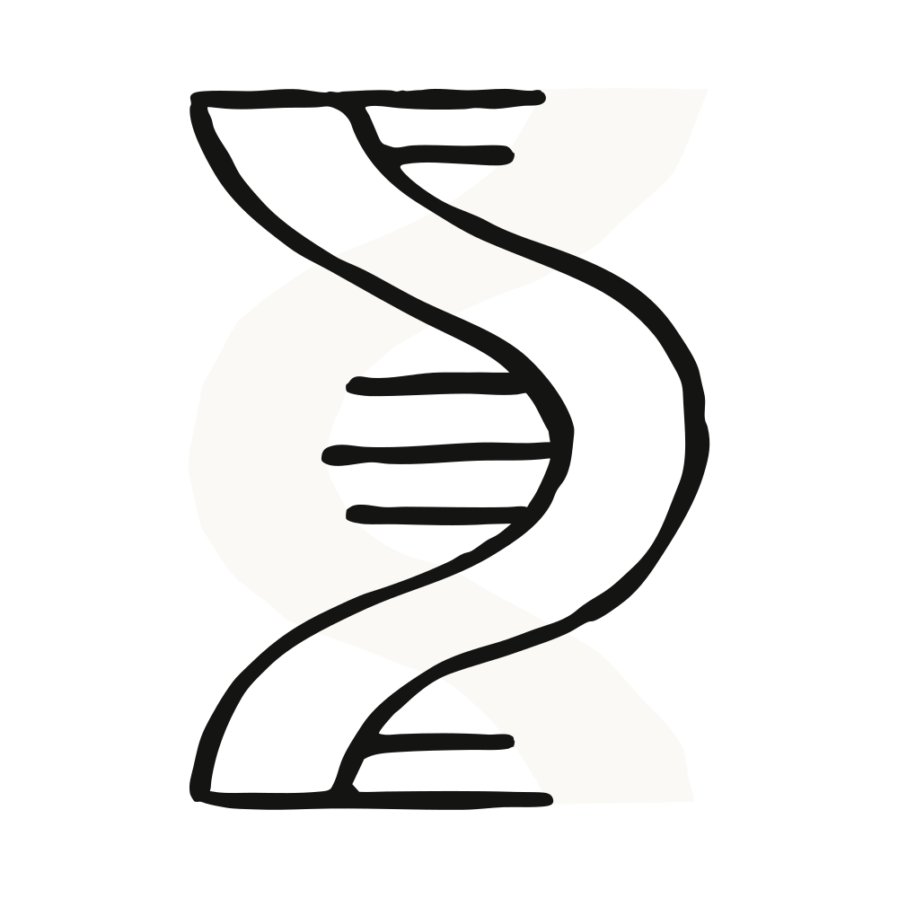

*本文由发现团队研究员Brianna撰写，分享近期生物信息学基准测试工作的结果。*

大型语言模型几乎刚能进行对话，人们就开始问它们与人类专家相比如何。模型能通过律师资格考试吗？能回答执业医师考试题目吗？能解奥数题吗？这类*基准测试*——一套完整的人类审核的问题，用于评估模型的某项能力——如今已成为AI开发商之间的竞争焦点，出现在模型发布系统卡中，并在[多个](https://huggingface.co/spaces/lmarena-ai/arena-leaderboard)[在线](https://artificialanalysis.ai/)[排行榜](https://epoch.ai/benchmarks)上被追踪。

抛开竞争不谈，基准测试帮助我们回答一个重要问题：模型是否足够有能力、足够可靠，以支撑甚至产出专业级工作。科学家们[正在使用模型](https://www.anthropic.com/news/accelerating-scientific-research)为分析流程编写代码、提出假设、从数据中得出结论，长期目标是[加速创新和发现](https://darioamodei.com/essay/machines-of-loving-grace#1-biology-and-health)。但AI目前在科学领域到底有多熟练？Claude和其他模型的进步速度有多快？

为回答这些问题，研究界已构建了多个基准测试。[MMLU-Pro](https://arxiv.org/abs/2406.01574)测试专家级知识和推理问题。[GPQA](https://arxiv.org/abs/2311.12022)提出生物学、物理学和化学领域的研究生水平、"Google防搜"问题。[LAB-Bench](https://arxiv.org/abs/2407.10362)测试生物学特定的知识工作——阅读文献、解读图表、推理实验方案。尽管这些基准测试诞生于"聊天机器人"时代，它们延续到了智能体和工具使用时代，并加入了更困难的科学推理评估，如[FrontierScience](https://arxiv.org/abs/2601.21165)和[Humanity's Last Exam](https://arxiv.org/abs/2501.14249)，因为知识和推理能力仍然是衡量科学能力的重要指标。

然而，许多现实世界的科学任务需要的不止这些。它们需要阅读论文、查询数据库、运行实验、编码和分析。既然模型现在能做很多这类事情，基准测试也随之演进以反映这些工作流。[BLADE](https://blade-bench.github.io/)让模型处理一个数据集和一个开放式任务，并检查模型是否采取了与人类科学家相似的分析步骤。[BixBench](https://arxiv.org/abs/2503.00096)使用生物学数据集，根据模型的结论是否与科学家的结论一致来评分。在[SciGym](https://arxiv.org/abs/2507.02083)中，模型被放入一个模拟生物实验室，必须设计并运行自己的实验来揭示隐藏机制。

这些基准测试让我们更接近衡量科学能力的目标，但它们并不能真正测试一个模型能否为定义科研的那些混乱、开放性问题设计出创造性解决方案。这就是我们开发BioMysteryBench的原因——一个让Claude分析真实世界数据集的生物信息学基准测试，同时应对评估复杂且有噪声的生物系统所固有的挑战。我们发现Claude在生物学领域的科学能力正在代际间快速提升，当前模型的表现与人类专家相当，最新一代模型解决了人类专家小组无法解决的许多问题，有时采用的是截然不同的策略。

医生有执业考试，律师有司法考试，但成为科学家没有标准化测试。AI也面临同样的问题。尽管我们非常希望将这些模型用于科学研究，但还没有任何一个智能体科学基准测试能像[SWE-bench](https://arxiv.org/abs/2310.06770)在软件工程领域那样成为公认的标准。我们认为这是因为科学研究，尤其是生物学，有几个特性使其特别难以通过基准测试来评估。

如果回答一个研究问题只有一种正确方法，博士生几个月就能拿到学位，企业研发部门就不复存在，科学展海报也不需要"方法"部分。科学家如何解决问题取决于他们的技能和背景、可用的资源以及他们的研究品味。

考虑一个看似简单却困扰代谢研究者多年的问题：为什么有些2型糖尿病患者对口服药物二甲双胍有反应，而其他患者没有？要回答这个问题，你可以对有反应者与无反应者进行全基因组关联分析（GWAS），寻找预测性遗传变异；或者对两组的肠道微生物组进行测序，因为二甲双胍部分由肠道细菌代谢。两者都是合理的方向，而如何推进通常只取决于专业知识和资源。

[BixBench](https://arxiv.org/abs/2503.00096)通过根据模型的结论而非得出方法评分，很好地处理了这一点。代价是，这些结论是由做出了系列主观选择的个别科学家产生的，这些选择本身可能塑造了答案。而这又有其自身的陷阱……

即使在选定的研究方向内，个体决策也可能高度主观：一位科学家可能认可某个决策，而另一位研究者可能有严重异议。问问任何收到过一轮同行评审中矛盾意见的沮丧作者就知道了！更困难的是，生物数据集通常噪声足够大，以至于研究决策中的微小差异就可能导致对数据的完全不同的结论。

在长达十年的二甲双胍反应预测因子搜索中，研究设计的细微差异导致了对二甲双胍反应的截然不同的结论。2011年一篇论文[报告了一个预测二甲双胍反应的变异](https://www.nature.com/articles/ng.735)，在两个队列中得到了复现，其合理机制涉及AMPK激活。一年后，糖尿病预防计划[在糖尿病前期患者中测试了同一变异，结果一无所获](https://pmc.ncbi.nlm.nih.gov/articles/PMC3425006/)。最终，一项2012年的荟萃分析没有开展自己的研究，而是汇总了五个队列的数据，再次判定[2011年论文的效应是真实的，但比最初报告的更为温和](https://pubmed.ncbi.nlm.nih.gov/22453232/)。

[SciGym](https://arxiv.org/abs/2507.02083)处理这种模糊性的巧妙方式是选择具有明确定义答案的任务。因为底层生物网络是一个模拟器，实际上存在标准答案，并且噪声是受控的，而非继承自混乱的活体系统。然而，目前尚不清楚模拟实验室中的表现在多大程度上能反映在真实数据上的表现。

模型可能产生最大影响的研究任务，正是那些人类独自尚未解决的任务。而这些，最终正是我们希望能够在模型上评估的任务。比如，二甲双胍的作用机制是什么？在其问世三十年后，该领域仍不确定其主要靶点。发现它，或找到一种合成成本更低、更稳定的二甲双胍同系物，将产生巨大影响。

机器学习长期通过依赖实验数据而非专家直觉，来处理人类表现不佳的问题，如序列预测和蛋白质建模。[ProteinGym](https://www.biorxiv.org/content/10.1101/2023.12.07.570727v1.full)使用深度突变扫描实验作为标准答案来评估模型在突变适应度效应上的表现，长期运行的[CASP](https://predictioncenter.org/)竞赛则参照未发表的晶体结构评估蛋白质折叠。两者都基于没有任何专家敢于自行复现的实验测量。然而，这些基准测试围绕着一组狭窄的任务构建，并未涵盖我们实际想要衡量的生物信息学工作的广度。

由于没有基准测试能完美应对上述三个挑战，我们开发了BioMysteryBench。BioMysteryBench使用混乱的真实世界生物信息学数据，同时不让这些数据固有的复杂性和挑战破坏评估质量。

BioMysteryBench包含99个来自生物信息学各领域的问题，由领域专家编写。专家们被要求收集数据集，并基于数据的受控、客观特性创建问题，而非基于无法验证的科学结论。通过从实验或临床发现中推导答案，可以开发出不需要人类可解的问题。

尽管这些问题是从经过验证的标准答案中创建的，它们仍然具有研究科学家想要回答的那种任务的特质。Claude被赋予每个问题，并被放入一个配备最小化标准生物信息学工具集的容器中，可以通过pip和conda安装额外工具，并有权访问标准生物信息学数据库（如NCBI和Ensembl）以下载额外资源，如参考基因组。

BioMysteryBench具有四项独特特性，使其成为科学领域特别强大的基准测试，并能应对上述挑战：

在开发此评估时，问题主要来自原始或经过最少处理的DNA或RNA测序数据，因为这是许多生物处理流程的起点（WGS、scRNA-seq、甲基化、ChIP-seq、宏基因组学、Hi-C），也包括若干来自蛋白质组学和代谢组学的问题。

问题开发者提出的问题包括：

为尽量减少本质上无法解决的问题，同时仍为那些可能被AI解决的问题留出空间，我们要求每位问题作者提交一个验证notebook，证明信号确实存在于数据中（即使从头找出来可能很困难）。可以将其类比为高中代数原理：验证答案比推导答案容易得多。

对于每个问题，我们指派最多五位领域专家从头回答问题。一旦一个问题被至少一位人类正确回答，我们就认为它是人类可解的。BioMysteryBench包含76个此类任务。

有时Claude的策略与人类相似。这可能是因为人类已经找到了接近最优的方法，或者因为该方法在预训练数据中有充分体现。

其他时候，Claude采取了完全不同的路线，说明解决这些问题没有严格正确的方式，模型可能确实有与我们不同的偏好。

上述例子展示了一种特别有趣的策略：人类专家使用算法或数据库来识别和标注数据集的属性，而Claude则直观地识别出某些模式或序列。诚然，这种巧妙的抽象并非AI独有——例如，第一个真核启动子是在一位科学家注意到序列"TATA"在基因上游序列中反复出现时被发现的。这种*直觉*一直难以被构建到传统生物学机器学习模型中，但LLM或许能够以前所未有的规模发掘此类模式。

这让我们得到了一组专家小组无法解决的问题。这可能意味着（1）问题本身有缺陷或损坏，（2）问题本质上不可解（例如信号不在数据中），或（3）问题在理论上可解但人类缺乏解决所需的知识。经过与基准测试者和额外专家的质量检查，我们移除了4个属于第（1）类的问题，留下了23个人类困难问题。

有趣的是，Claude Sonnet 4.6及更强模型能够解决相当一部分人类困难问题，Claude Mythos Preview的解决率达到30%。那么，Claude到底做了什么人类没做的事情？

通过分析Opus 4.6的运行记录，我们识别出Claude相对于人类使用的两种主要策略：一种是相当AI特有的：Claude庞大的底层知识库包含了来自数十万篇论文的结构生物学、分子谱和荟萃分析信息。另一种策略则是我们人类科学家可以学习的：当Claude对答案不确定时，它会叠加多种方法并组合不同的证据线索来得出结论。

在部分人类困难任务中，Opus庞大的底层知识库帮助它解决了问题。对于人类专家需要运行荟萃分析或拼接数据库的任务，Opus通过将其对机制和本体的内部知识与实时分析相结合来直接解决。通常，这让Claude能够解决人类无法解决的任务。以下是几个例子：

尽管先验知识对Claude的帮助似乎压倒性的大，我们也在人类可解问题集中看到了一个有趣的案例，其中这些知识反而成了它的绊脚石：

当Opus 4.6对答案不确定时，它通常会尝试多种不同的解决方法，并选择多种方法收敛到的那个答案。

与我们已经讨论过的许多基准测试一样，BioMysteryBench有其自身的局限性：对于人类和模型都未解决的任务，我们永远无法完全确定它们是不可能还是仅仅异常困难。验证notebook有助于确保信号存在且数据格式正确，但它们不保证模型或人类能从头找到答案。所以我们请我们的模型和人类基准测试者不必过于沮丧，如果一年后仍无人解决人类困难问题集。这种不确定性也是基准测试令人兴奋的部分原因：一个科学能力更强的模型可能第一个破解此前无人——无论是人类还是模型——破解的问题。

Claude在各代间展示了稳健的进步，并且在人类可解和人类困难任务上都做得足够好，以至于我们认为让Claude Mythos Preview进行一些自己的科学分析会很有趣。以下是对其前代Claude在BioMysteryBench上表现的几点额外洞察：

> 标题中的准确率数字告诉你每个模型有多经常得到正确答案，但不会告诉你是怎么得到的。我想知道一个困难问题上的正确答案和一个可解问题上的正确答案是否意味着同一件事。由于每个问题都被尝试了五次，我可以查看每个问题的解决次数：如果一个模型解出某问题5/5次，它有一个可靠的方法；如果解出1/5次，它可能只是幸运地走上了一条无法稳定重现的推理路径。于是我把每个模型在两个集合上已解决的问题按解决次数（0/5到5/5）做了分解。

> "已解决"的质地在这两个集合之间发生了剧烈变化。在人类可解问题上，Opus 4.6呈现强烈的双峰分布——在所有它至少解决过一次的问题中，86%的问题它解决了至少4/5次。要么知道答案，要么不知道。在人类困难集合上，这个比例下降到44%，脆弱的胜利（5次尝试中仅解决1-2次）的占比从9%跃升至44%。Sonnet 4.6表现出相同的转变，且更为剧烈（75%可靠→22%；9%脆弱→56%）。所以77.4%→23.5%的标题准确率下降实际上低估了正在发生的事情：在可解问题上，模型正在提取它稳定知道的东西，而在困难问题上，近一半的胜利是它偶然撞上的路径而非可重现的方法。准确率差距是真实的，但其下的可靠性差距才是关于能力前沿实际位置更有趣的故事。Opus 4.7和Mythos略微推进了前沿（Mythos在可解问题上的胜利中94%达到≥4/5），但相同的高低可靠性与脆弱分裂在困难集合上对所有模型都成立。

我们认为Claude Mythos Preview的分析站得住脚，并更深入地探讨了可靠性——这是衡量模型表现的重要指标。然而，它也感觉有点……无聊？它为上面展示的性能分析增加了一些细微差别，但并没有从根本上解决一个新问题。尽管如此，模型似乎开始发展出研究品味的萌芽（即使它们在产生深度洞察方面还有一段路要走）。

BioMysteryBench是衡量科学能力的一个令人鼓舞的指标。最新几代Claude稳定地解决了大多数人类可解问题，并且在相当一部分人类困难任务上，它们的表现超过了五位领域专家组成的小组。模型在各代间不断进步，不再仅仅是跟上训练有素的科学家在生物信息学问题上的步伐；在某些任务上，它们已经领先。

我们也很高兴看到这一领域的趋同研究：在本文定稿期间，Genentech和Roche发布了[CompBioBench](https://www.biorxiv.org/content/10.64898/2026.04.06.716850v1)。他们的基准测试包含100个计算生物学任务，"基于合成/增强数据以及对真实数据集的元数据搅乱/擦洗，以创建具有单一标准答案的挑战性问题，需要多步推理、工具使用、定制代码以及与真实世界外部资源的交互。"听起来很熟悉？他们的结果也与BioMysteryBench相呼应：Claude Opus 4.6在总体上达到81%，在最难的问题上达到69%，进一步证实前沿模型现在已成为生物信息学研究中真正有用的协作者。

如果你对了解模型在困难的可验证计算生物学任务上的表现感兴趣，可以[在此访问BioMysteryBench](https://huggingface.co/datasets/Anthropic/BioMysteryBench-preview)。
